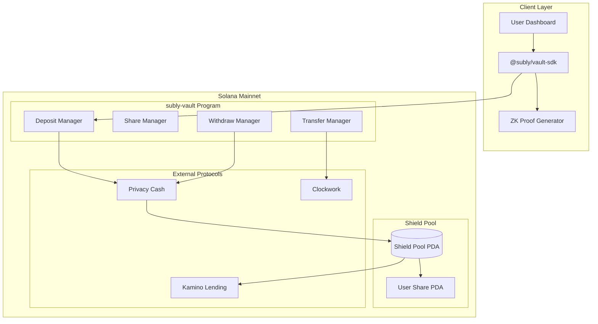

# 設計書

## アーキテクチャ概要

Protocol B: subly-vault は**シールドプール方式**を採用。全ユーザーの資金を混合し、個別ユーザーとKaminoポジションのリンクを断絶することでプライバシーを保護する。

```
┌─────────────────────────────────────────────────────────────────────────┐
│ User Wallet → Privacy Cash → Shield Pool (全ユーザー混合) → Kamino     │
│              (プライベート)   (プール単位で管理)           (プール単位)  │
│                                                                         │
│ - 個別ユーザーとKaminoポジションのリンクなし                            │
│ - ユーザーは「プール内シェア」を保持（ECIES暗号化）                     │
│ - 送金も Privacy Cash 経由でプライベートに実行                          │
└─────────────────────────────────────────────────────────────────────────┘
```



## コンポーネント設計

### 1. subly-vault Program (Anchor)

**責務**:
- Shield Pool の管理（初期化、状態更新）
- ユーザーシェアの管理（ECIES暗号化シェアの保存）
- 入金・出金・送金トランザクションの処理
- ZK証明の検証
- 外部プロトコル（Privacy Cash、Kamino）とのCPI

**実装の要点**:
- 本番名は `subly-vault`（現在の `subly-mainnet` から改名）
- モジュール構造は `instructions/`, `state/`, `integrations/`, `errors.rs`, `events.rs`, `constants.rs`
- ZK証明検証はLight Protocol SDKを使用

### 2. Shield Pool

**責務**:
- 全ユーザーの資金をプール
- シェア総数と評価額の管理
- Kaminoポジションとの紐付け

**PDA構造**:
```rust
#[account]
pub struct ShieldPool {
    pub pool_id: Pubkey,             // PDA
    pub authority: Pubkey,           // 管理者
    pub total_pool_value: u64,       // プール評価額（USDC）
    pub total_shares: u64,           // 発行済みシェア総数
    pub kamino_obligation: Pubkey,   // Kaminoのobligation
    pub last_yield_update: i64,      // 最終利回り更新
    pub nonce: u128,                 // 操作nonce
    pub bump: u8,
}
// seeds = [b"shield_pool"]
```

### 3. User Share

**責務**:
- ユーザーのシェア量を暗号化して保存
- コミットメントによるユーザー識別（アドレスは保存しない）

**PDA構造**:
```rust
#[account]
pub struct UserShare {
    pub share_id: Pubkey,
    pub pool: Pubkey,
    pub encrypted_share_amount: [u8; 64],  // ECIES暗号化
    pub user_commitment: [u8; 32],          // hash(secret || pool_id)
    pub last_update: i64,
    pub bump: u8,
}
// seeds = [b"share", pool.key(), user_commitment]
```

### 4. Scheduled Transfer

**責務**:
- 定期送金スケジュールの管理
- Clockworkによる自動実行

**PDA構造**:
```rust
#[account]
pub struct ScheduledTransfer {
    pub transfer_id: Pubkey,
    pub user_commitment: [u8; 32],
    pub recipient: Pubkey,            // 事業者アドレス（公開）
    pub amount: u64,
    pub interval_seconds: u32,
    pub next_execution: i64,
    pub is_active: bool,
    pub bump: u8,
}
// seeds = [b"transfer", user_commitment, transfer_nonce]
```

### 5. vault-sdk (TypeScript)

**責務**:
- Solanaプログラムとの通信
- ECIES暗号化・復号
- ZK証明の生成
- Privacy Cash連携

**API設計**:
```typescript
class SublyVaultClient {
  // 入金
  async deposit(params: { amountUsdc: number }): Promise<TransactionSignature>;

  // 出金
  async withdraw(params: { amountUsdc: number }): Promise<TransactionSignature>;

  // 残高取得（本人のみ）
  async getBalance(): Promise<{ shares: bigint; valueUsdc: bigint }>;

  // 定期送金設定
  async setupRecurringPayment(params: {
    recipientAddress: PublicKey;
    amountUsdc: number;
    interval: 'hourly' | 'daily' | 'weekly' | 'monthly';
  }): Promise<TransactionSignature>;

  // 定期送金キャンセル
  async cancelRecurringPayment(transferId: PublicKey): Promise<TransactionSignature>;

  // 運用状況取得
  async getYieldInfo(): Promise<{ apy: number; earnedUsdc: bigint }>;
}
```

## データフロー

### 入金フロー
```
1. ユーザーがUSDC入金を要求
2. SDK: 秘密値(secret)からコミットメント生成 commitment = hash(secret || pool_id)
3. SDK: シェア計算 new_shares = deposit_amount * total_shares / total_pool_value
4. SDK: シェアをECIES暗号化 encrypted_share = encrypt(new_shares, derive_key(wallet_sig))
5. SDK: ZK証明生成（入金証明）
6. SDK: Privacy Cash depositSPL()を呼び出し → Shield Poolへ入金
7. Program: ZK証明検証
8. Program: UserShare PDA更新
9. Program: ShieldPool.total_shares, total_pool_value更新
10. Program: Kaminoに預け入れ（プール全体として）
```

### 出金フロー
```
1. ユーザーが出金を要求
2. SDK: 現在のシェアを復号
3. SDK: 評価額計算 value = shares * total_pool_value / total_shares
4. SDK: 新シェア計算・暗号化
5. SDK: ZK証明生成（出金証明 + 残高証明）
6. SDK: Nullifier生成 nullifier = hash(secret || "withdraw" || nonce)
7. Program: ZK証明検証
8. Program: Nullifier重複チェック
9. Program: Kaminoから必要額引き出し
10. Program: Privacy Cash withdrawSPL()で送金
11. Program: UserShare PDA更新
```

### 定期送金フロー
```
1. ユーザーが定期送金を設定
2. SDK: ScheduledTransfer PDA作成
3. Clockwork: 定期的にexecute_paymentを呼び出し
4. Program: 事前生成されたZK証明を使用（またはリアルタイム生成）
5. Program: シェア更新 + Privacy Cash送金
6. 事業者: USDCを受け取り（送金元は秘匿）
```

## エラーハンドリング戦略

### カスタムエラー

```rust
#[error_code]
pub enum VaultError {
    #[msg("Pool not initialized")]
    PoolNotInitialized,

    #[msg("Insufficient balance for withdrawal")]
    InsufficientBalance,

    #[msg("Invalid ZK proof")]
    InvalidProof,

    #[msg("Nullifier already used")]
    NullifierAlreadyUsed,

    #[msg("Invalid commitment")]
    InvalidCommitment,

    #[msg("Transfer not active")]
    TransferNotActive,

    #[msg("Privacy Cash operation failed")]
    PrivacyCashError,

    #[msg("Kamino operation failed")]
    KaminoError,

    #[msg("Invalid encryption")]
    InvalidEncryption,
}
```

### エラーハンドリングパターン

- ZK証明失敗: トランザクション全体をrevert
- Privacy Cash失敗: ロールバック + イベント発行
- Kamino失敗: リトライキューに追加
- シェア計算エラー: オーバーフローチェック済みの算術使用

## テスト戦略

### ユニットテスト
- シェア計算ロジック
- ECIES暗号化・復号
- コミットメント生成
- PDA導出

### 統合テスト
- 入金フロー（localnet）
- 出金フロー（localnet）
- 定期送金フロー（localnet）
- ZK証明の生成・検証

### E2Eテスト
- ウォレット接続 → 入金 → 残高確認
- 定期送金設定 → 実行確認
- Solana Explorerでプライバシー確認（Mainnet）

## 依存ライブラリ

### Rust (Cargo.toml)
```toml
[dependencies]
anchor-lang = "0.32.1"
anchor-spl = "0.32.1"
light-sdk = "0.x"                    # ZK証明
privacy-cash-sdk = "latest"          # Privacy Cash CPI
kamino-lending-cpi = "latest"        # Kamino Lending CPI
clockwork-sdk = "latest"             # Clockwork自動化
```

### TypeScript (package.json)
```json
{
  "dependencies": {
    "@coral-xyz/anchor": "^0.32.0",
    "@solana/kit": "latest",
    "@solana/wallet-adapter": "latest",
    "privacycash": "latest",
    "@kamino-finance/klend-sdk": "latest",
    "eciesjs": "^0.4.0",
    "zod": "^3.x"
  }
}
```

## ディレクトリ構造

```
subly-mainnet/
├── programs/
│   └── subly-vault/              # 改名: subly-mainnet → subly-vault
│       ├── src/
│       │   ├── lib.rs            # プログラムエントリーポイント
│       │   ├── instructions/     # 命令ハンドラ
│       │   │   ├── mod.rs
│       │   │   ├── initialize.rs     # プール初期化
│       │   │   ├── deposit.rs        # 入金
│       │   │   ├── withdraw.rs       # 出金
│       │   │   ├── setup_transfer.rs # 定期送金設定
│       │   │   ├── execute_transfer.rs # 定期送金実行
│       │   │   └── cancel_transfer.rs  # 定期送金キャンセル
│       │   ├── state/            # アカウント定義
│       │   │   ├── mod.rs
│       │   │   ├── shield_pool.rs
│       │   │   ├── user_share.rs
│       │   │   └── scheduled_transfer.rs
│       │   ├── integrations/     # 外部プロトコル連携（将来用）
│       │   │   ├── mod.rs
│       │   │   ├── privacy_cash.rs
│       │   │   └── kamino.rs
│       │   ├── errors.rs         # カスタムエラー
│       │   ├── events.rs         # イベント定義
│       │   └── constants.rs      # 定数
│       └── Cargo.toml
├── packages/
│   └── vault-sdk/
│       ├── src/
│       │   ├── index.ts
│       │   ├── client.ts
│       │   ├── instructions/
│       │   ├── types/
│       │   └── utils/
│       │       ├── encryption.ts # ECIES暗号化
│       │       ├── commitment.ts # コミットメント生成
│       │       └── pda.ts
│       └── package.json
├── tests/
│   ├── subly-vault.ts
│   └── fixtures/
├── Anchor.toml
├── Cargo.toml
└── package.json
```

## 実装の順序

### フェーズ1: 基盤整備
1. プログラム名をsubly-mainnetからsubly-vaultに変更
2. ディレクトリ構造の作成
3. 基本的なモジュール構造の設定

### フェーズ2: Shield Pool基本機能
1. ShieldPool PDAの定義と初期化
2. UserShare PDAの定義
3. 基本的なエラーとイベントの定義

### フェーズ3: 入金機能
1. deposit命令の実装
2. シェア計算ロジック
3. ECIES暗号化（オンチェーンではZK証明検証）

### フェーズ4: 出金機能
1. withdraw命令の実装
2. Nullifier管理
3. 残高検証ロジック

### フェーズ5: 定期送金機能
1. ScheduledTransfer PDAsの定義
2. setup_transfer, execute_transfer, cancel_transfer命令

### フェーズ6: SDK実装
1. SublyVaultClientクラス
2. 暗号化・コミットメントユーティリティ
3. 各命令のラッパー

### フェーズ7: テスト
1. Anchor統合テスト
2. SDK単体テスト

## セキュリティ考慮事項

- **秘密値の管理**: クライアント側でのみ保持、オンチェーンには保存しない
- **ZK証明の重要性**: 全ての状態変更はZK証明で検証
- **Nullifierによる二重使用防止**: 同じ操作を2回実行できないようにする
- **オーバーフロー対策**: checked_add, checked_mul を使用
- **PDA検証**: 全てのPDAシードを厳密に検証

## パフォーマンス考慮事項

- **ZK証明生成**: クライアント側で5-10秒（ユーザー体験に影響）
- **バッチZK証明**: 定期送金用に事前生成してオンチェーン保存
- **Compute Unit制限**: CPI呼び出しを最小限に

## 環境別テスト戦略

### Localnet（開発・単体テスト）
- Shield Pool基本機能
- シェア計算・ECIES暗号化
- コミットメント生成・検証
- 定期送金スケジュール管理
- ZK証明の生成・検証（モック可）

### Mainnet（E2Eテスト・デモ）
- Privacy Cash入金・送金の完全連携
- Kamino Lending運用の完全連携
- Clockwork自動化の完全連携
- プライバシー確認（Solana Explorer）

### 環境切り替え
```rust
// プログラム内で環境に応じた分岐
#[cfg(feature = "localnet")]
mod mock_integrations;

#[cfg(not(feature = "localnet"))]
mod integrations;
```

```typescript
// SDK内で環境に応じた分岐
const isMainnet = cluster === 'mainnet-beta';
if (isMainnet) {
  // Privacy Cash実連携
} else {
  // ローカルテスト用の簡易処理
}
```

## 将来の拡張性

- **マルチプール**: pool_nonceを使用した複数プール対応
- **マルチトークン**: USDT等の追加対応
- **Protocol A連携**: Arcium Mainnetローンチ後の統合
