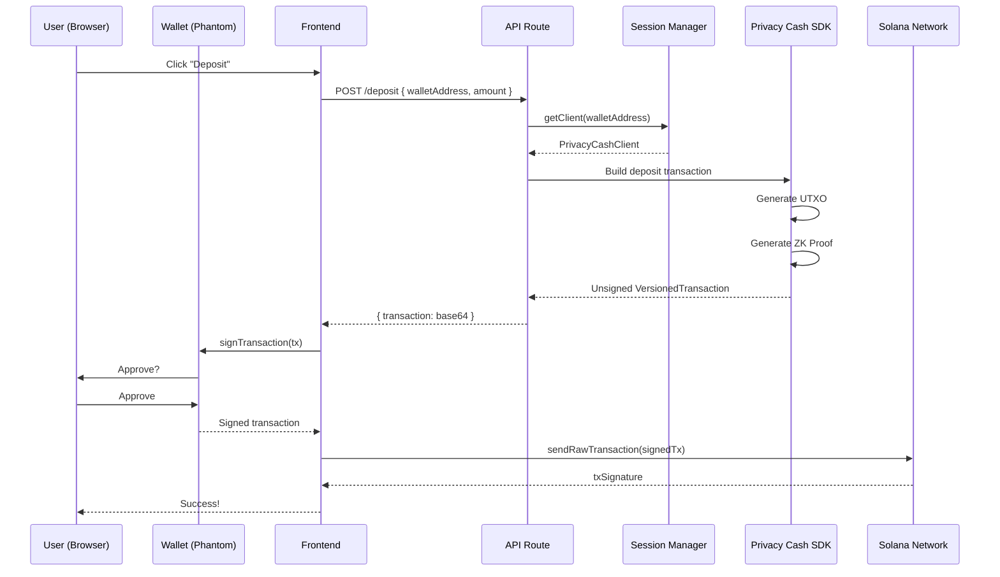
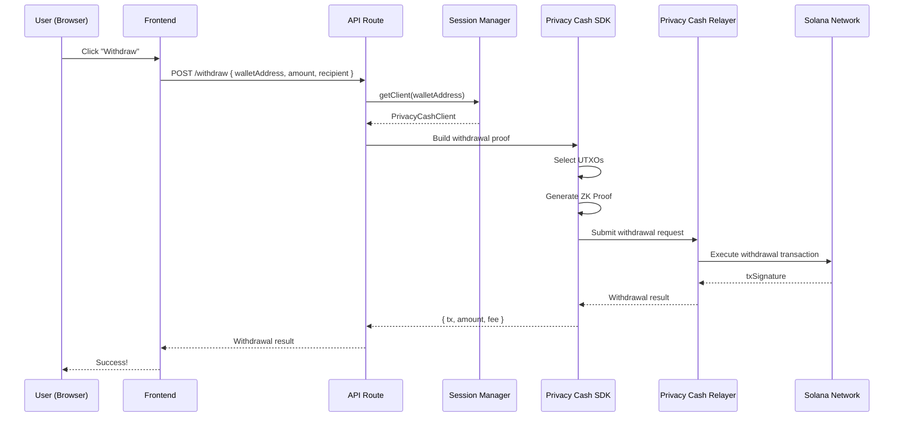

# 設計書: Vault Backend Integration

## アーキテクチャ概要

```
┌─────────────────────────────────────────────────────────────┐
│                      Frontend (Browser)                      │
│  ┌─────────────┐  ┌─────────────┐  ┌─────────────────────┐  │
│  │ Wallet      │  │ Sign        │  │ Sign Transaction    │  │
│  │ Connection  │→ │ Message     │→ │ (Deposit only)      │  │
│  └─────────────┘  └─────────────┘  └─────────────────────┘  │
└───────────────────────────┬─────────────────────────────────┘
                            │ API Calls
                            ▼
┌─────────────────────────────────────────────────────────────┐
│                   Next.js API Routes                         │
│  ┌─────────────┐  ┌─────────────┐  ┌─────────────────────┐  │
│  │ /init       │  │ /balance    │  │ /deposit, /withdraw │  │
│  │ Session Init│  │ Get Balance │  │ Build/Execute Tx    │  │
│  └──────┬──────┘  └──────┬──────┘  └──────────┬──────────┘  │
│         │                │                     │             │
│         ▼                ▼                     ▼             │
│  ┌─────────────────────────────────────────────────────────┐│
│  │              Session Manager (Redis/Memory)              ││
│  │   - Wallet Address → Encryption Key mapping              ││
│  │   - Session TTL management                               ││
│  └─────────────────────────────────────────────────────────┘│
│         │                │                     │             │
│         ▼                ▼                     ▼             │
│  ┌─────────────────────────────────────────────────────────┐│
│  │                Privacy Cash SDK (Node.js)                ││
│  │   - UTXO Management                                      ││
│  │   - ZK Proof Generation                                  ││
│  │   - Transaction Building                                 ││
│  └─────────────────────────────────────────────────────────┘│
└─────────────────────────────────────────────────────────────┘
                            │
                            ▼
┌─────────────────────────────────────────────────────────────┐
│                    Solana Network                            │
│  ┌─────────────┐  ┌─────────────────────────────────────┐   │
│  │ Privacy Cash│  │ Shield Pool (Subly Vault Program)   │   │
│  │ Program     │  │                                     │   │
│  └─────────────┘  └─────────────────────────────────────┘   │
└─────────────────────────────────────────────────────────────┘
```

## コンポーネント設計

### 1. Session Manager

#### 目的
ユーザーの暗号化キーを安全に管理し、API呼び出し間で保持する。

#### インターフェース
```typescript
interface SessionManager {
  // 署名から暗号化キーを導出して保存
  initializeSession(
    walletAddress: string,
    signature: Uint8Array
  ): Promise<{ sessionId: string }>;

  // セッションからPrivacy Cashクライアントを取得
  getClient(walletAddress: string): Promise<PrivacyCashClient | null>;

  // セッション破棄
  destroySession(walletAddress: string): Promise<void>;
}
```

#### 実装オプション
1. **In-Memory Store** (開発用)
   - Map<walletAddress, { encryptionKey, expiry }>
   - サーバー再起動でセッション消失

2. **Redis** (本番推奨)
   - 暗号化キーを暗号化して保存
   - TTL設定で自動期限切れ

### 2. Privacy Cash Service

#### 目的
Privacy Cash SDKのラッパーとして、APIルートから使用しやすいインターフェースを提供。

#### インターフェース
```typescript
interface PrivacyCashService {
  // 残高取得
  getBalance(client: PrivacyCashClient): Promise<{
    balance: number;
    baseUnits: number;
  }>;

  // 入金トランザクション構築（未署名）
  buildDepositTransaction(
    client: PrivacyCashClient,
    userPubkey: PublicKey,
    amount: number
  ): Promise<{
    transaction: VersionedTransaction;
    utxoData: UtxoData;
  }>;

  // 出金実行（リレーヤー経由）
  executeWithdrawal(
    client: PrivacyCashClient,
    amount: number,
    recipient?: string
  ): Promise<WithdrawResult>;
}
```

### 3. API Routes更新

#### `/api/privacy-cash/init`
```typescript
// 現在: セッション情報をメモリに保存
// 変更: EncryptionService.deriveEncryptionKeyFromSignature()を使用
//       セッションマネージャーに保存
```

#### `/api/privacy-cash/balance`
```typescript
// 現在: モックデータ返却
// 変更: セッションからクライアント取得
//       client.getPrivateBalanceUSDC()呼び出し
```

#### `/api/privacy-cash/deposit`
```typescript
// 現在: 空のトランザクション返却
// 変更: UTXO生成、ZKプルーフ生成
//       未署名VersionedTransaction返却
```

#### `/api/privacy-cash/withdraw`
```typescript
// 現在: モックデータ返却
// 変更: ZKプルーフ生成
//       リレーヤー経由で実行
```

## データフロー

### 入金フロー（詳細）



### 出金フロー（詳細）



## セキュリティ考慮事項

### 1. 暗号化キー管理
- 暗号化キーはサーバーメモリ内のみに保持
- 永続化する場合は追加の暗号化層を適用
- セッションTTL: 1時間（設定可能）

### 2. 入力バリデーション
- ウォレットアドレスの形式検証
- 金額の範囲検証（> 0, <= 残高）
- 署名の長さ検証（64バイト）

### 3. エラーハンドリング
- センシティブ情報をエラーメッセージに含めない
- スタックトレースは本番環境で非表示

## 環境変数

```bash
# Required
SOLANA_RPC_URL=https://api.mainnet-beta.solana.com

# Optional (for Redis session store)
REDIS_URL=redis://localhost:6379

# Session configuration
SESSION_TTL_SECONDS=3600

# Privacy Cash configuration
PRIVACY_CASH_DEBUG=false
```

## ファイル構成

```
apps/dashboard-vault/
├── app/
│   └── api/
│       └── privacy-cash/
│           ├── init/route.ts      # 更新
│           ├── balance/route.ts   # 更新
│           ├── deposit/route.ts   # 更新
│           └── withdraw/route.ts  # 更新
├── lib/
│   ├── session-manager.ts         # 新規
│   ├── privacy-cash-service.ts    # 新規
│   └── config.ts                  # 新規（環境変数）
└── ...
```
