# 機能設計書 (Functional Design Document)

## 概要

本ドキュメントはSublyの機能設計を定義する。Sublyは2つのプロトコルで構成される：

- **Protocol A: subly-membership** - 会員管理とプライバシー保護（Devnet）
- **Protocol B: subly-vault** - 資金運用とプライベート決済（Mainnet）

## システム構成図

### 全体アーキテクチャ

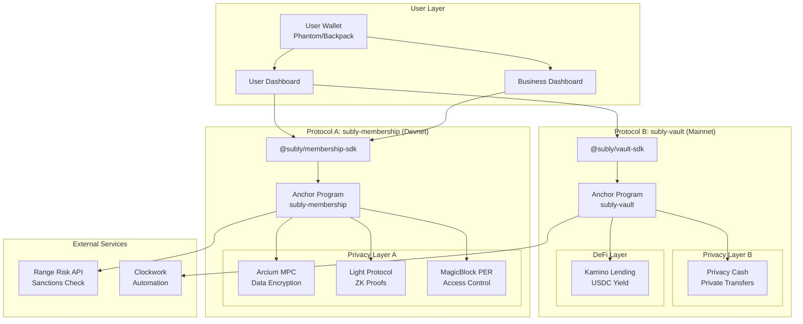
```mermaid
graph TB
    subgraph "User Layer"
        U[User Wallet<br/>Phantom/Backpack]
        BD[Business Dashboard]
        UD[User Dashboard]
    end

    subgraph "Protocol A: subly-membership (Devnet)"
        SDK_A["@subly/membership-sdk"]
        PA[Anchor Program<br/>subly-membership]

        subgraph "Privacy Layer A"
            ARC[Arcium MPC<br/>Data Encryption]
            LP[Light Protocol<br/>ZK Proofs]
            MB[MagicBlock PER<br/>Access Control]
        end
    end

    subgraph "Protocol B: subly-vault (Mainnet)"
        SDK_B["@subly/vault-sdk"]
        PB[Anchor Program<br/>subly-vault]

        subgraph "Privacy Layer B"
            PC[Privacy Cash<br/>Private Transfers]
        end

        subgraph "DeFi Layer"
            KL[Kamino Lending<br/>USDC Yield]
        end
    end

    subgraph "External Services"
        RR[Range Risk API<br/>Sanctions Check]
        CW[Clockwork<br/>Automation]
    end

    U --> BD
    U --> UD
    BD --> SDK_A
    UD --> SDK_A
    UD --> SDK_B
    SDK_A --> PA
    PA --> ARC
    PA --> LP
    PA --> MB
    SDK_B --> PB
    PB --> PC
    PB --> KL
    PA --> RR
    PB --> CW
```

### Protocol A 詳細アーキテクチャ

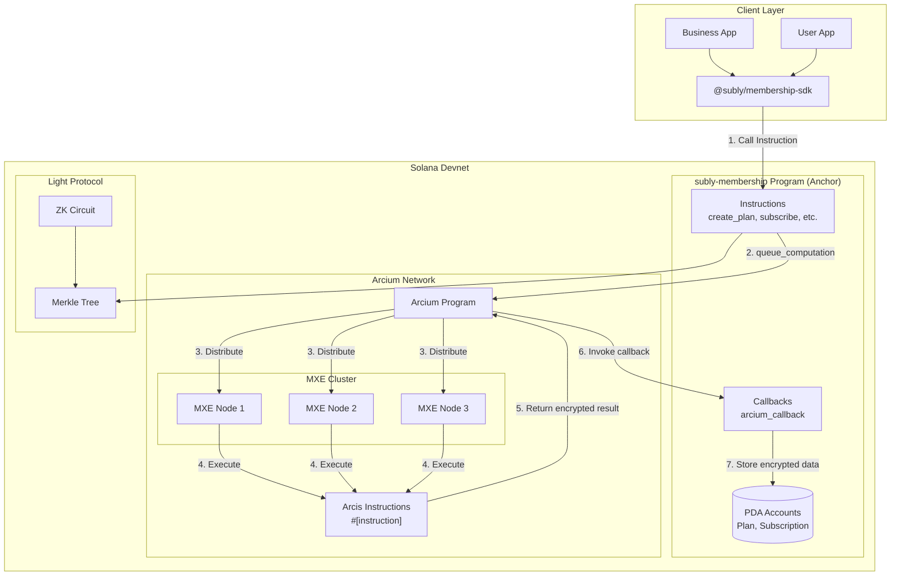
```mermaid
graph TB
    subgraph "Client Layer"
        BIZ[Business App]
        USR[User App]
        MS["@subly/membership-sdk"]
    end

    subgraph "Solana Devnet"
        subgraph "subly-membership Program (Anchor)"
            IX[Instructions<br/>create_plan, subscribe, etc.]
            CB[Callbacks<br/>arcium_callback]
            PDA[(PDA Accounts<br/>Plan, Subscription)]
        end

        subgraph "Arcium Network"
            ARC_PROG[Arcium Program]
            subgraph "MXE Cluster"
                MXE1[MXE Node 1]
                MXE2[MXE Node 2]
                MXE3[MXE Node 3]
            end
            ARCIS["Arcis Instructions<br/>#[instruction]"]
        end

        subgraph "Light Protocol"
            MT[Merkle Tree]
            ZKC[ZK Circuit]
        end
    end

    BIZ --> MS
    USR --> MS
    MS -->|1. Call Instruction| IX
    IX -->|2. queue_computation| ARC_PROG
    ARC_PROG -->|3. Distribute| MXE1
    ARC_PROG -->|3. Distribute| MXE2
    ARC_PROG -->|3. Distribute| MXE3
    MXE1 -->|4. Execute| ARCIS
    MXE2 -->|4. Execute| ARCIS
    MXE3 -->|4. Execute| ARCIS
    ARCIS -->|5. Return encrypted result| ARC_PROG
    ARC_PROG -->|6. Invoke callback| CB
    CB -->|7. Store encrypted data| PDA
    IX --> MT
    ZKC --> MT
```

### Arcium処理フロー

Arciumを使用したデータ処理は以下の流れで行われる：

```
┌─────────────────────────────────────────────────────────────────────────┐
│ 1. クライアント                                                          │
│    - データを暗号化（X25519公開鍵 + nonce）                              │
│    - Anchor命令を呼び出し                                                │
├─────────────────────────────────────────────────────────────────────────┤
│ 2. Anchor Program (オンチェーン)                                         │
│    - queue_computation() でArciumプログラムにCPI                         │
│    - 引数: 暗号化データ、計算オフセット、コールバックアカウント          │
├─────────────────────────────────────────────────────────────────────────┤
│ 3. Arcium Network (MXE)                                                  │
│    - 暗号化データを秘密分散（secret shares）に変換                       │
│    - #[instruction] で定義されたArcis回路を実行                          │
│    - 計算結果を暗号化して返却                                            │
├─────────────────────────────────────────────────────────────────────────┤
│ 4. Callback (オンチェーン)                                               │
│    - #[arcium_callback] で結果を受け取り                                 │
│    - 暗号化されたままPDAに保存                                           │
└─────────────────────────────────────────────────────────────────────────┘
```

### Protocol B 詳細アーキテクチャ

**設計方針: シールドプール方式**

ユーザーとKamino Lendingのリンクを断ち切るため、シールドプール（プライバシープール）を導入する。
参考: [Encifher](https://docs.encifher.io/docs) のプライバシーコプロセッサアーキテクチャ

```
┌─────────────────────────────────────────────────────────────────────────┐
│ 問題: 単純な設計ではプライバシーが保護されない                           │
├─────────────────────────────────────────────────────────────────────────┤
│ User Wallet → Privacy Cash → Vault PDA → Kamino                        │
│              (プライベート)   (公開)      (公開)                        │
│                                                                         │
│ → VaultからKaminoへの送金がオンチェーンで追跡可能                        │
│ → ユーザーの入金額・運用状況が推測可能                                   │
├─────────────────────────────────────────────────────────────────────────┤
│ 解決策: シールドプール方式                                               │
├─────────────────────────────────────────────────────────────────────────┤
│ User Wallet → Privacy Cash → Shield Pool (全ユーザー混合) → Kamino     │
│              (プライベート)   (プール単位で管理)           (プール単位)  │
│                                                                         │
│ - 個別ユーザーとKaminoポジションのリンクなし                            │
│ - ユーザーは「プール内シェア」を保持（暗号化）                          │
│ - 送金も Privacy Cash 経由でプライベートに実行                          │
└─────────────────────────────────────────────────────────────────────────┘
```

```mermaid
graph TB
    subgraph "Client Layer"
        USR[User Dashboard]
        VS["@subly/vault-sdk"]
        ZK[ZK Proof Generator<br/>クライアント側証明生成]
    end

    subgraph "Solana Mainnet"
        subgraph "subly-vault Program"
            DM[Deposit Manager]
            SM[Share Manager<br/>暗号化シェア管理]
            TM[Transfer Manager]
        end

        subgraph "Shield Pool"
            SP[(Shield Pool<br/>全ユーザーの資金を混合)]
            SS[Share State<br/>ユーザーシェア(暗号化)]
        end

        subgraph "Privacy Cash"
            PC_IN[depositSPL<br/>プライベート入金]
            PC_OUT[withdrawSPL<br/>プライベート出金]
        end

        subgraph "DeFi Layer"
            KL[Kamino Lending<br/>プール全体で運用]
        end

        subgraph "Automation"
            CW[Clockwork Thread<br/>定期送金実行]
        end
    end

    USR --> VS
    VS --> ZK
    ZK -->|ZK証明生成| VS
    VS -->|1. 入金要求 + ZK証明| DM
    DM -->|2. プライベート入金| PC_IN
    PC_IN -->|3. Shield Poolへ| SP
    SP -->|4. シェア記録| SM
    SM -->|5. 暗号化シェア保存| SS

    SP -->|プール全体で| KL

    VS -->|送金要求 + ZK証明| TM
    TM -->|ZK検証後シェア更新| SM
    SM --> SS
    TM -->|プライベート送金| PC_OUT
    CW -->|定期実行 + バッチ証明| TM
```

**シールドプールの特徴:**

1. **資金の混合**: 全ユーザーの資金がShield Poolで混合され、個別追跡が不可能
2. **シェアベース管理**: ユーザーは「プール内シェア」を保持（クライアント側ECIESで暗号化）
3. **プール単位のDeFi運用**: KaminoへはShield Pool全体として入金、個別ユーザーとのリンクなし
4. **プライベート送金**: 事業者への支払いもPrivacy Cash経由で秘匿化
5. **ZK証明による検証**: シェア更新の正当性はZK証明でオンチェーン検証

## データモデル定義

### Protocol A: subly-membership

#### ER図

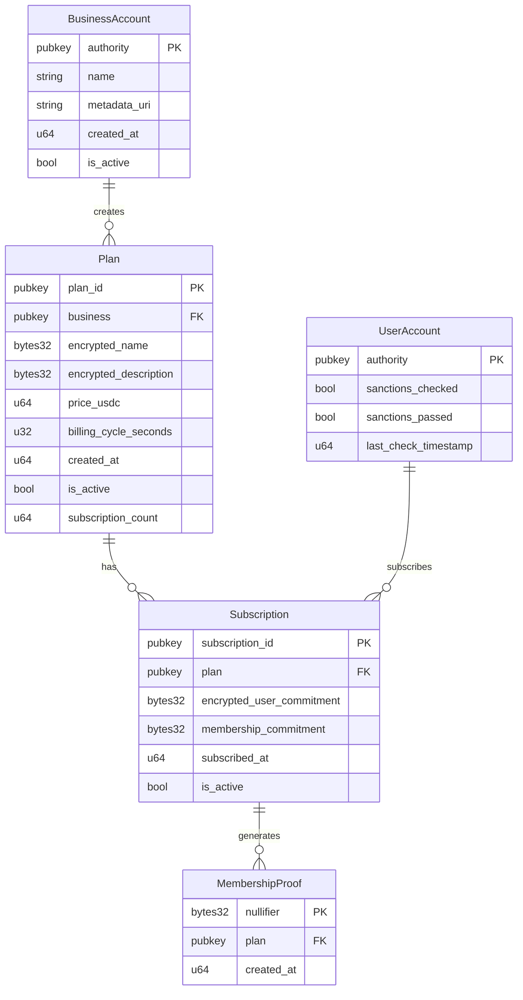
```mermaid
erDiagram
    BusinessAccount ||--o{ Plan : creates
    Plan ||--o{ Subscription : has
    UserAccount ||--o{ Subscription : subscribes
    Subscription ||--o{ MembershipProof : generates

    BusinessAccount {
        pubkey authority PK
        string name
        string metadata_uri
        u64 created_at
        bool is_active
    }

    Plan {
        pubkey plan_id PK
        pubkey business FK
        bytes32 encrypted_name
        bytes32 encrypted_description
        u64 price_usdc
        u32 billing_cycle_seconds
        u64 created_at
        bool is_active
        u64 subscription_count
    }

    UserAccount {
        pubkey authority PK
        bool sanctions_checked
        bool sanctions_passed
        u64 last_check_timestamp
    }

    Subscription {
        pubkey subscription_id PK
        pubkey plan FK
        bytes32 encrypted_user_commitment
        bytes32 membership_commitment
        u64 subscribed_at
        bool is_active
    }

    MembershipProof {
        bytes32 nullifier PK
        pubkey plan FK
        u64 created_at
    }
```

#### アカウント構造（Anchor）

```rust
// Business Account - 事業者情報
#[account]
pub struct BusinessAccount {
    pub authority: Pubkey,           // 事業者のウォレット
    pub name: String,                // 事業者名（平文、32文字まで）
    pub metadata_uri: String,        // メタデータURI（128文字まで）
    pub created_at: i64,             // 作成日時
    pub is_active: bool,             // 有効フラグ
    pub bump: u8,                    // PDAバンプ
}

// Plan - サブスクリプションプラン
#[account]
pub struct Plan {
    pub plan_id: Pubkey,             // プランID（PDA）
    pub business: Pubkey,            // 事業者アカウント
    pub encrypted_name: [u8; 32],    // 暗号化されたプラン名
    pub encrypted_description: [u8; 64], // 暗号化された説明
    pub price_usdc: u64,             // 価格（USDC、6桁精度）
    pub billing_cycle_seconds: u32,  // 課金周期（秒）
    pub created_at: i64,             // 作成日時
    pub is_active: bool,             // 有効フラグ
    pub subscription_count: u64,     // 契約数（誰かは分からない）
    pub bump: u8,
}

// User Account - ユーザー情報（制裁チェック用）
#[account]
pub struct UserAccount {
    pub authority: Pubkey,           // ユーザーのウォレット
    pub sanctions_checked: bool,     // 制裁チェック済みフラグ
    pub sanctions_passed: bool,      // 制裁チェック合格フラグ
    pub last_check_timestamp: i64,   // 最終チェック日時
    pub bump: u8,
}

// Subscription - サブスクリプション契約（暗号化）
#[account]
pub struct Subscription {
    pub subscription_id: Pubkey,     // サブスクリプションID
    pub plan: Pubkey,                // プランへの参照
    pub encrypted_user_commitment: [u8; 32], // 暗号化されたユーザーコミットメント
    pub membership_commitment: [u8; 32],     // Light Protocol用コミットメント
    pub subscribed_at: i64,          // 契約日時
    pub is_active: bool,             // 有効フラグ
    pub bump: u8,
}

// Membership Proof Nullifier - 証明の二重使用防止
#[account]
pub struct MembershipNullifier {
    pub nullifier: [u8; 32],         // ナリファイア
    pub plan: Pubkey,                // プラン
    pub created_at: i64,             // 作成日時
    pub bump: u8,
}

// MXE Account - Arcium MXEとの連携用（PersistentMXEAccountから派生）
#[account]
pub struct MxeAccount {
    pub bump: u8,
    // Arciumが管理する内部状態
}
```

#### PDA導出ルール - Protocol A

```rust
// ========================================
// PDA Seeds定義 - Protocol A
// ========================================

// BusinessAccount PDA
// 事業者ごとに1つのアカウント
seeds = [b"business", authority.key().as_ref()]
bump = business_bump

// Plan PDA
// 事業者ごとにプランを識別
seeds = [b"plan", business.key().as_ref(), &plan_nonce.to_le_bytes()]
bump = plan_bump
// plan_nonce: 事業者が作成したプランの連番（0, 1, 2, ...）

// Subscription PDA
// プラン × ユーザーコミットメントで一意
seeds = [b"subscription", plan.key().as_ref(), user_commitment.as_ref()]
bump = subscription_bump
// user_commitment: hash(secret || plan_id) - ユーザーを特定せずに契約を識別

// UserAccount PDA (制裁チェック用)
seeds = [b"user", authority.key().as_ref()]
bump = user_bump

// MembershipNullifier PDA
// 証明の二重使用防止
seeds = [b"nullifier", nullifier_hash.as_ref()]
bump = nullifier_bump

// MXE Account PDA
// Arcium統合用（プログラム全体で1つ）
seeds = [b"mxe", program_id.as_ref()]
bump = mxe_bump
```

#### アカウントサイズ計算 - Protocol A

```rust
// ========================================
// Account Space Calculations
// ========================================
// 計算式: 8 (discriminator) + 各フィールドのサイズ

impl BusinessAccount {
    pub const SPACE: usize = 8    // discriminator
        + 32                       // authority: Pubkey
        + 4 + 32                   // name: String (max 32 chars)
        + 4 + 128                  // metadata_uri: String (max 128 chars)
        + 8                        // created_at: i64
        + 1                        // is_active: bool
        + 1;                       // bump: u8
    // Total: 218 bytes
}

impl Plan {
    pub const SPACE: usize = 8    // discriminator
        + 32                       // plan_id: Pubkey
        + 32                       // business: Pubkey
        + 32                       // encrypted_name: [u8; 32]
        + 64                       // encrypted_description: [u8; 64]
        + 8                        // price_usdc: u64
        + 4                        // billing_cycle_seconds: u32
        + 8                        // created_at: i64
        + 1                        // is_active: bool
        + 8                        // subscription_count: u64 (または暗号化時は32)
        + 16                       // nonce: u128
        + 1;                       // bump: u8
    // Total: 214 bytes (平文カウント) / 238 bytes (暗号化カウント)
}

impl UserAccount {
    pub const SPACE: usize = 8    // discriminator
        + 32                       // authority: Pubkey
        + 1                        // sanctions_checked: bool
        + 1                        // sanctions_passed: bool
        + 8                        // last_check_timestamp: i64
        + 1;                       // bump: u8
    // Total: 51 bytes
}

impl Subscription {
    pub const SPACE: usize = 8    // discriminator
        + 32                       // subscription_id: Pubkey
        + 32                       // plan: Pubkey
        + 32                       // encrypted_user_commitment: [u8; 32]
        + 32                       // membership_commitment: [u8; 32]
        + 8                        // subscribed_at: i64
        + 8                        // cancelled_at: i64 (追加)
        + 1                        // is_active: bool
        + 16                       // nonce: u128
        + 1;                       // bump: u8
    // Total: 170 bytes
}

impl MembershipNullifier {
    pub const SPACE: usize = 8    // discriminator
        + 32                       // nullifier: [u8; 32]
        + 32                       // plan: Pubkey
        + 8                        // created_at: i64
        + 1                        // is_used: bool
        + 8                        // used_at: i64
        + 1;                       // bump: u8
    // Total: 90 bytes
}

impl MxeAccount {
    pub const SPACE: usize = 8    // discriminator
        + 1;                       // bump: u8
    // Total: 9 bytes
    // Note: Arciumが追加フィールドを必要とする場合は拡張
}
```

#### MXE Account統合詳細

Arcium MPCとの統合には、MXEクラスターとの通信設定が必要。

```
┌─────────────────────────────────────────────────────────────────────────┐
│ MXE Account初期化フロー                                                  │
├─────────────────────────────────────────────────────────────────────────┤
│                                                                         │
│  1. プログラムデプロイ時                                                 │
│     ┌─────────────────┐                                                │
│     │ initialize_mxe  │                                                │
│     │ (Admin only)    │                                                │
│     └────────┬────────┘                                                │
│              │                                                          │
│              ▼                                                          │
│     ┌─────────────────────────────────────────────────┐                │
│     │ MxeAccount PDA作成                              │                │
│     │ - seeds: [b"mxe", program_id]                   │                │
│     │ - Arcium Programに登録                          │                │
│     └─────────────────────────────────────────────────┘                │
│                                                                         │
│  2. 計算キュー時                                                         │
│     ┌─────────────────┐                                                │
│     │ queue_computation│                                               │
│     └────────┬────────┘                                                │
│              │                                                          │
│              ▼                                                          │
│     ┌─────────────────────────────────────────────────┐                │
│     │ Arcium Program                                  │                │
│     │ - MxeAccountの検証                              │                │
│     │ - 計算をMXEクラスターに分配                     │                │
│     └─────────────────────────────────────────────────┘                │
│                                                                         │
├─────────────────────────────────────────────────────────────────────────┤
│ 必要なArciumアカウント                                                   │
├─────────────────────────────────────────────────────────────────────────┤
│ Account                  │ Purpose                                     │
│──────────────────────────┼─────────────────────────────────────────────│
│ MxeAccount               │ プログラム固有のMXE設定                     │
│ ComputationAccount       │ 進行中の計算を追跡（一時的）               │
│ ArciumProgram            │ Arciumメインプログラム参照                  │
│ MxeClusterAccount        │ 使用するMXEクラスターの設定                │
├─────────────────────────────────────────────────────────────────────────┤
│ 初期化コード例                                                           │
└─────────────────────────────────────────────────────────────────────────┘
```

```rust
/// MXE Account初期化（プログラムデプロイ後に1回実行）
pub fn initialize_mxe(
    ctx: Context<InitializeMxe>,
    cluster_id: Pubkey,  // 使用するMXEクラスターのID
) -> Result<()> {
    let mxe = &mut ctx.accounts.mxe_account;
    mxe.bump = ctx.bumps.mxe_account;

    // Arcium Programに登録
    arcium_cpi::register_mxe(
        ctx.accounts.into_arcium_context(),
        cluster_id,
    )?;

    Ok(())
}

#[derive(Accounts)]
pub struct InitializeMxe<'info> {
    #[account(mut)]
    pub admin: Signer<'info>,

    #[account(
        init,
        payer = admin,
        space = MxeAccount::SPACE,
        seeds = [b"mxe", crate::ID.as_ref()],
        bump
    )]
    pub mxe_account: Account<'info, MxeAccount>,

    pub arcium_program: Program<'info, Arcium>,

    #[account(mut)]
    pub cluster_account: Account<'info, MxeClusterAccount>,

    pub system_program: Program<'info, System>,
}
```

#### Arcis命令設計（MXE内で実行）

ArciumのMXE内で実行される暗号化処理ロジック。`#[instruction]`マクロで定義。

**重要: Enc<Shared, T> と Enc<Mxe, T> の使い分け**

```
┌─────────────────────────────────────────────────────────────────────────┐
│ Enc<Shared, T>                                                          │
│ - クライアントとMXEが共有秘密鍵で暗号化したデータ                        │
│ - ユーザーが入力データを暗号化して送る時に使用                           │
│ - クライアントはx25519鍵交換 + RescueCipherで暗号化                      │
├─────────────────────────────────────────────────────────────────────────┤
│ Enc<Mxe, T>                                                             │
│ - MXEのみが復号可能な形式で暗号化されたデータ                            │
│ - プロトコル状態（契約数など）をオンチェーンに保存する時に使用           │
│ - PDAに保存されたデータは誰もオンチェーンで読めないが、MXEは復号可能     │
├─────────────────────────────────────────────────────────────────────────┤
│ 再暗号化 (Shared → Mxe) が必要なケース                                  │
│ - ユーザー入力を受け取り、それを使ってプロトコル状態を更新する場合       │
│ - 例: ユーザーの投票(Shared)を受け取り、投票集計(Mxe)を更新              │
│ - 更新後のデータはMxe形式でPDAに保存（MXEのみが次の計算で使用可能）      │
└─────────────────────────────────────────────────────────────────────────┘
```

```rust
// ========================================
// Arcis Instructions (MXE内で実行)
// ========================================
// 参考: https://github.com/arcium-hq/examples

use arcis::prelude::*;

/// 契約数の初期化
/// 新しいプランを作成時に、暗号化されたカウンター(0)を初期化
#[instruction]
pub fn init_subscription_count(
    nonce: u128,
) -> (Enc<Mxe, u64>, u128) {
    // 初期値0をMXE所有の暗号文として生成
    let initial_count: u64 = 0;
    let encrypted_count = Enc::<Mxe, u64>::from_arcis(initial_count);
    let new_nonce = nonce + 1;

    (encrypted_count, new_nonce)
}

/// サブスクリプション契約処理
/// ユーザーコミットメントを受け取り、契約数をインクリメント
///
/// 流れ:
/// 1. ユーザーがコミットメント(Shared)を暗号化して送信
/// 2. MXEが復号し、PDAの契約数(Mxe)も復号
/// 3. 契約数をインクリメント
/// 4. 結果をMxe形式で再暗号化してPDAに保存
#[instruction]
pub fn process_subscription(
    user_commitment: Enc<Shared, [u8; 32]>,  // ユーザーのコミットメント（ユーザーが暗号化）
    current_count_ctxt: Enc<Mxe, u64>,       // 現在の契約数（PDAから読み込み）
    nonce: u128,
) -> ([u8; 32], Enc<Mxe, u64>, u128) {
    // ユーザーコミットメントを復号（MPC内でのみ平文が見える）
    let commitment = user_commitment.to_arcis();

    // 契約数をインクリメント（暗号化されたまま計算）
    let count = current_count_ctxt.to_arcis();
    let new_count = count + 1;

    // 新しいカウントをMxe形式で再暗号化（MXEのみが復号可能）
    let encrypted_count = current_count_ctxt.owner.from_arcis(new_count);

    let new_nonce = nonce + 1;

    // コミットメントは平文で返す（Light ProtocolのMerkle Treeに追加するため）
    // 注: コミットメント自体はハッシュなので、ユーザーを特定できない
    (commitment.reveal(), encrypted_count, new_nonce)
}

/// 契約数の取得（復号化して公開）
/// 事業者が契約数のみを確認できるようにする
///
/// 注: 契約数は公開情報として扱う（誰が契約しているかは分からない）
#[instruction]
pub fn reveal_subscription_count(
    encrypted_count: Enc<Mxe, u64>,
) -> u64 {
    // 契約数のみを公開（個人情報は含まれない）
    encrypted_count.to_arcis().reveal()
}

/// サブスクリプション解約処理
/// 契約数をデクリメント
#[instruction]
pub fn process_unsubscription(
    current_count_ctxt: Enc<Mxe, u64>,
    nonce: u128,
) -> (Enc<Mxe, u64>, u128) {
    let count = current_count_ctxt.to_arcis();
    let new_count = if count > 0 { count - 1 } else { 0 };
    let encrypted_count = current_count_ctxt.owner.from_arcis(new_count);
    let new_nonce = nonce + 1;

    (encrypted_count, new_nonce)
}
```

**設計上の注意点:**

1. **プラン名・説明の暗号化は不要**
   - プラン名や説明は公開情報として扱う（ユーザーが見れる必要がある）
   - 暗号化が必要なのは「誰が契約しているか」という情報

2. **コミットメントの扱い**
   - ユーザーコミットメント = hash(secret || plan_id)
   - コミットメント自体はハッシュなので、平文で公開してもユーザーを特定できない
   - Light ProtocolのMerkle Treeに追加するために平文が必要

3. **契約数の暗号化**
   - 契約数はMxe形式で保存し、オンチェーンでは見えない
   - 事業者がreveal_subscription_countを呼ぶと平文で取得可能
   - これにより「プランXには5人の契約者がいる」ことは分かるが「誰か」は分からない

#### Anchor命令とArcisの連携

```rust
// ========================================
// Anchor Program Instructions
// ========================================

use anchor_lang::prelude::*;
use arcium_anchor::prelude::*;

/// プラン作成命令（Anchor）
/// queue_computation でArcium MPCを呼び出し、暗号化処理を実行
pub fn create_plan(
    ctx: Context<CreatePlan>,
    computation_offset: u64,
    name: [u8; 32],              // 暗号化された名前（クライアントで暗号化済み）
    description: [u8; 64],       // 暗号化された説明
    price_usdc: u64,
    billing_cycle_seconds: u32,
    encryption_pubkey: [u8; 32], // X25519公開鍵
    nonce: u128,
) -> Result<()> {
    // プランの基本情報を設定
    let plan = &mut ctx.accounts.plan;
    plan.business = ctx.accounts.business.key();
    plan.price_usdc = price_usdc;
    plan.billing_cycle_seconds = billing_cycle_seconds;
    plan.created_at = Clock::get()?.unix_timestamp;
    plan.is_active = true;
    plan.nonce = nonce;
    // 暗号化データは一時的に保存（コールバックで更新）
    plan.encrypted_name = [0; 32];
    plan.encrypted_description = [0; 64];
    plan.subscription_count = [0; 32]; // 暗号化された0

    // Arcium計算をキュー
    let args = vec![
        Argument::ArcisPubkey(encryption_pubkey),
        Argument::PlaintextU128(nonce),
        Argument::EncryptedBytes32(name),
        Argument::EncryptedBytes64(description),
    ];

    queue_computation(
        ctx.accounts,
        computation_offset,
        args,
        vec![CallbackAccount {
            pubkey: ctx.accounts.plan.key(),
            is_writable: true,
        }],
        None,
    )?;

    Ok(())
}

/// プラン作成のコールバック
#[arcium_callback(encrypted_ix = "encrypt_plan_metadata")]
pub fn create_plan_callback(
    ctx: Context<CreatePlanCallback>,
    output: ComputationOutputs,
) -> Result<()> {
    let bytes = match output {
        ComputationOutputs::Bytes(bytes) => bytes,
        _ => return Err(ErrorCode::InvalidComputationOutput.into()),
    };

    // 出力をパース
    // [0..16]: new_nonce
    // [16..48]: encrypted_name
    // [48..112]: encrypted_description
    let new_nonce: u128 = u128::from_le_bytes(bytes[0..16].try_into().unwrap());
    let encrypted_name: [u8; 32] = bytes[16..48].try_into().unwrap();
    let encrypted_description: [u8; 64] = bytes[48..112].try_into().unwrap();

    // PDAを更新
    let plan = &mut ctx.accounts.plan;
    plan.nonce = new_nonce;
    plan.encrypted_name = encrypted_name;
    plan.encrypted_description = encrypted_description;

    Ok(())
}

/// サブスクリプション契約命令（Anchor）
/// ユーザーがプランに契約する
pub fn subscribe(
    ctx: Context<Subscribe>,
    computation_offset: u64,
    encrypted_user_commitment: [u8; 32], // クライアントで暗号化済み
    encryption_pubkey: [u8; 32],
    nonce: u128,
) -> Result<()> {
    let plan = &ctx.accounts.plan;
    let subscription = &mut ctx.accounts.subscription;

    // プランが有効か確認
    require!(plan.is_active, MembershipError::PlanInactive);

    // サブスクリプションの基本情報を設定
    subscription.subscription_id = subscription.key();
    subscription.plan = plan.key();
    subscription.subscribed_at = Clock::get()?.unix_timestamp;
    subscription.is_active = true;
    subscription.nonce = nonce;

    // Arcium計算をキュー（契約数インクリメント + コミットメント処理）
    let args = vec![
        Argument::ArcisPubkey(encryption_pubkey),
        Argument::PlaintextU128(nonce),
        Argument::EncryptedBytes32(encrypted_user_commitment),
        Argument::EncryptedBytes32(plan.subscription_count), // 現在の暗号化カウント
    ];

    queue_computation(
        ctx.accounts,
        computation_offset,
        args,
        vec![
            CallbackAccount {
                pubkey: ctx.accounts.subscription.key(),
                is_writable: true,
            },
            CallbackAccount {
                pubkey: ctx.accounts.plan.key(),
                is_writable: true,
            },
        ],
        None,
    )?;

    Ok(())
}

/// サブスクリプション契約のコールバック
#[arcium_callback(encrypted_ix = "process_subscription")]
pub fn subscribe_callback(
    ctx: Context<SubscribeCallback>,
    output: ComputationOutputs,
) -> Result<()> {
    let bytes = match output {
        ComputationOutputs::Bytes(bytes) => bytes,
        _ => return Err(ErrorCode::InvalidComputationOutput.into()),
    };

    // 出力をパース
    // [0..32]: membership_commitment (Light Protocol用)
    // [32..64]: new_encrypted_count
    // [64..80]: new_nonce
    let membership_commitment: [u8; 32] = bytes[0..32].try_into().unwrap();
    let new_encrypted_count: [u8; 32] = bytes[32..64].try_into().unwrap();
    let new_nonce: u128 = u128::from_le_bytes(bytes[64..80].try_into().unwrap());

    // Subscription PDAを更新
    let subscription = &mut ctx.accounts.subscription;
    subscription.membership_commitment = membership_commitment;
    subscription.nonce = new_nonce;

    // Plan PDAの契約数を更新
    let plan = &mut ctx.accounts.plan;
    plan.subscription_count = new_encrypted_count;

    // Light ProtocolのMerkle Treeにコミットメントを追加
    light_protocol_cpi::add_leaf(
        ctx.accounts.into_light_protocol_context(),
        membership_commitment,
    )?;

    emit!(SubscriptionCreated {
        plan: plan.key(),
        commitment: membership_commitment,
        timestamp: Clock::get()?.unix_timestamp,
    });

    Ok(())
}

/// サブスクリプション解約命令（Anchor）
/// ユーザーがサブスクリプションを解約する
pub fn unsubscribe(
    ctx: Context<Unsubscribe>,
    computation_offset: u64,
    nullifier: [u8; 32],         // 解約用nullifier = hash(secret || "unsubscribe" || subscription_id)
    proof: Vec<u8>,              // 所有権証明（ZK証明）
    public_inputs: Vec<[u8; 32]>,
) -> Result<()> {
    let subscription = &ctx.accounts.subscription;
    let plan = &ctx.accounts.plan;
    let nullifier_account = &mut ctx.accounts.nullifier_account;

    // サブスクリプションが有効か確認
    require!(subscription.is_active, MembershipError::SubscriptionNotActive);

    // Nullifierの重複チェック（二重解約防止）
    require!(
        !nullifier_account.is_used,
        MembershipError::NullifierAlreadyUsed
    );

    // ZK証明を検証（ユーザーがこのサブスクリプションの所有者であることを証明）
    light_protocol_cpi::verify_proof(
        ctx.accounts.into_light_protocol_context(),
        &proof,
        &public_inputs,
    )?;

    // Nullifierを使用済みにマーク
    nullifier_account.nullifier = nullifier;
    nullifier_account.is_used = true;
    nullifier_account.used_at = Clock::get()?.unix_timestamp;

    // Arcium計算をキュー（契約数デクリメント）
    let args = vec![
        Argument::EncryptedBytes32(plan.subscription_count), // 現在の暗号化カウント
        Argument::PlaintextU128(subscription.nonce),
    ];

    queue_computation(
        ctx.accounts,
        computation_offset,
        args,
        vec![
            CallbackAccount {
                pubkey: ctx.accounts.subscription.key(),
                is_writable: true,
            },
            CallbackAccount {
                pubkey: ctx.accounts.plan.key(),
                is_writable: true,
            },
        ],
        None,
    )?;

    Ok(())
}

/// サブスクリプション解約のコールバック
#[arcium_callback(encrypted_ix = "process_unsubscription")]
pub fn unsubscribe_callback(
    ctx: Context<UnsubscribeCallback>,
    output: ComputationOutputs,
) -> Result<()> {
    let bytes = match output {
        ComputationOutputs::Bytes(bytes) => bytes,
        _ => return Err(ErrorCode::InvalidComputationOutput.into()),
    };

    // 出力をパース
    // [0..32]: new_encrypted_count
    // [32..48]: new_nonce
    let new_encrypted_count: [u8; 32] = bytes[0..32].try_into().unwrap();
    let new_nonce: u128 = u128::from_le_bytes(bytes[32..48].try_into().unwrap());

    // Plan PDAの契約数を更新
    let plan = &mut ctx.accounts.plan;
    plan.subscription_count = new_encrypted_count;
    plan.nonce = new_nonce;

    // Subscription PDAを無効化
    let subscription = &mut ctx.accounts.subscription;
    subscription.is_active = false;
    subscription.cancelled_at = Clock::get()?.unix_timestamp;

    // Light ProtocolのMerkle Treeからコミットメントを無効化
    // (実際にはnullifierを登録して証明を無効化)
    light_protocol_cpi::register_nullifier(
        ctx.accounts.into_light_protocol_context(),
        subscription.membership_commitment,
    )?;

    emit!(SubscriptionCancelled {
        plan: plan.key(),
        commitment: subscription.membership_commitment,
        timestamp: Clock::get()?.unix_timestamp,
    });

    Ok(())
}

// ========================================
// Account Contexts
// ========================================

#[derive(Accounts)]
pub struct Subscribe<'info> {
    #[account(mut)]
    pub payer: Signer<'info>,

    #[account(
        mut,
        constraint = plan.is_active @ MembershipError::PlanInactive
    )]
    pub plan: Account<'info, Plan>,

    #[account(
        init,
        payer = payer,
        space = Subscription::SPACE,
        seeds = [b"subscription", plan.key().as_ref(), &subscription_nonce.to_le_bytes()],
        bump
    )]
    pub subscription: Account<'info, Subscription>,

    pub subscription_nonce: u64,

    /// Arcium関連アカウント
    pub arcium_program: Program<'info, Arcium>,
    pub mxe_account: Account<'info, MxeAccount>,

    /// Light Protocol関連アカウント
    pub light_program: Program<'info, LightProtocol>,
    #[account(mut)]
    pub merkle_tree: AccountInfo<'info>,

    pub system_program: Program<'info, System>,
}

#[derive(Accounts)]
pub struct Unsubscribe<'info> {
    #[account(mut)]
    pub payer: Signer<'info>,

    #[account(
        mut,
        constraint = subscription.is_active @ MembershipError::SubscriptionNotActive
    )]
    pub subscription: Account<'info, Subscription>,

    #[account(mut)]
    pub plan: Account<'info, Plan>,

    #[account(
        init,
        payer = payer,
        space = MembershipNullifier::SPACE,
        seeds = [b"nullifier", subscription.key().as_ref()],
        bump
    )]
    pub nullifier_account: Account<'info, MembershipNullifier>,

    /// Arcium関連アカウント
    pub arcium_program: Program<'info, Arcium>,
    pub mxe_account: Account<'info, MxeAccount>,

    /// Light Protocol関連アカウント
    pub light_program: Program<'info, LightProtocol>,

    pub system_program: Program<'info, System>,
}
```

### Protocol B: subly-vault

#### ER図（シールドプール方式）

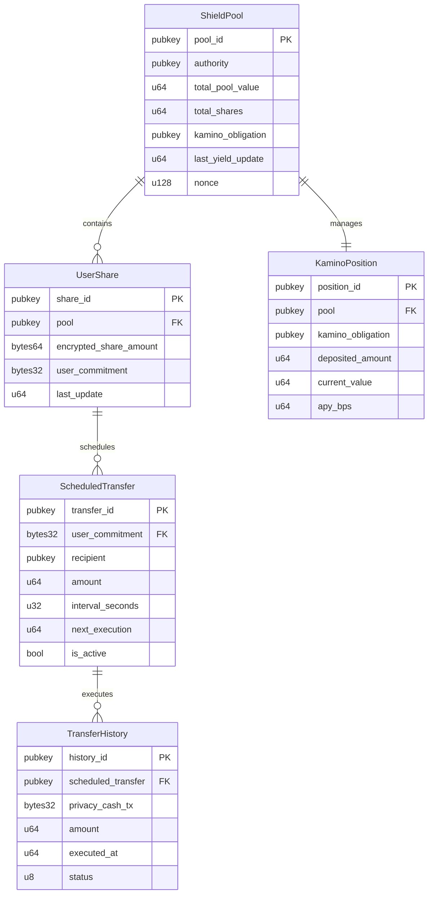
```mermaid
erDiagram
    ShieldPool ||--o{ UserShare : contains
    ShieldPool ||--|| KaminoPosition : manages
    UserShare ||--o{ ScheduledTransfer : schedules
    ScheduledTransfer ||--o{ TransferHistory : executes

    ShieldPool {
        pubkey pool_id PK
        pubkey authority
        u64 total_pool_value
        u64 total_shares
        pubkey kamino_obligation
        u64 last_yield_update
        u128 nonce
    }

    UserShare {
        pubkey share_id PK
        pubkey pool FK
        bytes64 encrypted_share_amount
        bytes32 user_commitment
        u64 last_update
    }

    KaminoPosition {
        pubkey position_id PK
        pubkey pool FK
        pubkey kamino_obligation
        u64 deposited_amount
        u64 current_value
        u64 apy_bps
    }

    ScheduledTransfer {
        pubkey transfer_id PK
        bytes32 user_commitment FK
        pubkey recipient
        u64 amount
        u32 interval_seconds
        u64 next_execution
        bool is_active
    }

    TransferHistory {
        pubkey history_id PK
        pubkey scheduled_transfer FK
        bytes32 privacy_cash_tx
        u64 amount
        u64 executed_at
        u8 status
    }
```

#### アカウント構造（Anchor）

```rust
// ========================================
// Shield Pool - 全ユーザーの資金を混合するプール
// ========================================

#[account]
pub struct ShieldPool {
    pub pool_id: Pubkey,             // プールのPDA
    pub authority: Pubkey,           // 管理者（プロトコル）
    pub total_pool_value: u64,       // プール全体の評価額（USDC）
    pub total_shares: u64,           // 発行済みシェア総数
    pub kamino_obligation: Pubkey,   // Kaminoのobligation（プール全体で1つ）
    pub last_yield_update: i64,      // 最終利回り更新日時
    pub nonce: u128,                 // 操作nonce（重複防止）
    pub bump: u8,
}

// ========================================
// User Share - ユーザーのプール内シェア（暗号化）
// ========================================
// 注: ユーザーとシェアの紐付けはコミットメントで行う
//     オンチェーンではユーザーアドレスを保存しない

#[account]
pub struct UserShare {
    pub share_id: Pubkey,            // シェアID（PDA）
    pub pool: Pubkey,                // Shield Poolへの参照
    pub encrypted_share_amount: [u8; 64], // 暗号化されたシェア量（ECIES: 32 nonce + 32 ciphertext）
    pub user_commitment: [u8; 32],   // ユーザーコミットメント = hash(secret || pool_id)
    pub last_update: i64,            // 最終更新日時
    pub bump: u8,
}

// ========================================
// Kamino Position - プール全体のDeFiポジション
// ========================================

#[account]
pub struct KaminoPosition {
    pub position_id: Pubkey,         // ポジションID
    pub pool: Pubkey,                // Shield Poolへの参照
    pub kamino_obligation: Pubkey,   // Kaminoのobligationアカウント
    pub deposited_amount: u64,       // 預け入れ額（プール全体）
    pub current_value: u64,          // 現在評価額
    pub apy_bps: u64,                // 現在のAPY（ベーシスポイント）
    pub last_update: i64,            // 最終更新日時
    pub bump: u8,
}

// ========================================
// Scheduled Transfer - 定期送金設定
// ========================================
// 注: user_commitmentで紐付け、ユーザーアドレスは保存しない

#[account]
pub struct ScheduledTransfer {
    pub transfer_id: Pubkey,         // 送金ID
    pub user_commitment: [u8; 32],   // ユーザーコミットメント（UserShareと紐付け）
    pub recipient: Pubkey,           // 送金先（事業者アドレス、公開）
    pub amount: u64,                 // 送金額（USDC）
    pub interval_seconds: u32,       // 送金間隔（秒）
    pub next_execution: i64,         // 次回実行予定日時
    pub is_active: bool,             // 有効フラグ
    pub bump: u8,
}

// ========================================
// Transfer History - 送金履歴
// ========================================

#[account]
pub struct TransferHistory {
    pub history_id: Pubkey,          // 履歴ID
    pub scheduled_transfer: Pubkey,  // 定期送金への参照
    pub privacy_cash_tx: [u8; 32],   // Privacy Cashトランザクション参照
    pub amount: u64,                 // 送金額
    pub executed_at: i64,            // 実行日時
    pub status: TransferStatus,      // ステータス
    pub bump: u8,
}

#[derive(AnchorSerialize, AnchorDeserialize, Clone, PartialEq, Eq)]
pub enum TransferStatus {
    Pending,
    Completed,
    Failed,
}

// ========================================
// Deposit History - 入金履歴（利益計算用）
// ========================================

#[account]
pub struct DepositHistory {
    pub history_id: Pubkey,          // 履歴ID
    pub pool: Pubkey,                // Shield Poolへの参照
    pub user_commitment: [u8; 32],   // ユーザーコミットメント（UserShareと紐付け）
    pub amount: u64,                 // 入金額（USDC）
    pub shares_received: u64,        // 受け取ったシェア数
    pub pool_value_at_deposit: u64,  // 入金時のプール評価額
    pub total_shares_at_deposit: u64, // 入金時の総シェア数
    pub deposited_at: i64,           // 入金日時
    pub bump: u8,
}
```

#### PDA導出ルール - Protocol B

```rust
// ========================================
// PDA Seeds定義 - Protocol B
// ========================================

// ShieldPool PDA
// プロトコル全体で1つ（または複数プール対応の場合はpool_nonce使用）
seeds = [b"shield_pool"]
bump = pool_bump
// 複数プール対応時: seeds = [b"shield_pool", &pool_nonce.to_le_bytes()]

// UserShare PDA
// プール × ユーザーコミットメントで一意
seeds = [b"share", pool.key().as_ref(), user_commitment.as_ref()]
bump = share_bump
// user_commitment: hash(secret || pool_id) - ユーザーを特定せずにシェアを識別

// KaminoPosition PDA
// プールごとに1つのDeFiポジション
seeds = [b"kamino_position", pool.key().as_ref()]
bump = position_bump

// ScheduledTransfer PDA
// ユーザーコミットメント × 連番で一意
seeds = [b"transfer", user_commitment.as_ref(), &transfer_nonce.to_le_bytes()]
bump = transfer_bump

// TransferHistory PDA
// 定期送金 × 実行回数で一意
seeds = [b"history", scheduled_transfer.key().as_ref(), &execution_index.to_le_bytes()]
bump = history_bump

// DepositHistory PDA
// ユーザーコミットメント × 入金連番で一意
seeds = [b"deposit_history", user_commitment.as_ref(), &deposit_index.to_le_bytes()]
bump = deposit_history_bump

// Nullifier PDA
// 二重使用防止
seeds = [b"nullifier", nullifier_hash.as_ref()]
bump = nullifier_bump

// WithdrawRequest PDA
// 出金リクエストごとに一意
seeds = [b"withdraw", user_commitment.as_ref(), &request_nonce.to_le_bytes()]
bump = request_bump

// BatchProofStorage PDA
// 定期送金 × インデックスで一意
seeds = [b"batch_proof", scheduled_transfer.key().as_ref(), &index.to_le_bytes()]
bump = batch_bump
```

#### アカウントサイズ計算 - Protocol B

```rust
// ========================================
// Account Space Calculations - Protocol B
// ========================================

impl ShieldPool {
    pub const SPACE: usize = 8    // discriminator
        + 32                       // pool_id: Pubkey
        + 32                       // authority: Pubkey
        + 8                        // total_pool_value: u64
        + 8                        // total_shares: u64
        + 32                       // kamino_obligation: Pubkey
        + 8                        // last_yield_update: i64
        + 16                       // nonce: u128
        + 1;                       // bump: u8
    // Total: 145 bytes
}

impl UserShare {
    pub const SPACE: usize = 8    // discriminator
        + 32                       // share_id: Pubkey
        + 32                       // pool: Pubkey
        + 64                       // encrypted_share_amount: [u8; 64]
        + 32                       // user_commitment: [u8; 32]
        + 8                        // last_update: i64
        + 1;                       // bump: u8
    // Total: 177 bytes
}

impl KaminoPosition {
    pub const SPACE: usize = 8    // discriminator
        + 32                       // position_id: Pubkey
        + 32                       // pool: Pubkey
        + 32                       // kamino_obligation: Pubkey
        + 8                        // deposited_amount: u64
        + 8                        // current_value: u64
        + 8                        // apy_bps: u64
        + 8                        // last_update: i64
        + 1;                       // bump: u8
    // Total: 137 bytes
}

impl ScheduledTransfer {
    pub const SPACE: usize = 8    // discriminator
        + 32                       // transfer_id: Pubkey
        + 32                       // user_commitment: [u8; 32]
        + 32                       // recipient: Pubkey
        + 8                        // amount: u64
        + 4                        // interval_seconds: u32
        + 8                        // next_execution: i64
        + 1                        // is_active: bool
        + 1                        // skip_count: u8 (追加: 連続スキップ回数)
        + 1;                       // bump: u8
    // Total: 127 bytes
}

impl TransferHistory {
    pub const SPACE: usize = 8    // discriminator
        + 32                       // history_id: Pubkey
        + 32                       // scheduled_transfer: Pubkey
        + 32                       // privacy_cash_tx: [u8; 32]
        + 8                        // amount: u64
        + 8                        // executed_at: i64
        + 1                        // status: TransferStatus (enum = 1 byte)
        + 1;                       // bump: u8
    // Total: 122 bytes
}

impl DepositHistory {
    pub const SPACE: usize = 8    // discriminator
        + 32                       // history_id: Pubkey
        + 32                       // pool: Pubkey
        + 32                       // user_commitment: [u8; 32]
        + 8                        // amount: u64
        + 8                        // shares_received: u64
        + 8                        // pool_value_at_deposit: u64
        + 8                        // total_shares_at_deposit: u64
        + 8                        // deposited_at: i64
        + 1;                       // bump: u8
    // Total: 145 bytes
}

impl Nullifier {
    pub const SPACE: usize = 8    // discriminator
        + 32                       // nullifier: [u8; 32]
        + 1                        // is_used: bool
        + 8                        // used_at: i64
        + 1                        // operation_type: OperationType (enum = 1 byte)
        + 1;                       // bump: u8
    // Total: 51 bytes
}

impl WithdrawRequest {
    pub const SPACE: usize = 8    // discriminator
        + 32                       // request_id: Pubkey
        + 32                       // commitment: [u8; 32]
        + 8                        // amount: u64
        + 1                        // status: WithdrawStatus (enum = 1 byte)
        + 1                        // retry_count: u8
        + 8                        // created_at: i64
        + 8                        // completed_at: i64
        + 8                        // expires_at: i64
        + 1;                       // bump: u8
    // Total: 107 bytes
}

impl BatchProofStorage {
    pub const SPACE: usize = 8    // discriminator
        + 32                       // transfer_id: Pubkey
        + 4                        // index: u32
        + 4 + 256                  // proof: Vec<u8> (max 256 bytes)
        + 4 + (32 * 8)             // public_inputs: Vec<[u8; 32]> (max 8 inputs)
        + 64                       // new_encrypted_share: [u8; 64]
        + 32                       // nullifier: [u8; 32]
        + 1                        // is_used: bool
        + 8                        // pool_value_at_generation: u64
        + 2                        // pool_value_tolerance_bps: u16
        + 1;                       // bump: u8
    // Total: 672 bytes
}
```

#### シールドプールのプライバシー保証

```
┌─────────────────────────────────────────────────────────────────────────┐
│ プライバシー保護のポイント                                               │
├─────────────────────────────────────────────────────────────────────────┤
│ 1. ユーザーアドレスを保存しない                                          │
│    - UserShareにはuser_commitment（ハッシュ）のみ保存                    │
│    - ユーザーは秘密値(secret)を知っていればシェアを主張可能              │
├─────────────────────────────────────────────────────────────────────────┤
│ 2. 入金の秘匿化                                                          │
│    - Privacy Cash経由で入金 → 入金元・金額が秘匿                         │
│    - Shield Poolへの入金は「プール全体への追加」として見える              │
├─────────────────────────────────────────────────────────────────────────┤
│ 3. シェア量の暗号化                                                      │
│    - encrypted_share_amountはECIES暗号化（ユーザー鍵で暗号化）           │
│    - オンチェーンでは誰のシェアがいくらか分からない                      │
│    - ZK証明で正当性を検証しつつプライベート情報は非公開                  │
├─────────────────────────────────────────────────────────────────────────┤
│ 4. Kaminoとのリンク断絶                                                  │
│    - KaminoへはShield Pool全体として入金                                 │
│    - 個別ユーザー ↔ Kaminoポジションのリンクが存在しない                │
├─────────────────────────────────────────────────────────────────────────┤
│ 5. 送金の秘匿化                                                          │
│    - Privacy Cash経由で送金 → 送金元が秘匿                               │
│    - 事業者には「誰かからUSDCが届いた」としか見えない                    │
└─────────────────────────────────────────────────────────────────────────┘
```

#### 暗号化方式とZK証明設計 - Protocol B

Protocol B（Mainnet）ではArciumを使用せず、**クライアント側暗号化 + ゼロ知識証明**を採用する。

**設計原則:**
- シェア量はユーザーの鍵で暗号化してオンチェーン保存
- 入金・出金・送金時にZK証明で正当性を検証
- Privacy Cashで送金プライバシーを担保

```
┌─────────────────────────────────────────────────────────────────────────┐
│ Protocol B 暗号化アーキテクチャ                                          │
├─────────────────────────────────────────────────────────────────────────┤
│ 暗号化方式: ECIES (Elliptic Curve Integrated Encryption Scheme)          │
│                                                                         │
│ encryption_key = derive_key(wallet_signature, pool_id, "subly-vault")   │
│ encrypted_share = encrypt(share_amount, encryption_key, nonce)          │
│                                                                         │
│ ユーザーはウォレット署名から鍵を導出 → シェア量を暗号化                 │
│ オンチェーンには暗号文のみ保存 → 第三者は金額を見れない                 │
│ ユーザーはウォレットがあれば常に復号可能                                │
├─────────────────────────────────────────────────────────────────────────┤
│ ZK証明の役割:                                                            │
│                                                                         │
│ 1. 入金証明: 「Privacy Cashから正当に入金した」ことを証明               │
│ 2. シェア更新証明: 「新旧シェアの差が入金/出金額と一致」を証明          │
│ 3. 所有権証明: 「このコミットメントの秘密を知っている」を証明           │
│ 4. 残高証明: 「シェア評価額 >= 出金/送金額」を証明                      │
└─────────────────────────────────────────────────────────────────────────┘
```

**シェア計算の数学的定義:**

```
┌─────────────────────────────────────────────────────────────────────────┐
│ シェア計算式（全てクライアント側で計算、ZK証明で検証）                   │
├─────────────────────────────────────────────────────────────────────────┤
│ 入金時のシェア計算:                                                       │
│   new_shares = deposit_amount * total_shares / total_pool_value         │
│   (プールが空の場合: new_shares = deposit_amount)                        │
├─────────────────────────────────────────────────────────────────────────┤
│ シェアの評価額計算:                                                       │
│   value = user_shares * total_pool_value / total_shares                 │
├─────────────────────────────────────────────────────────────────────────┤
│ 利回り分配:                                                              │
│   - シェア数は変わらない（暗号文も変わらない）                           │
│   - total_pool_valueが増加することでシェアの評価額が上がる               │
│   - 利回り = (current_value - deposited_amount) / deposited_amount      │
└─────────────────────────────────────────────────────────────────────────┘
```

#### ZK回路設計 - Protocol B

Light Protocolの圧縮アカウントとZK証明機能を活用する。

```
┌─────────────────────────────────────────────────────────────────────────┐
│ ZK回路一覧                                                               │
├─────────────────────────────────────────────────────────────────────────┤
│ 1. DepositProof - 入金証明                                               │
│    Public Inputs:                                                        │
│      - pool_id: プールのアドレス                                         │
│      - commitment: ユーザーコミットメント                                │
│      - new_encrypted_share: 新しい暗号化シェア                          │
│      - total_pool_value: 現在のプール価値                                │
│      - total_shares: 現在の総シェア数                                    │
│      - privacy_cash_note_nullifier: 入金ノートのnullifier               │
│    Private Inputs:                                                       │
│      - secret: ユーザーの秘密値                                          │
│      - deposit_amount: 入金額                                            │
│      - old_share_amount: 旧シェア量（初回は0）                           │
│      - encryption_key: 暗号化鍵                                          │
│    Constraints:                                                          │
│      - hash(secret || pool_id) == commitment                            │
│      - new_share = old_share + (deposit * total_shares / total_pool_value)
│      - decrypt(new_encrypted_share, encryption_key) == new_share        │
├─────────────────────────────────────────────────────────────────────────┤
│ 2. WithdrawProof - 出金証明                                              │
│    Public Inputs:                                                        │
│      - pool_id, commitment, old_encrypted_share, new_encrypted_share    │
│      - withdrawal_amount: 出金額                                         │
│      - total_pool_value, total_shares                                    │
│      - nullifier: この出金操作のnullifier                                │
│    Private Inputs:                                                       │
│      - secret, old_share_amount, encryption_key                          │
│    Constraints:                                                          │
│      - hash(secret || pool_id) == commitment                            │
│      - decrypt(old_encrypted_share, key) == old_share_amount            │
│      - share_value = old_share * total_pool_value / total_shares        │
│      - share_value >= withdrawal_amount                                  │
│      - shares_to_burn = withdrawal_amount * total_shares / total_pool_value
│      - new_share = old_share - shares_to_burn                           │
│      - nullifier = hash(secret || "withdraw" || nonce)                  │
├─────────────────────────────────────────────────────────────────────────┤
│ 3. TransferProof - 定期送金証明                                          │
│    Public Inputs:                                                        │
│      - 同上 + transfer_id, recipient                                     │
│    Private Inputs:                                                       │
│      - 同上                                                              │
│    Constraints:                                                          │
│      - 同上（送金額での検証）                                            │
└─────────────────────────────────────────────────────────────────────────┘
```

```typescript
// ZK回路の型定義（Circom/Light Protocol互換）

interface DepositProofInputs {
  // Public
  poolId: PublicKey;
  commitment: Uint8Array;
  newEncryptedShare: Uint8Array;
  totalPoolValue: bigint;
  totalShares: bigint;
  privacyCashNullifier: Uint8Array;

  // Private
  secret: Uint8Array;
  depositAmount: bigint;
  oldShareAmount: bigint;
  encryptionKey: Uint8Array;
}

interface WithdrawProofInputs {
  // Public
  poolId: PublicKey;
  commitment: Uint8Array;
  oldEncryptedShare: Uint8Array;
  newEncryptedShare: Uint8Array;
  withdrawalAmount: bigint;
  totalPoolValue: bigint;
  totalShares: bigint;
  nullifier: Uint8Array;

  // Private
  secret: Uint8Array;
  oldShareAmount: bigint;
  encryptionKey: Uint8Array;
}

// Light Protocol ZK Compression を使用したZK証明生成
async function generateDepositProof(
  inputs: DepositProofInputs
): Promise<{ proof: Uint8Array; publicInputs: Uint8Array[] }> {
  // Light Protocol SDKを使用
  const { proof, publicInputs } = await lightSdk.generateProof(
    'deposit_circuit',
    inputs
  );
  return { proof, publicInputs };
}
```

#### Anchor命令設計 - Protocol B（ZK証明ベース）

```rust
// ========================================
// Anchor Program Instructions - Protocol B
// ========================================
// ZK証明ベースのShield Pool実装

use anchor_lang::prelude::*;
use light_sdk::merkle_context::*;
use light_sdk::verify_proof::*;

/// 入金命令
/// Privacy Cashからの入金 + ZK証明でシェアを更新
pub fn deposit(
    ctx: Context<Deposit>,
    deposit_amount: u64,                   // 入金額（平文、Privacy Cashで検証済み）
    new_encrypted_share: [u8; 64],         // 新しい暗号化シェア
    proof: Vec<u8>,                        // ZK証明
    public_inputs: Vec<[u8; 32]>,          // 公開入力
) -> Result<()> {
    let pool = &mut ctx.accounts.shield_pool;
    let user_share = &mut ctx.accounts.user_share;

    // ZK証明を検証
    // - コミットメントの所有権
    // - シェア計算の正当性
    // - 暗号化の正当性
    verify_deposit_proof(
        &proof,
        &public_inputs,
        pool.pool_id,
        user_share.user_commitment,
        pool.total_pool_value,
        pool.total_shares,
    )?;

    // シェア計算（ZK証明で検証済みなのでオンチェーンでも計算）
    let new_shares = if pool.total_shares == 0 {
        deposit_amount
    } else {
        (deposit_amount as u128 * pool.total_shares as u128 / pool.total_pool_value as u128) as u64
    };

    // 状態更新
    user_share.encrypted_share_amount = new_encrypted_share;
    user_share.last_update = Clock::get()?.unix_timestamp;

    pool.total_shares += new_shares;
    pool.total_pool_value += deposit_amount;

    emit!(DepositEvent {
        pool: pool.pool_id,
        commitment: user_share.user_commitment,
        amount: deposit_amount,
        new_total_shares: pool.total_shares,
        new_total_value: pool.total_pool_value,
    });

    Ok(())
}

/// 出金命令
/// ZK証明でシェア所有と残高を検証して出金
pub fn withdraw(
    ctx: Context<Withdraw>,
    withdrawal_amount: u64,
    new_encrypted_share: [u8; 64],
    proof: Vec<u8>,
    public_inputs: Vec<[u8; 32]>,
    nullifier: [u8; 32],
) -> Result<()> {
    let pool = &mut ctx.accounts.shield_pool;
    let user_share = &mut ctx.accounts.user_share;
    let nullifier_account = &mut ctx.accounts.nullifier;

    // Nullifierの重複チェック（二重出金防止）
    require!(
        !nullifier_account.is_used,
        VaultError::NullifierAlreadyUsed
    );

    // ZK証明を検証
    verify_withdraw_proof(
        &proof,
        &public_inputs,
        pool.pool_id,
        user_share.user_commitment,
        user_share.encrypted_share_amount,
        new_encrypted_share,
        withdrawal_amount,
        pool.total_pool_value,
        pool.total_shares,
        nullifier,
    )?;

    // シェア計算
    let shares_to_burn = (withdrawal_amount as u128 * pool.total_shares as u128
        / pool.total_pool_value as u128) as u64;

    // 状態更新
    user_share.encrypted_share_amount = new_encrypted_share;
    user_share.last_update = Clock::get()?.unix_timestamp;

    pool.total_shares -= shares_to_burn;
    pool.total_pool_value -= withdrawal_amount;

    // Nullifierを使用済みにマーク
    nullifier_account.nullifier = nullifier;
    nullifier_account.is_used = true;
    nullifier_account.used_at = Clock::get()?.unix_timestamp;

    // 出金リクエストを作成（Privacy Cash経由で実行）
    let withdraw_request = &mut ctx.accounts.withdraw_request;
    withdraw_request.commitment = user_share.user_commitment;
    withdraw_request.amount = withdrawal_amount;
    withdraw_request.status = WithdrawStatus::Approved;
    withdraw_request.created_at = Clock::get()?.unix_timestamp;

    emit!(WithdrawEvent {
        pool: pool.pool_id,
        commitment: user_share.user_commitment,
        amount: withdrawal_amount,
        new_total_shares: pool.total_shares,
        new_total_value: pool.total_pool_value,
    });

    Ok(())
}

/// 定期送金設定
/// ユーザーがScheduledTransferを作成
pub fn create_scheduled_transfer(
    ctx: Context<CreateScheduledTransfer>,
    recipient: Pubkey,
    amount: u64,
    interval_seconds: u32,
    proof: Vec<u8>,                        // 所有権証明
    public_inputs: Vec<[u8; 32]>,
) -> Result<()> {
    let user_share = &ctx.accounts.user_share;

    // 所有権のZK証明を検証
    verify_ownership_proof(
        &proof,
        &public_inputs,
        user_share.user_commitment,
    )?;

    let transfer = &mut ctx.accounts.scheduled_transfer;
    transfer.transfer_id = transfer.key();
    transfer.user_commitment = user_share.user_commitment;
    transfer.recipient = recipient;
    transfer.amount = amount;
    transfer.interval_seconds = interval_seconds;
    transfer.next_execution = Clock::get()?.unix_timestamp + interval_seconds as i64;
    transfer.is_active = true;

    Ok(())
}

/// 定期送金実行（Clockworkからトリガー）
pub fn execute_scheduled_transfer(
    ctx: Context<ExecuteScheduledTransfer>,
    new_encrypted_share: [u8; 64],
    proof: Vec<u8>,
    public_inputs: Vec<[u8; 32]>,
    nullifier: [u8; 32],
) -> Result<()> {
    let transfer = &mut ctx.accounts.scheduled_transfer;
    let pool = &mut ctx.accounts.shield_pool;
    let user_share = &mut ctx.accounts.user_share;

    // 実行タイミングチェック
    require!(
        Clock::get()?.unix_timestamp >= transfer.next_execution,
        VaultError::TransferNotDue
    );

    // ZK証明を検証（残高確認 + シェア更新）
    verify_transfer_proof(
        &proof,
        &public_inputs,
        pool.pool_id,
        user_share.user_commitment,
        user_share.encrypted_share_amount,
        new_encrypted_share,
        transfer.amount,
        pool.total_pool_value,
        pool.total_shares,
        nullifier,
    )?;

    // シェア計算
    let shares_to_burn = (transfer.amount as u128 * pool.total_shares as u128
        / pool.total_pool_value as u128) as u64;

    // 状態更新
    user_share.encrypted_share_amount = new_encrypted_share;
    pool.total_shares -= shares_to_burn;
    pool.total_pool_value -= transfer.amount;

    // 次回実行日時を更新
    transfer.next_execution += transfer.interval_seconds as i64;

    // 送金履歴を記録
    let history = &mut ctx.accounts.transfer_history;
    history.scheduled_transfer = transfer.transfer_id;
    history.amount = transfer.amount;
    history.executed_at = Clock::get()?.unix_timestamp;
    history.status = TransferStatus::Pending; // Privacy Cash送金待ち

    // Privacy Cash送金はオフチェーンのcrankで実行

    Ok(())
}

// ZK証明検証関数
fn verify_deposit_proof(
    proof: &[u8],
    public_inputs: &[[u8; 32]],
    pool_id: Pubkey,
    commitment: [u8; 32],
    total_pool_value: u64,
    total_shares: u64,
) -> Result<()> {
    // Light Protocol SDKの検証関数を使用
    // 実際の実装ではlight-sdk crateを使用
    require!(
        light_sdk::verify_proof(
            DEPOSIT_VERIFYING_KEY,
            proof,
            public_inputs
        ),
        VaultError::InvalidProof
    );
    Ok(())
}

fn verify_withdraw_proof(
    proof: &[u8],
    public_inputs: &[[u8; 32]],
    pool_id: Pubkey,
    commitment: [u8; 32],
    old_encrypted_share: [u8; 64],
    new_encrypted_share: [u8; 64],
    withdrawal_amount: u64,
    total_pool_value: u64,
    total_shares: u64,
    nullifier: [u8; 32],
) -> Result<()> {
    require!(
        light_sdk::verify_proof(
            WITHDRAW_VERIFYING_KEY,
            proof,
            public_inputs
        ),
        VaultError::InvalidProof
    );
    Ok(())
}
```

#### Privacy Cash連携詳細

```
┌─────────────────────────────────────────────────────────────────────────┐
│ Privacy Cash 連携フロー（ZK証明ベース）                                  │
├─────────────────────────────────────────────────────────────────────────┤
│ 入金フロー:                                                              │
│ 1. ユーザーがPrivacy Cash SDKでdepositSPL()を呼び出し                   │
│ 2. USDCがPrivacy Cashのシールドプールに入金（秘匿化）                   │
│ 3. ユーザーがZK証明を生成（入金額、シェア計算の正当性）                 │
│ 4. Sublyがプログラム上でZK証明を検証し、シェアを発行                    │
├─────────────────────────────────────────────────────────────────────────┤
│ 出金フロー:                                                              │
│ 1. ユーザーがSublyで出金リクエスト + ZK証明                              │
│ 2. プログラムがZK証明を検証（残高確認、シェア更新の正当性）             │
│ 3. 出金リクエストがApprovedになり、crankがPrivacy Cashで送金            │
│ 4. ユーザーのウォレットにプライベート送金                                │
├─────────────────────────────────────────────────────────────────────────┤
│ 事業者への送金フロー:                                                    │
│ 1. Clockwork/crankが定期送金をトリガー                                   │
│ 2. ユーザーが事前に署名したZK証明を使用（または委任署名）               │
│ 3. プログラムがZK証明を検証、シェアを差し引き                            │
│ 4. crankがPrivacy Cash経由で事業者に送金                                │
│ 5. 事業者は「誰かからUSDCが届いた」としか見えない                        │
└─────────────────────────────────────────────────────────────────────────┘
```

**定期送金のZK証明事前生成について:**

```
┌─────────────────────────────────────────────────────────────────────────┐
│ 課題: ユーザー不在時の定期送金                                           │
├─────────────────────────────────────────────────────────────────────────┤
│ ZK証明はユーザーの秘密鍵が必要 → ユーザーがオフラインだと生成できない   │
├─────────────────────────────────────────────────────────────────────────┤
│ 解決策1: バッチ証明の事前生成                                            │
│ - ユーザーが定期送金設定時に、N回分のZK証明を事前生成                   │
│ - 各証明にnonce/indexを含め、順番に使用                                  │
│ - 証明が尽きたらユーザーに通知、追加生成を依頼                          │
├─────────────────────────────────────────────────────────────────────────┤
│ 解決策2: 委任キーの使用                                                  │
│ - ユーザーが「送金専用」の委任鍵を生成                                  │
│ - 委任鍵でZK証明を生成できるよう設計                                    │
│ - crankが委任鍵を使って都度ZK証明を生成                                 │
│ - セキュリティ: 委任鍵は送金のみ、出金は不可                            │
└─────────────────────────────────────────────────────────────────────────┘
```

```typescript
// Privacy Cash SDK 連携コード例（ZK証明ベース）

import { PrivacyCash } from 'privacycash';
import { generateProof, encryptShare } from '@subly/vault-sdk';

// Privacy Cash クライアント初期化
const privacyCash = new PrivacyCash({
  connection,
  wallet,
});

// ========================================
// 入金処理
// ========================================

async function depositToShieldPool(
  amount: number,
  userSecret: Uint8Array,
  poolId: PublicKey
): Promise<DepositResult> {
  // 1. Privacy Cashにプライベート入金
  const depositTx = await privacyCash.depositSPL({
    mint: USDC_MINT,
    amount: amount * 1_000_000, // 6 decimals
    commitment: 'confirmed',
  });

  // 2. 入金ノートのnullifierを取得
  const note = await privacyCash.getDepositNote(depositTx.signature);
  const privacyCashNullifier = note.nullifier;

  // 3. ユーザーコミットメント生成
  const commitment = await generateCommitment(userSecret, poolId);

  // 4. 暗号化鍵を導出（ウォレット署名から）
  const encryptionKey = await deriveEncryptionKey(wallet, poolId);

  // 5. 現在のシェア量を取得（既存ユーザーの場合）
  const existingShare = await getUserShare(poolId, commitment);
  const oldShareAmount = existingShare?.decryptedAmount ?? 0n;

  // 6. 新しいシェア量を計算
  const poolState = await getPoolState(poolId);
  const newShareAmount = calculateNewShares(
    oldShareAmount,
    BigInt(amount * 1_000_000),
    poolState.totalPoolValue,
    poolState.totalShares
  );

  // 7. 新しいシェアを暗号化
  const newEncryptedShare = await encryptShare(newShareAmount, encryptionKey);

  // 8. ZK証明を生成
  const { proof, publicInputs } = await generateProof('deposit', {
    poolId,
    commitment,
    newEncryptedShare,
    totalPoolValue: poolState.totalPoolValue,
    totalShares: poolState.totalShares,
    privacyCashNullifier,
    // Private inputs
    secret: userSecret,
    depositAmount: BigInt(amount * 1_000_000),
    oldShareAmount,
    encryptionKey,
  });

  // 9. Sublyに入金リクエスト
  const tx = await sublyProgram.methods
    .deposit(
      new BN(amount * 1_000_000),
      Array.from(newEncryptedShare),
      Array.from(proof),
      publicInputs.map(p => Array.from(p)),
    )
    .accounts({
      shieldPool: poolPda,
      userShare: userSharePda,
      // ... other accounts
    })
    .rpc();

  return { signature: tx, newShareAmount };
}

// ========================================
// 出金処理
// ========================================

async function withdrawFromShieldPool(
  amount: number,
  userSecret: Uint8Array,
  poolId: PublicKey,
  recipient?: PublicKey
): Promise<WithdrawResult> {
  // 1. 現在のシェア情報を取得
  const commitment = await generateCommitment(userSecret, poolId);
  const userShare = await getUserShare(poolId, commitment);
  const encryptionKey = await deriveEncryptionKey(wallet, poolId);

  // 2. シェアを復号
  const currentShareAmount = await decryptShare(
    userShare.encryptedShareAmount,
    encryptionKey
  );

  // 3. 出金後のシェアを計算
  const poolState = await getPoolState(poolId);
  const sharesToBurn = calculateSharesToBurn(
    BigInt(amount * 1_000_000),
    poolState.totalPoolValue,
    poolState.totalShares
  );
  const newShareAmount = currentShareAmount - sharesToBurn;

  // 4. 新しいシェアを暗号化
  const newEncryptedShare = await encryptShare(newShareAmount, encryptionKey);

  // 5. Nullifier生成（二重出金防止）
  const nonce = Date.now();
  const nullifier = await generateNullifier(userSecret, 'withdraw', nonce);

  // 6. ZK証明を生成
  const { proof, publicInputs } = await generateProof('withdraw', {
    poolId,
    commitment,
    oldEncryptedShare: userShare.encryptedShareAmount,
    newEncryptedShare,
    withdrawalAmount: BigInt(amount * 1_000_000),
    totalPoolValue: poolState.totalPoolValue,
    totalShares: poolState.totalShares,
    nullifier,
    // Private inputs
    secret: userSecret,
    oldShareAmount: currentShareAmount,
    encryptionKey,
  });

  // 7. 出金リクエスト送信
  const tx = await sublyProgram.methods
    .withdraw(
      new BN(amount * 1_000_000),
      Array.from(newEncryptedShare),
      Array.from(proof),
      publicInputs.map(p => Array.from(p)),
      Array.from(nullifier),
    )
    .accounts({
      shieldPool: poolPda,
      userShare: userSharePda,
      withdrawRequest: withdrawRequestPda,
      nullifier: nullifierPda,
      // ... other accounts
    })
    .rpc();

  // 8. crankが Privacy Cash経由で送金を実行
  // (非同期で処理される)

  return {
    signature: tx,
    amount: amount * 1_000_000,
    status: 'pending_transfer',
  };
}

// ========================================
// 定期送金設定（バッチ証明方式）
// ========================================

async function createScheduledTransfer(
  recipient: PublicKey,
  amount: number,
  intervalSeconds: number,
  numPrepaidProofs: number = 12, // 12回分の証明を事前生成
  userSecret: Uint8Array,
  poolId: PublicKey
): Promise<CreateTransferResult> {
  const commitment = await generateCommitment(userSecret, poolId);
  const encryptionKey = await deriveEncryptionKey(wallet, poolId);
  const userShare = await getUserShare(poolId, commitment);
  const poolState = await getPoolState(poolId);

  // 1. 所有権証明を生成
  const { proof: ownershipProof, publicInputs: ownershipInputs } =
    await generateProof('ownership', {
      commitment,
      secret: userSecret,
    });

  // 2. 定期送金を作成
  const tx = await sublyProgram.methods
    .createScheduledTransfer(
      recipient,
      new BN(amount * 1_000_000),
      intervalSeconds,
      Array.from(ownershipProof),
      ownershipInputs.map(p => Array.from(p)),
    )
    .accounts({
      userShare: userSharePda,
      scheduledTransfer: transferPda,
      // ... other accounts
    })
    .rpc();

  // 3. バッチ証明を事前生成
  const batchProofs = await generateBatchTransferProofs(
    numPrepaidProofs,
    userSecret,
    poolId,
    amount,
    userShare.encryptedShareAmount,
    poolState
  );

  // 4. バッチ証明をオンチェーンに保存（または暗号化してIPFS/Arweaveに）
  for (const batchProof of batchProofs) {
    await sublyProgram.methods
      .storeBatchProof(
        transferPda,
        batchProof.index,
        Array.from(batchProof.proof),
        batchProof.publicInputs.map(p => Array.from(p)),
        Array.from(batchProof.newEncryptedShare),
        Array.from(batchProof.nullifier),
      )
      .accounts({
        scheduledTransfer: transferPda,
        batchProofStorage: batchProofPda,
        // ... other accounts
      })
      .rpc();
  }

  return {
    transferId: transferPda,
    signature: tx,
    numPrepaidProofs,
  };
}

// バッチ証明生成ヘルパー
async function generateBatchTransferProofs(
  count: number,
  userSecret: Uint8Array,
  poolId: PublicKey,
  amount: number,
  currentEncryptedShare: Uint8Array,
  initialPoolState: PoolState
): Promise<BatchProof[]> {
  const proofs: BatchProof[] = [];
  const encryptionKey = await deriveEncryptionKey(wallet, poolId);
  const commitment = await generateCommitment(userSecret, poolId);

  let currentShareAmount = await decryptShare(currentEncryptedShare, encryptionKey);
  let currentEncrypted = currentEncryptedShare;
  // Note: プール状態は変動するため、証明生成時の状態を使用
  // 実行時に状態が変わっていた場合は証明が無効になる可能性がある
  // → 解決策: 証明にプール状態のレンジを含める、または都度再生成

  for (let i = 0; i < count; i++) {
    const sharesToBurn = calculateSharesToBurn(
      BigInt(amount * 1_000_000),
      initialPoolState.totalPoolValue,
      initialPoolState.totalShares
    );
    const newShareAmount = currentShareAmount - sharesToBurn;
    const newEncryptedShare = await encryptShare(newShareAmount, encryptionKey);

    const nullifier = await generateNullifier(
      userSecret,
      'scheduled_transfer',
      i
    );

    const { proof, publicInputs } = await generateProof('transfer', {
      poolId,
      commitment,
      oldEncryptedShare: currentEncrypted,
      newEncryptedShare,
      transferAmount: BigInt(amount * 1_000_000),
      nullifier,
      index: i,
      // Private inputs
      secret: userSecret,
      oldShareAmount: currentShareAmount,
      encryptionKey,
    });

    proofs.push({
      index: i,
      proof,
      publicInputs,
      newEncryptedShare,
      nullifier,
    });

    // 次のイテレーション用に更新
    currentShareAmount = newShareAmount;
    currentEncrypted = newEncryptedShare;
  }

  return proofs;
}
```

#### Kamino Lending連携詳細

```
┌─────────────────────────────────────────────────────────────────────────┐
│ Kamino Lending 連携設計                                                  │
├─────────────────────────────────────────────────────────────────────────┤
│ 原則:                                                                    │
│ - Shield Pool全体として1つのKamino obligationを持つ                     │
│ - 個別ユーザーとKaminoポジションのリンクは存在しない                    │
│ - プール全体の評価額でシェアの価値を計算                                │
│ - ユーザーのシェア量は暗号化されているため、個人の利益は秘匿           │
├─────────────────────────────────────────────────────────────────────────┤
│ 運用戦略:                                                                │
│ - プールの80%をKamino Lendingに預け入れ                                 │
│ - 20%は流動性バッファとしてプールに保持                                 │
│ - バッファが不足した場合はKaminoから引き出し                            │
├─────────────────────────────────────────────────────────────────────────┤
│ 利回り更新:                                                              │
│ - 1時間ごとにKaminoポジションの評価額を取得（crank実行）               │
│ - total_pool_valueを更新                                                 │
│ - シェアの価値は自動的に上昇（暗号化シェア量は変わらない）             │
├─────────────────────────────────────────────────────────────────────────┤
│ 利回りとプライバシー:                                                    │
│ - total_pool_value / total_shares は公開情報                            │
│ - 個人のシェア量は暗号化されているため、個人の利益は計算不可能         │
│ - ユーザーは自分のシェアを復号して利益を確認可能                        │
└─────────────────────────────────────────────────────────────────────────┘
```

```rust
// ========================================
// Kamino連携 Anchor命令
// ========================================

/// プール全体をKaminoに預け入れ
/// 誰でも呼び出し可能（crankとして機能）
pub fn deposit_to_kamino(
    ctx: Context<DepositToKamino>,
    amount: u64,
) -> Result<()> {
    let pool = &ctx.accounts.shield_pool;

    // 流動性バッファを確保（20%）
    let available_for_deposit = pool.total_pool_value * 80 / 100;
    let current_in_kamino = ctx.accounts.kamino_position.deposited_amount;
    let deposit_amount = available_for_deposit.saturating_sub(current_in_kamino);

    require!(deposit_amount > 0, VaultError::NoDepositNeeded);
    require!(amount <= deposit_amount, VaultError::ExceedsAvailable);

    // Kamino CPIでdeposit
    kamino_cpi::deposit(
        ctx.accounts.into_kamino_deposit_context(),
        amount,
    )?;

    // KaminoPosition更新
    let position = &mut ctx.accounts.kamino_position;
    position.deposited_amount += amount;
    position.last_update = Clock::get()?.unix_timestamp;

    Ok(())
}

/// Kaminoから引き出し（流動性確保）
/// 出金リクエストがある場合に自動実行
pub fn withdraw_from_kamino(
    ctx: Context<WithdrawFromKamino>,
    amount: u64,
) -> Result<()> {
    // Kamino CPIでwithdraw
    kamino_cpi::withdraw(
        ctx.accounts.into_kamino_withdraw_context(),
        amount,
    )?;

    // KaminoPosition更新
    let position = &mut ctx.accounts.kamino_position;
    position.deposited_amount = position.deposited_amount.saturating_sub(amount);
    position.last_update = Clock::get()?.unix_timestamp;

    Ok(())
}

/// プール評価額の更新（定期実行）
/// crankが1時間ごとに呼び出し
pub fn update_pool_value(
    ctx: Context<UpdatePoolValue>,
) -> Result<()> {
    // Kaminoからポジションの現在価値を取得
    let kamino_value = kamino_cpi::get_position_value(
        ctx.accounts.kamino_obligation.key(),
    )?;

    // プール内の流動性バッファ
    let buffer_balance = ctx.accounts.pool_token_account.amount;

    // 総評価額を更新
    let pool = &mut ctx.accounts.shield_pool;
    let old_value = pool.total_pool_value;
    pool.total_pool_value = kamino_value + buffer_balance;
    pool.last_yield_update = Clock::get()?.unix_timestamp;

    // KaminoPosition更新
    let position = &mut ctx.accounts.kamino_position;
    position.current_value = kamino_value;

    // APY計算（概算）
    if position.deposited_amount > 0 {
        let profit = kamino_value.saturating_sub(position.deposited_amount);
        let time_elapsed = Clock::get()?.unix_timestamp - position.last_update;
        if time_elapsed > 0 {
            let days_elapsed = time_elapsed as u64 / 86400;
            if days_elapsed > 0 {
                position.apy_bps = (profit * 10000 * 365) / (position.deposited_amount * days_elapsed);
            }
        }
    }

    emit!(PoolValueUpdated {
        pool: pool.pool_id,
        old_value,
        new_value: pool.total_pool_value,
        apy_bps: position.apy_bps,
    });

    Ok(())
}

/// 出金リクエストの処理（Privacy Cash送金）
/// crankがペンディング状態の出金をPrivacy Cash経由で送金
pub fn process_withdraw_request(
    ctx: Context<ProcessWithdrawRequest>,
) -> Result<()> {
    let request = &mut ctx.accounts.withdraw_request;

    require!(
        request.status == WithdrawStatus::Approved,
        VaultError::InvalidRequestStatus
    );

    // プールの流動性を確認
    let pool_balance = ctx.accounts.pool_token_account.amount;

    if pool_balance < request.amount {
        // Kaminoから引き出しが必要
        let needed = request.amount - pool_balance;
        // withdraw_from_kamino を別途呼び出し
        return Err(VaultError::InsufficientLiquidity.into());
    }

    // Privacy Cash経由で送金（PDA署名）
    // 注: 実際の実装ではPrivacy Cash SDKのCPIを使用
    privacy_cash_cpi::withdraw_spl(
        ctx.accounts.into_privacy_cash_context(),
        request.amount,
    )?;

    // ステータス更新
    request.status = WithdrawStatus::Completed;
    request.completed_at = Clock::get()?.unix_timestamp;

    Ok(())
}

/// 定期送金の実行（Privacy Cash送金）
/// crankがペンディング状態の送金をPrivacy Cash経由で実行
pub fn process_transfer_payment(
    ctx: Context<ProcessTransferPayment>,
) -> Result<()> {
    let history = &mut ctx.accounts.transfer_history;
    let transfer = &ctx.accounts.scheduled_transfer;

    require!(
        history.status == TransferStatus::Pending,
        VaultError::InvalidTransferStatus
    );

    // プールの流動性を確認
    let pool_balance = ctx.accounts.pool_token_account.amount;

    if pool_balance < history.amount {
        // Kaminoから引き出しが必要
        return Err(VaultError::InsufficientLiquidity.into());
    }

    // Privacy Cash経由で事業者に送金（PDA署名）
    let privacy_cash_tx = privacy_cash_cpi::withdraw_spl_to(
        ctx.accounts.into_privacy_cash_context(),
        transfer.recipient,
        history.amount,
    )?;

    // ステータス更新
    history.status = TransferStatus::Completed;
    history.privacy_cash_tx = privacy_cash_tx;
    history.executed_at = Clock::get()?.unix_timestamp;

    Ok(())
}
```

```typescript
// Kamino SDK 連携コード例

import { Kamino } from '@kamino-finance/klend-sdk';

// Kamino クライアント初期化
const kamino = new Kamino('mainnet-beta', connection);

// ========================================
// プール → Kamino 預け入れ（Crank）
// ========================================

async function depositPoolToKamino(
  poolPda: PublicKey,
  amount: number
): Promise<string> {
  const tx = await sublyProgram.methods
    .depositToKamino(new BN(amount * 1_000_000))
    .accounts({
      shieldPool: poolPda,
      kaminoPosition: kaminoPositionPda,
      kaminoObligation: obligationPda,
      kaminoMarket: USDC_MARKET,
      poolTokenAccount: poolUsdcAccount,
      kaminoProgram: KAMINO_PROGRAM_ID,
      kaminoReserve: USDC_RESERVE,
    })
    .rpc();

  return tx;
}

// ========================================
// プール評価額更新（Crank）
// ========================================

async function updatePoolValue(
  poolPda: PublicKey
): Promise<string> {
  const tx = await sublyProgram.methods
    .updatePoolValue()
    .accounts({
      shieldPool: poolPda,
      kaminoPosition: kaminoPositionPda,
      kaminoObligation: obligationPda,
      poolTokenAccount: poolUsdcAccount,
    })
    .rpc();

  return tx;
}

// ========================================
// Clockworkで定期実行をセットアップ
// ========================================

async function setupCrankJobs(
  poolPda: PublicKey
): Promise<{ valueUpdateThread: PublicKey; withdrawThread: PublicKey }> {
  // 1. プール評価額更新（1時間ごと）
  const valueUpdateThread = await clockwork.threadCreate({
    id: `pool-value-${poolPda.toBase58().slice(0, 8)}`,
    kickoffInstruction: await sublyProgram.methods
      .updatePoolValue()
      .accounts({
        shieldPool: poolPda,
        kaminoPosition: kaminoPositionPda,
      })
      .instruction(),
    trigger: {
      cron: {
        schedule: '0 * * * *', // 毎時0分
        skippable: true,
      },
    },
  });

  // 2. 出金処理（10分ごと）
  const withdrawThread = await clockwork.threadCreate({
    id: `withdraw-${poolPda.toBase58().slice(0, 8)}`,
    kickoffInstruction: await sublyProgram.methods
      .processPendingWithdrawals()
      .accounts({
        shieldPool: poolPda,
      })
      .instruction(),
    trigger: {
      cron: {
        schedule: '*/10 * * * *', // 10分ごと
        skippable: true,
      },
    },
  });

  return { valueUpdateThread, withdrawThread };
}

// ========================================
// ユーザー向け: 現在の利回りを確認
// ========================================

async function getYieldInfo(
  poolPda: PublicKey,
  userSecret: Uint8Array
): Promise<YieldInfo> {
  const pool = await sublyProgram.account.shieldPool.fetch(poolPda);
  const position = await sublyProgram.account.kaminoPosition.fetch(
    kaminoPositionPda
  );
  const commitment = await generateCommitment(userSecret, poolPda);
  const userShare = await getUserShare(poolPda, commitment);
  const encryptionKey = await deriveEncryptionKey(wallet, poolPda);

  // シェアを復号
  const shareAmount = await decryptShare(
    userShare.encryptedShareAmount,
    encryptionKey
  );

  // 評価額を計算
  const shareValue = (shareAmount * pool.totalPoolValue) / pool.totalShares;

  // 原価を計算（入金履歴から）
  const depositHistory = await getDepositHistory(poolPda, commitment);
  const totalDeposited = depositHistory.reduce((sum, d) => sum + d.amount, 0n);

  // 利益を計算
  const profit = shareValue - totalDeposited;
  const yieldPercent = totalDeposited > 0n
    ? Number((profit * 10000n) / totalDeposited) / 100
    : 0;

  return {
    shareAmount,
    shareValue,
    totalDeposited,
    profit,
    yieldPercent,
    poolApy: Number(position.apyBps) / 100,
    lastUpdate: new Date(pool.lastYieldUpdate * 1000),
  };
}
```

#### Clockwork統合詳細シーケンス図

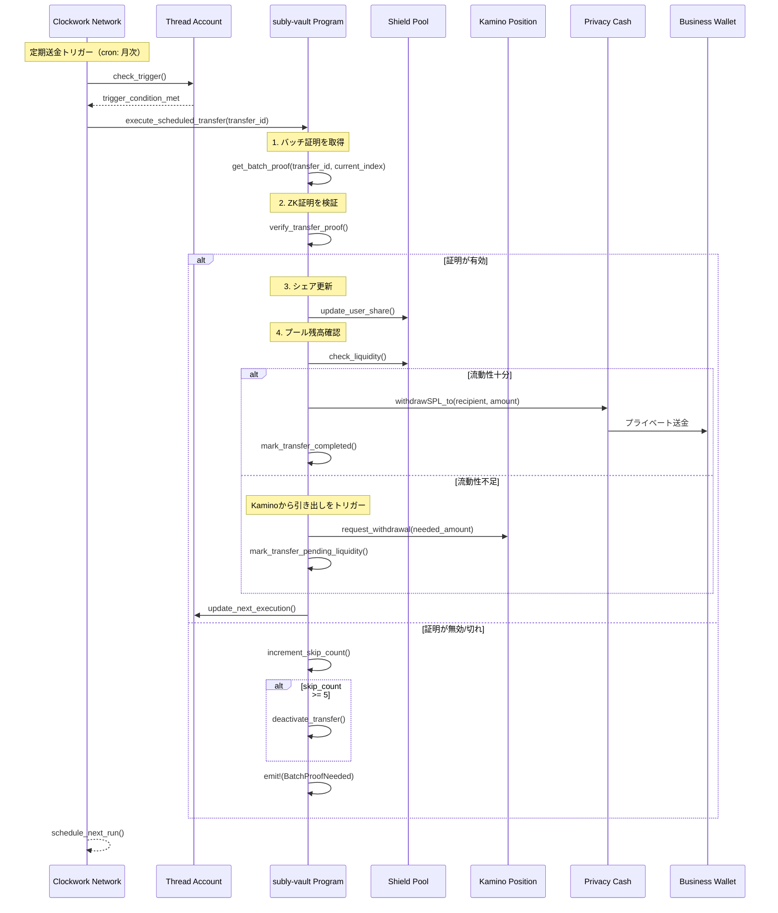
```mermaid
sequenceDiagram
    participant CW as Clockwork Network
    participant TH as Thread Account
    participant PB as subly-vault Program
    participant SP as Shield Pool
    participant KP as Kamino Position
    participant PC as Privacy Cash
    participant B as Business Wallet

    Note over CW: 定期送金トリガー（cron: 月次）

    CW->>TH: check_trigger()
    TH-->>CW: trigger_condition_met

    CW->>PB: execute_scheduled_transfer(transfer_id)

    Note over PB: 1. バッチ証明を取得

    PB->>PB: get_batch_proof(transfer_id, current_index)

    Note over PB: 2. ZK証明を検証

    PB->>PB: verify_transfer_proof()

    alt 証明が有効
        Note over PB: 3. シェア更新
        PB->>SP: update_user_share()

        Note over PB: 4. プール残高確認
        PB->>SP: check_liquidity()

        alt 流動性十分
            PB->>PC: withdrawSPL_to(recipient, amount)
            PC->>B: プライベート送金
            PB->>PB: mark_transfer_completed()
        else 流動性不足
            Note over PB: Kaminoから引き出しをトリガー
            PB->>KP: request_withdrawal(needed_amount)
            PB->>PB: mark_transfer_pending_liquidity()
        end

        PB->>TH: update_next_execution()
    else 証明が無効/切れ
        PB->>PB: increment_skip_count()
        alt skip_count >= 5
            PB->>PB: deactivate_transfer()
        end
        PB->>PB: emit!(BatchProofNeeded)
    end

    CW-->>CW: schedule_next_run()
```

#### Crank処理インフラ設計

```
┌─────────────────────────────────────────────────────────────────────────┐
│ Crank処理アーキテクチャ                                                  │
├─────────────────────────────────────────────────────────────────────────┤
│                                                                         │
│  ┌─────────────────┐    ┌─────────────────┐    ┌─────────────────┐    │
│  │   Clockwork     │    │   Helius        │    │   Self-hosted   │    │
│  │   Network       │    │   Webhooks      │    │   Crank         │    │
│  │   (Primary)     │    │   (Fallback)    │    │   (Emergency)   │    │
│  └────────┬────────┘    └────────┬────────┘    └────────┬────────┘    │
│           │                      │                      │              │
│           └──────────────────────┼──────────────────────┘              │
│                                  │                                      │
│                                  ▼                                      │
│                    ┌─────────────────────────┐                         │
│                    │   subly-vault Program   │                         │
│                    └─────────────────────────┘                         │
│                                                                         │
├─────────────────────────────────────────────────────────────────────────┤
│ 実行タイミング                                                           │
├─────────────────────────────────────────────────────────────────────────┤
│ Job                        │ Frequency      │ Trigger                  │
│────────────────────────────┼────────────────┼──────────────────────────│
│ update_pool_value          │ 1時間ごと      │ Clockwork cron           │
│ deposit_to_kamino          │ 条件ベース     │ buffer < 20% threshold   │
│ process_withdraw_requests  │ 10分ごと       │ Clockwork cron           │
│ execute_scheduled_transfer │ 条件ベース     │ next_execution reached   │
│ process_transfer_payments  │ 10分ごと       │ Clockwork cron           │
├─────────────────────────────────────────────────────────────────────────┤
│ フェイルオーバー設計                                                      │
├─────────────────────────────────────────────────────────────────────────┤
│ 1. Primary: Clockwork Network                                          │
│    - Thread-based automation                                           │
│    - 自動リトライ（最大3回）                                            │
│    - Fee: SOL per execution                                            │
│                                                                         │
│ 2. Fallback: Helius Webhooks                                           │
│    - Account変更監視（WithdrawRequest, ScheduledTransfer）             │
│    - Clockworkが30分以上未実行の場合にトリガー                         │
│    - AWS Lambda経由で実行                                               │
│                                                                         │
│ 3. Emergency: Self-hosted Crank                                        │
│    - EC2/Cloud Run上のNode.jsプロセス                                  │
│    - 1時間以上未実行の緊急時のみ起動                                   │
│    - PagerDutyアラート連携                                              │
├─────────────────────────────────────────────────────────────────────────┤
│ 監視・アラート                                                           │
├─────────────────────────────────────────────────────────────────────────┤
│ - Datadog: Crank実行成功率、レイテンシ                                  │
│ - PagerDuty: 30分以上の実行遅延でアラート                               │
│ - Slack: 日次サマリー（実行件数、失敗件数、スキップ件数）               │
└─────────────────────────────────────────────────────────────────────────┘
```

```typescript
// Crank設定例（Clockwork Thread）

interface CrankConfig {
  // プール評価額更新
  poolValueUpdate: {
    schedule: '0 * * * *';           // 毎時0分
    maxRetries: 3;
    retryDelayMs: 30000;
    priority: 'high';
  };

  // 出金処理
  withdrawProcessing: {
    schedule: '*/10 * * * *';        // 10分ごと
    maxRetries: 3;
    retryDelayMs: 60000;
    priority: 'high';
  };

  // 定期送金実行
  scheduledTransfers: {
    schedule: null;                   // 条件ベース
    triggerCondition: 'next_execution <= now';
    maxRetries: 5;
    retryDelayMs: 120000;
    priority: 'medium';
  };

  // Kamino入金
  kaminoDeposit: {
    schedule: null;                   // 条件ベース
    triggerCondition: 'buffer_ratio < 0.2';
    maxRetries: 3;
    retryDelayMs: 60000;
    priority: 'low';
  };
}

// Helius Webhook設定（フォールバック用）
interface HeliusWebhookConfig {
  webhookURL: 'https://api.subly.io/crank/webhook';
  transactionTypes: ['PROGRAM_INVOKE'];
  accountAddresses: [
    SHIELD_POOL_ADDRESS,
    WITHDRAW_REQUEST_PDA_PREFIX,
  ];
  webhookType: 'enhanced';
}
```

#### エッジケース・エラーハンドリング

```
┌─────────────────────────────────────────────────────────────────────────┐
│ エッジケース一覧                                                         │
├─────────────────────────────────────────────────────────────────────────┤
│ 1. プールが空の状態での初回入金                                          │
│    - total_shares = 0 の場合、シェア = 入金額（1:1）                    │
│    - ZK回路でこのケースを考慮                                            │
├─────────────────────────────────────────────────────────────────────────┤
│ 2. ZK証明の検証失敗                                                      │
│    - InvalidProofエラーを返却                                            │
│    - クライアント側でシェア計算ミス、または不正な証明                    │
│    - 再試行可能（正しい証明で再送信）                                    │
├─────────────────────────────────────────────────────────────────────────┤
│ 3. Nullifierの重複                                                       │
│    - NullifierAlreadyUsedエラー                                          │
│    - 二重出金/二重送金の防止                                             │
│    - クライアントは新しいnonceでNullifierを再生成                        │
├─────────────────────────────────────────────────────────────────────────┤
│ 4. シェア不足での出金リクエスト                                          │
│    - ZK証明の制約でブロック（証明生成時にエラー）                        │
│    - または証明検証時にエラー                                            │
├─────────────────────────────────────────────────────────────────────────┤
│ 5. 定期送金のバッチ証明切れ                                              │
│    - ユーザーに通知（オフチェーン webhook/push）                         │
│    - 証明が追加されるまで送金をスキップ                                  │
│    - 5回連続スキップで定期送金を自動無効化                               │
├─────────────────────────────────────────────────────────────────────────┤
│ 6. プール状態変化による証明無効化                                        │
│    - バッチ証明生成時と実行時でプール状態が異なる場合                    │
│    - 証明に許容範囲を設定（例: ±5%の変動まで許容）                      │
│    - 範囲外の場合は証明を再生成                                          │
├─────────────────────────────────────────────────────────────────────────┤
│ 7. Kamino流動性不足                                                      │
│    - 出金をペンディング状態にして後で処理                                │
│    - Kaminoから引き出し完了後に再処理                                    │
│    - 最大待機時間を設定（例: 24時間）                                    │
├─────────────────────────────────────────────────────────────────────────┤
│ 8. Privacy Cash送金失敗                                                  │
│    - 送金をリトライ（最大3回）                                           │
│    - 失敗した場合はシェアを戻す（復元証明が必要）                        │
│    - TransferHistoryにFailed状態を記録                                   │
├─────────────────────────────────────────────────────────────────────────┤
│ 9. 暗号化シェアの復号失敗                                                │
│    - ウォレット変更などで鍵が変わった場合                                │
│    - 旧ウォレットで復号 → 新ウォレットで再暗号化の移行処理              │
│    - 移行用のZK回路を用意                                                │
└─────────────────────────────────────────────────────────────────────────┘
```

```rust
// エラーコード定義（Protocol B - ZKベース）

#[error_code]
pub enum VaultError {
    #[msg("Pool is empty, cannot calculate share value")]
    EmptyPool,

    #[msg("Invalid ZK proof")]
    InvalidProof,

    #[msg("Nullifier has already been used")]
    NullifierAlreadyUsed,

    #[msg("Insufficient shares for withdrawal")]
    InsufficientShares,

    #[msg("Insufficient shares for scheduled payment")]
    InsufficientSharesForPayment,

    #[msg("Transfer not due yet")]
    TransferNotDue,

    #[msg("No batch proof available for this transfer")]
    NoBatchProofAvailable,

    #[msg("Batch proof index mismatch")]
    BatchProofIndexMismatch,

    #[msg("Pool state changed beyond tolerance")]
    PoolStateOutOfTolerance,

    #[msg("Kamino liquidity insufficient")]
    KaminoLiquidityInsufficient,

    #[msg("Insufficient liquidity in pool buffer")]
    InsufficientLiquidity,

    #[msg("Privacy Cash transfer failed")]
    PrivacyCashTransferFailed,

    #[msg("Concurrent operation not allowed")]
    ConcurrentOperationNotAllowed,

    #[msg("Pool value update in progress")]
    PoolUpdateInProgress,

    #[msg("Withdrawal request expired")]
    WithdrawalRequestExpired,

    #[msg("Invalid commitment")]
    InvalidCommitment,

    #[msg("Max retry exceeded")]
    MaxRetryExceeded,

    #[msg("Invalid request status")]
    InvalidRequestStatus,

    #[msg("Invalid transfer status")]
    InvalidTransferStatus,

    #[msg("No deposit needed - buffer is full")]
    NoDepositNeeded,

    #[msg("Amount exceeds available")]
    ExceedsAvailable,
}

// Nullifierアカウント（二重使用防止）
#[account]
pub struct Nullifier {
    pub nullifier: [u8; 32],
    pub is_used: bool,
    pub used_at: i64,
    pub operation_type: OperationType,
    pub bump: u8,
}

#[derive(AnchorSerialize, AnchorDeserialize, Clone, PartialEq, Eq)]
pub enum OperationType {
    Withdraw,
    Transfer,
}

// 出金リクエスト
#[account]
pub struct WithdrawRequest {
    pub request_id: Pubkey,
    pub commitment: [u8; 32],         // ユーザーコミットメント
    pub amount: u64,
    pub status: WithdrawStatus,
    pub retry_count: u8,
    pub created_at: i64,
    pub completed_at: i64,
    pub expires_at: i64,
    pub bump: u8,
}

#[derive(AnchorSerialize, AnchorDeserialize, Clone, PartialEq, Eq)]
pub enum WithdrawStatus {
    Approved,          // ZK証明検証済み、Privacy Cash送金待ち
    Processing,        // Privacy Cash送金中
    Completed,         // 完了
    Failed,            // 失敗（リトライ上限到達）
    Expired,           // 期限切れ
}

// バッチ証明ストレージ（定期送金用）
#[account]
pub struct BatchProofStorage {
    pub transfer_id: Pubkey,
    pub index: u32,
    pub proof: Vec<u8>,
    pub public_inputs: Vec<[u8; 32]>,
    pub new_encrypted_share: [u8; 64],
    pub nullifier: [u8; 32],
    pub is_used: bool,
    pub pool_value_at_generation: u64,   // 証明生成時のプール価値
    pub pool_value_tolerance_bps: u16,   // 許容変動幅（ベーシスポイント）
    pub bump: u8,
}
```

## コンポーネント設計

### フロントエンドコンポーネント構成

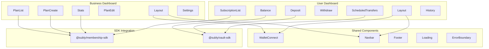
```mermaid
graph TB
    subgraph "Shared Components"
        WC[WalletConnect]
        NB[Navbar]
        FT[Footer]
        LD[Loading]
        ER[ErrorBoundary]
    end

    subgraph "Business Dashboard"
        BD_L[Layout]
        BD_P[PlanList]
        BD_PC[PlanCreate]
        BD_PE[PlanEdit]
        BD_S[Stats]
        BD_SET[Settings]
    end

    subgraph "User Dashboard"
        UD_L[Layout]
        UD_B[Balance]
        UD_D[Deposit]
        UD_W[Withdraw]
        UD_SL[SubscriptionList]
        UD_ST[ScheduledTransfers]
        UD_H[History]
    end

    subgraph "SDK Integration"
        SDK_M["@subly/membership-sdk"]
        SDK_V["@subly/vault-sdk"]
    end

    BD_L --> WC
    BD_L --> NB
    BD_P --> SDK_M
    BD_PC --> SDK_M
    BD_S --> SDK_M

    UD_L --> WC
    UD_L --> NB
    UD_B --> SDK_V
    UD_D --> SDK_V
    UD_SL --> SDK_M
    UD_ST --> SDK_V
```

### コンポーネントインターフェース詳細

#### 主要コンポーネントのProps/State定義

```typescript
// ========================================
// Shared Components
// ========================================

interface WalletConnectProps {
  onConnect: (publicKey: PublicKey) => void;
  onDisconnect: () => void;
  autoConnect?: boolean;
}

interface WalletConnectState {
  isConnecting: boolean;
  isConnected: boolean;
  publicKey: PublicKey | null;
  walletName: string | null;
  error: string | null;
}

interface LoadingProps {
  message?: string;
  progress?: number;        // 0-100, ZK証明生成などの進捗表示用
  showProgress?: boolean;
}

interface ErrorBoundaryProps {
  children: React.ReactNode;
  fallback?: React.ReactNode;
  onError?: (error: Error, errorInfo: React.ErrorInfo) => void;
}

// ========================================
// Business Dashboard Components
// ========================================

interface PlanCreateProps {
  onSuccess: (plan: Plan) => void;
  onCancel: () => void;
}

interface PlanCreateState {
  name: string;
  description: string;
  priceUsdc: string;
  billingCycle: BillingCycle;
  isDemo: boolean;           // デモモード（1時間周期）
  isSubmitting: boolean;
  isEncrypting: boolean;     // Arcium暗号化処理中
  encryptionProgress: number; // 暗号化進捗
  errors: {
    name?: string;
    priceUsdc?: string;
    general?: string;
  };
}

interface PlanListProps {
  businessId: PublicKey;
  onPlanSelect: (plan: Plan) => void;
  onCreateNew: () => void;
}

interface PlanListState {
  plans: Plan[];
  isLoading: boolean;
  error: string | null;
  selectedPlanId: PublicKey | null;
}

interface StatsProps {
  businessId: PublicKey;
}

interface StatsState {
  totalSubscriptions: number;
  planStats: Array<{
    planId: PublicKey;
    planName: string;
    subscriptionCount: number;
  }>;
  isLoading: boolean;
  isRevealingCount: boolean;  // Arciumでのreveal処理中
  error: string | null;
}

// ========================================
// User Dashboard Components
// ========================================

interface DepositProps {
  poolId: PublicKey;
  maxAmount: number;         // ウォレット残高
  onSuccess: (result: DepositResult) => void;
  onCancel: () => void;
}

interface DepositState {
  amount: string;
  isValidating: boolean;
  isGeneratingProof: boolean;  // ZK証明生成中
  proofProgress: number;       // 0-100
  isDepositing: boolean;
  isWaitingConfirmation: boolean;
  errors: {
    amount?: string;
    proof?: string;
    general?: string;
  };
}

interface WithdrawProps {
  poolId: PublicKey;
  maxAmount: number;         // シェア評価額
  onSuccess: (result: WithdrawResult) => void;
  onCancel: () => void;
}

interface WithdrawState {
  amount: string;
  recipient?: string;        // 出金先（空の場合は自分のウォレット）
  isDecryptingShare: boolean; // シェア復号中
  isGeneratingProof: boolean;
  proofProgress: number;
  isWithdrawing: boolean;
  isWaitingConfirmation: boolean;
  errors: {
    amount?: string;
    recipient?: string;
    proof?: string;
    general?: string;
  };
}

interface BalanceProps {
  poolId: PublicKey;
  userCommitment: Uint8Array;
}

interface BalanceState {
  isDecrypting: boolean;
  shareAmount: bigint | null;
  shareValue: number | null;    // USDC評価額
  totalDeposited: number | null;
  profit: number | null;
  yieldPercent: number | null;
  poolApy: number | null;
  lastUpdate: Date | null;
  error: string | null;
}

interface SubscriptionListProps {
  onSubscribe: (planId: PublicKey) => void;
  onUnsubscribe: (subscriptionId: PublicKey) => void;
}

interface SubscriptionListState {
  subscriptions: Subscription[];
  isLoading: boolean;
  unsubscribingId: PublicKey | null;  // 解約処理中のID
  error: string | null;
}

interface ScheduledTransfersProps {
  poolId: PublicKey;
  userCommitment: Uint8Array;
  onCreateNew: () => void;
}

interface ScheduledTransfersState {
  transfers: ScheduledTransfer[];
  isLoading: boolean;
  batchProofStatus: Map<string, {
    remaining: number;
    total: number;
    needsRefill: boolean;
  }>;
  error: string | null;
}

interface CreateScheduledTransferProps {
  poolId: PublicKey;
  userCommitment: Uint8Array;
  onSuccess: (transfer: ScheduledTransfer) => void;
  onCancel: () => void;
}

interface CreateScheduledTransferState {
  recipientAddress: string;
  amount: string;
  interval: 'hourly' | 'daily' | 'weekly' | 'monthly' | 'custom';
  customIntervalSeconds?: number;
  numPrepaidProofs: number;   // 事前生成する証明数（デフォルト12）
  isValidating: boolean;
  isGeneratingProofs: boolean;
  proofGenerationProgress: number;  // 0-100
  currentProofIndex: number;        // 何個目の証明を生成中か
  isSubmitting: boolean;
  errors: {
    recipientAddress?: string;
    amount?: string;
    interval?: string;
    general?: string;
  };
}
```

### 状態管理設計

```typescript
// ========================================
// Zustand Store設計
// ========================================

import { create } from 'zustand';
import { persist } from 'zustand/middleware';

// Wallet Store
interface WalletStore {
  publicKey: PublicKey | null;
  isConnected: boolean;
  connect: (publicKey: PublicKey) => void;
  disconnect: () => void;
}

export const useWalletStore = create<WalletStore>((set) => ({
  publicKey: null,
  isConnected: false,
  connect: (publicKey) => set({ publicKey, isConnected: true }),
  disconnect: () => set({ publicKey: null, isConnected: false }),
}));

// User Secret Store (永続化 - localStorage暗号化)
interface UserSecretStore {
  // プールごとのユーザーシークレット（暗号化して保存）
  secrets: Map<string, Uint8Array>;  // poolId -> encrypted secret
  setSecret: (poolId: string, secret: Uint8Array) => void;
  getSecret: (poolId: string) => Uint8Array | null;
  clearSecrets: () => void;
}

export const useUserSecretStore = create<UserSecretStore>()(
  persist(
    (set, get) => ({
      secrets: new Map(),
      setSecret: (poolId, secret) =>
        set((state) => {
          const newSecrets = new Map(state.secrets);
          newSecrets.set(poolId, secret);
          return { secrets: newSecrets };
        }),
      getSecret: (poolId) => get().secrets.get(poolId) ?? null,
      clearSecrets: () => set({ secrets: new Map() }),
    }),
    {
      name: 'subly-user-secrets',
      // カスタムシリアライズ（暗号化）
      storage: createEncryptedStorage(),
    }
  )
);

// Business Store
interface BusinessStore {
  businessAccount: BusinessAccount | null;
  plans: Plan[];
  isLoading: boolean;
  error: string | null;
  fetchBusiness: () => Promise<void>;
  fetchPlans: () => Promise<void>;
  addPlan: (plan: Plan) => void;
  updatePlan: (planId: PublicKey, updates: Partial<Plan>) => void;
}

// Vault Store
interface VaultStore {
  poolState: ShieldPoolState | null;
  userShare: UserShareState | null;
  scheduledTransfers: ScheduledTransfer[];
  isLoading: boolean;
  error: string | null;
  fetchPoolState: (poolId: PublicKey) => Promise<void>;
  fetchUserShare: (poolId: PublicKey, commitment: Uint8Array) => Promise<void>;
  fetchScheduledTransfers: (commitment: Uint8Array) => Promise<void>;
  updateShareLocally: (newShare: UserShareState) => void;
}

// ========================================
// React Query キャッシュ戦略
// ========================================

const queryClient = new QueryClient({
  defaultOptions: {
    queries: {
      staleTime: 30 * 1000,      // 30秒間はキャッシュを使用
      gcTime: 5 * 60 * 1000,     // 5分間キャッシュを保持
      retry: 3,
      retryDelay: (attempt) => Math.min(1000 * 2 ** attempt, 30000),
    },
  },
});

// プール状態のキャッシュ（頻繁に更新される）
const usePoolState = (poolId: PublicKey) => {
  return useQuery({
    queryKey: ['poolState', poolId.toBase58()],
    queryFn: () => vaultSdk.pool.getState(poolId),
    staleTime: 10 * 1000,       // 10秒
    refetchInterval: 60 * 1000, // 1分ごとに自動更新
  });
};

// ユーザーシェアのキャッシュ（復号が必要なため長めにキャッシュ）
const useUserShare = (poolId: PublicKey, commitment: Uint8Array) => {
  return useQuery({
    queryKey: ['userShare', poolId.toBase58(), uint8ArrayToHex(commitment)],
    queryFn: () => vaultSdk.shares.get(poolId, commitment),
    staleTime: 5 * 60 * 1000,   // 5分
  });
};

// プラン一覧のキャッシュ
const usePlans = (businessId?: PublicKey) => {
  return useQuery({
    queryKey: ['plans', businessId?.toBase58()],
    queryFn: () => membershipSdk.plans.list(businessId),
    staleTime: 60 * 1000,       // 1分
  });
};
```

### エラーメッセージマッピング

```typescript
// ========================================
// エラーコード → ユーザー向けメッセージ
// ========================================

// Protocol A エラーマッピング
const membershipErrorMessages: Record<number, string> = {
  6000: '権限がありません。ウォレットを確認してください。',
  6001: 'プランが見つかりません。',
  6002: 'このプランは現在無効です。',
  6003: 'サブスクリプションが見つかりません。',
  6004: 'すでにこのプランに契約しています。',
  6005: 'このアドレスからの契約は制限されています。',
  6006: '会員証明の検証に失敗しました。再度お試しください。',
  6007: 'この証明は既に使用されています。',
  6008: '暗号化処理に失敗しました。しばらく経ってから再度お試しください。',
  6009: '会員証明の生成に失敗しました。',
};

// Protocol B エラーマッピング
const vaultErrorMessages: Record<number, string> = {
  7000: '権限がありません。ウォレットを確認してください。',
  7001: '残高が不足しています。',
  7002: '定期送金が見つかりません。',
  7003: 'この定期送金は無効です。',
  7004: '金額が無効です。',
  7005: 'プライベート送金に失敗しました。しばらく経ってから再度お試しください。',
  7006: 'DeFi運用処理に失敗しました。',
  7007: '自動実行の設定に失敗しました。',
  7008: '運用益の計算に失敗しました。',
};

// ZK証明エラー
const zkProofErrorMessages: Record<string, string> = {
  PROOF_GENERATION_FAILED: 'ZK証明の生成に失敗しました。再度お試しください。',
  PROOF_VERIFICATION_FAILED: 'ZK証明の検証に失敗しました。',
  INSUFFICIENT_SHARES: '残高が不足しています。',
  INVALID_COMMITMENT: 'ユーザー情報の検証に失敗しました。',
  NULLIFIER_ALREADY_USED: 'この操作は既に実行されています。',
  POOL_STATE_CHANGED: 'プール状態が変更されました。再度お試しください。',
};

// 汎用エラーメッセージ
const genericErrorMessages: Record<string, string> = {
  NETWORK_ERROR: 'ネットワークエラーが発生しました。接続を確認してください。',
  WALLET_REJECTED: 'ウォレットで署名が拒否されました。',
  TRANSACTION_FAILED: 'トランザクションに失敗しました。',
  TIMEOUT: '処理がタイムアウトしました。再度お試しください。',
  UNKNOWN: '予期しないエラーが発生しました。',
};

// エラーハンドラー
function getErrorMessage(error: unknown): string {
  if (error instanceof AnchorError) {
    const code = error.error.errorCode.number;
    return membershipErrorMessages[code]
      ?? vaultErrorMessages[code]
      ?? `エラーコード: ${code}`;
  }

  if (error instanceof ZKProofError) {
    return zkProofErrorMessages[error.code] ?? error.message;
  }

  if (error instanceof Error) {
    if (error.message.includes('network')) {
      return genericErrorMessages.NETWORK_ERROR;
    }
    if (error.message.includes('rejected')) {
      return genericErrorMessages.WALLET_REJECTED;
    }
    if (error.message.includes('timeout')) {
      return genericErrorMessages.TIMEOUT;
    }
  }

  return genericErrorMessages.UNKNOWN;
}
```

### ローディング状態のUX設計

```typescript
// ========================================
// ローディング・進捗表示コンポーネント
// ========================================

interface ProgressStep {
  id: string;
  label: string;
  status: 'pending' | 'in_progress' | 'completed' | 'error';
  progress?: number;  // 0-100
  errorMessage?: string;
}

interface MultiStepProgressProps {
  steps: ProgressStep[];
  currentStepId: string;
}

// 入金処理の進捗ステップ
const depositSteps: ProgressStep[] = [
  { id: 'validate', label: '入力検証', status: 'pending' },
  { id: 'privacy_cash', label: 'Privacy Cashへ入金', status: 'pending' },
  { id: 'generate_proof', label: 'ZK証明生成', status: 'pending' },
  { id: 'submit', label: 'トランザクション送信', status: 'pending' },
  { id: 'confirm', label: '確認待ち', status: 'pending' },
];

// 定期送金設定の進捗ステップ
const createTransferSteps: ProgressStep[] = [
  { id: 'validate', label: '入力検証', status: 'pending' },
  { id: 'ownership_proof', label: '所有権証明生成', status: 'pending' },
  { id: 'create_transfer', label: '定期送金作成', status: 'pending' },
  { id: 'batch_proofs', label: 'バッチ証明生成 (1/12)', status: 'pending' },
  { id: 'store_proofs', label: '証明保存', status: 'pending' },
  { id: 'confirm', label: '完了', status: 'pending' },
];

// ZK証明生成の詳細進捗
interface ZKProofProgress {
  phase: 'loading_circuit' | 'computing_witness' | 'generating_proof' | 'done';
  phaseProgress: number;  // 0-100
  totalProgress: number;  // 0-100
  estimatedTimeRemaining?: number;  // 秒
}

// 進捗表示フック
function useZKProofProgress() {
  const [progress, setProgress] = useState<ZKProofProgress>({
    phase: 'loading_circuit',
    phaseProgress: 0,
    totalProgress: 0,
  });

  const generateProofWithProgress = async (
    circuitName: string,
    inputs: ProofInputs
  ): Promise<ProofResult> => {
    setProgress({ phase: 'loading_circuit', phaseProgress: 0, totalProgress: 0 });

    // 回路読み込み（約10%）
    const circuit = await loadCircuit(circuitName, (p) => {
      setProgress({ phase: 'loading_circuit', phaseProgress: p, totalProgress: p * 0.1 });
    });

    // Witness計算（約30%）
    setProgress({ phase: 'computing_witness', phaseProgress: 0, totalProgress: 10 });
    const witness = await computeWitness(circuit, inputs, (p) => {
      setProgress({ phase: 'computing_witness', phaseProgress: p, totalProgress: 10 + p * 0.3 });
    });

    // 証明生成（約60%）
    setProgress({ phase: 'generating_proof', phaseProgress: 0, totalProgress: 40 });
    const proof = await generateProof(circuit, witness, (p) => {
      setProgress({ phase: 'generating_proof', phaseProgress: p, totalProgress: 40 + p * 0.6 });
    });

    setProgress({ phase: 'done', phaseProgress: 100, totalProgress: 100 });

    return proof;
  };

  return { progress, generateProofWithProgress };
}

// タイムアウト設定
const operationTimeouts = {
  zkProofGeneration: 60 * 1000,     // 60秒
  transactionSubmit: 30 * 1000,     // 30秒
  transactionConfirm: 60 * 1000,    // 60秒
  arciumComputation: 45 * 1000,     // 45秒
  batchProofGeneration: 5 * 60 * 1000, // 5分（複数証明生成）
};
```

### SDK構成

**優先度について:**
- **@subly/membership-sdk (Protocol A)**: P0 - 必須、Devnetデモの核心
- **@subly/vault-sdk (Protocol B)**: P0 - 必須、Mainnetデモの核心

**両プロトコルは独立したデモとして機能:**
- Protocol A (Devnet): 会員管理とプライバシー保護 - Arcium MPC + Light Protocol
- Protocol B (Mainnet): 資金運用とプライベート決済 - ZK証明 + Privacy Cash + Kamino

#### @subly/membership-sdk (P0: 必須)

```typescript
// SDK インターフェース
interface SublyMembershipSDK {
  // Business Operations
  business: {
    register(params: RegisterBusinessParams): Promise<BusinessAccount>;
    getAccount(): Promise<BusinessAccount | null>;
    updateMetadata(params: UpdateMetadataParams): Promise<void>;
  };

  // Plan Operations
  plans: {
    create(params: CreatePlanParams): Promise<Plan>;
    list(businessId?: PublicKey): Promise<Plan[]>;
    get(planId: PublicKey): Promise<Plan>;
    update(planId: PublicKey, params: UpdatePlanParams): Promise<void>;
    deactivate(planId: PublicKey): Promise<void>;
    getSubscriptionCount(planId: PublicKey): Promise<number>;
  };

  // Subscription Operations
  subscriptions: {
    subscribe(planId: PublicKey): Promise<Subscription>;
    unsubscribe(subscriptionId: PublicKey): Promise<void>;
    list(): Promise<Subscription[]>;
    get(subscriptionId: PublicKey): Promise<Subscription>;
  };

  // Membership Verification
  membership: {
    generateProof(planId: PublicKey): Promise<MembershipProof>;
    verifyProof(proof: MembershipProof): Promise<boolean>;
  };

  // Sanctions Check
  sanctions: {
    checkAddress(address: PublicKey): Promise<SanctionsResult>;
  };
}

// Types
interface CreatePlanParams {
  name: string;
  description: string;
  priceUsdc: number;
  billingCycle: BillingCycle;
}

interface BillingCycle {
  type: 'hourly' | 'daily' | 'weekly' | 'monthly' | 'yearly' | 'custom';
  customSeconds?: number;
}

interface MembershipProof {
  planId: PublicKey;
  proof: Uint8Array;
  publicInputs: PublicInput[];
  timestamp: number;
}
```

#### @subly/vault-sdk (P0: 必須)

```typescript
// SDK インターフェース
interface SublyVaultSDK {
  // Deposit Operations
  deposit: {
    depositUsdc(amount: number): Promise<DepositResult>;
    getPrivateBalance(): Promise<number>;
  };

  // Withdrawal Operations
  withdraw: {
    withdrawUsdc(amount: number, recipient?: PublicKey): Promise<WithdrawResult>;
  };

  // Yield Operations
  yield: {
    getCurrentYield(): Promise<YieldInfo>;
    getYieldHistory(): Promise<YieldHistoryItem[]>;
  };

  // Scheduled Transfer Operations
  transfers: {
    create(params: CreateTransferParams): Promise<ScheduledTransfer>;
    list(): Promise<ScheduledTransfer[]>;
    get(transferId: PublicKey): Promise<ScheduledTransfer>;
    update(transferId: PublicKey, params: UpdateTransferParams): Promise<void>;
    cancel(transferId: PublicKey): Promise<void>;
    getHistory(transferId?: PublicKey): Promise<TransferHistory[]>;
  };

  // Account Operations
  account: {
    getVaultAccount(): Promise<UserVaultAccount>;
    getStats(): Promise<VaultStats>;
  };
}

// Types
interface CreateTransferParams {
  recipientAddress: PublicKey;
  amount: number;
  intervalSeconds: number;
}

interface YieldInfo {
  totalYield: number;
  currentApy: number;
  lastUpdate: Date;
}

interface VaultStats {
  totalDeposited: number;
  currentBalance: number;
  totalYieldEarned: number;
  totalTransferred: number;
}
```

## ユースケース図

### Protocol A: 事業者フロー

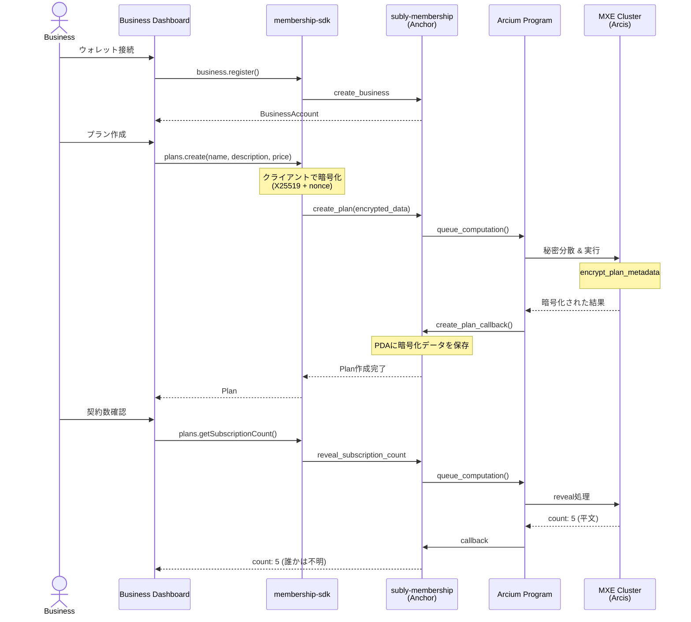
```mermaid
sequenceDiagram
    actor B as Business
    participant BD as Business Dashboard
    participant SDK as membership-sdk
    participant PA as subly-membership<br/>(Anchor)
    participant ARC as Arcium Program
    participant MXE as MXE Cluster<br/>(Arcis)

    B->>BD: ウォレット接続
    BD->>SDK: business.register()
    SDK->>PA: create_business
    PA-->>BD: BusinessAccount

    B->>BD: プラン作成
    BD->>SDK: plans.create(name, description, price)

    Note over SDK: クライアントで暗号化<br/>(X25519 + nonce)

    SDK->>PA: create_plan(encrypted_data)
    PA->>ARC: queue_computation()
    ARC->>MXE: 秘密分散 & 実行

    Note over MXE: encrypt_plan_metadata<br/>#[instruction] 実行

    MXE-->>ARC: 暗号化された結果
    ARC->>PA: create_plan_callback()

    Note over PA: PDAに暗号化データを保存

    PA-->>SDK: Plan作成完了
    SDK-->>BD: Plan

    B->>BD: 契約数確認
    BD->>SDK: plans.getSubscriptionCount()
    SDK->>PA: reveal_subscription_count
    PA->>ARC: queue_computation()
    ARC->>MXE: reveal処理
    MXE-->>ARC: count: 5 (平文)
    ARC->>PA: callback
    PA-->>BD: count: 5 (誰かは不明)
```

### Protocol A: ユーザー契約フロー

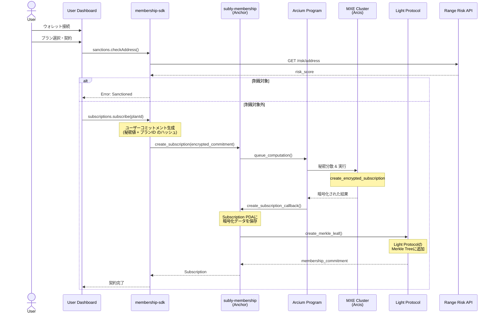
```mermaid
sequenceDiagram
    actor U as User
    participant UD as User Dashboard
    participant SDK as membership-sdk
    participant PA as subly-membership<br/>(Anchor)
    participant ARC as Arcium Program
    participant MXE as MXE Cluster<br/>(Arcis)
    participant LP as Light Protocol
    participant RR as Range Risk API

    U->>UD: ウォレット接続
    U->>UD: プラン選択・契約

    UD->>SDK: sanctions.checkAddress()
    SDK->>RR: GET /risk/address
    RR-->>SDK: risk_score

    alt 制裁対象
        SDK-->>UD: Error: Sanctioned
    else 制裁対象外
        UD->>SDK: subscriptions.subscribe(planId)

        Note over SDK: ユーザーコミットメント生成<br/>(秘密値 + プランID のハッシュ)

        SDK->>PA: create_subscription(encrypted_commitment)
        PA->>ARC: queue_computation()
        ARC->>MXE: 秘密分散 & 実行

        Note over MXE: create_encrypted_subscription<br/>#[instruction] 実行<br/>- コミットメント暗号化<br/>- 契約数インクリメント

        MXE-->>ARC: 暗号化された結果
        ARC->>PA: create_subscription_callback()

        Note over PA: Subscription PDAに<br/>暗号化データを保存

        PA->>LP: create_merkle_leaf()

        Note over LP: Light Protocolの<br/>Merkle Treeに追加

        LP-->>PA: membership_commitment
        PA-->>SDK: Subscription
        SDK-->>UD: 契約完了
    end
```

### Protocol A: 会員証明フロー

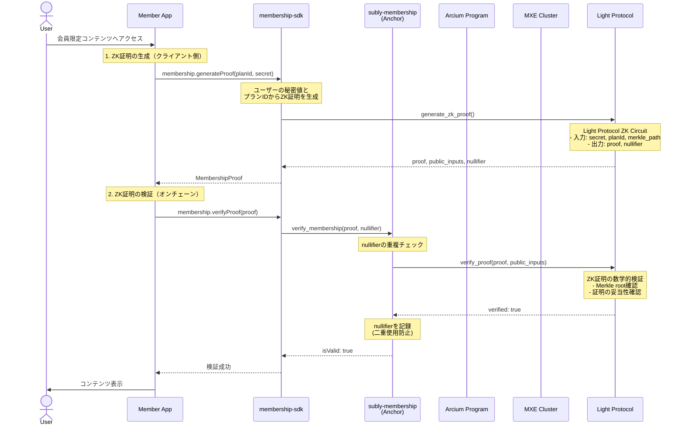
```mermaid
sequenceDiagram
    actor U as User
    participant APP as Member App
    participant SDK as membership-sdk
    participant PA as subly-membership<br/>(Anchor)
    participant ARC as Arcium Program
    participant MXE as MXE Cluster
    participant LP as Light Protocol

    U->>APP: 会員限定コンテンツへアクセス

    Note over APP: 1. ZK証明の生成（クライアント側）

    APP->>SDK: membership.generateProof(planId, secret)

    Note over SDK: ユーザーの秘密値と<br/>プランIDからZK証明を生成

    SDK->>LP: generate_zk_proof()

    Note over LP: Light Protocol ZK Circuit<br/>- 入力: secret, planId, merkle_path<br/>- 出力: proof, nullifier

    LP-->>SDK: proof, public_inputs, nullifier
    SDK-->>APP: MembershipProof

    Note over APP: 2. ZK証明の検証（オンチェーン）

    APP->>SDK: membership.verifyProof(proof)
    SDK->>PA: verify_membership(proof, nullifier)

    Note over PA: nullifierの重複チェック

    PA->>LP: verify_proof(proof, public_inputs)

    Note over LP: ZK証明の数学的検証<br/>- Merkle root確認<br/>- 証明の妥当性確認

    LP-->>PA: verified: true

    Note over PA: nullifierを記録<br/>(二重使用防止)

    PA-->>SDK: isValid: true
    SDK-->>APP: 検証成功

    APP->>U: コンテンツ表示
```

### Protocol A: サブスクリプション解約フロー

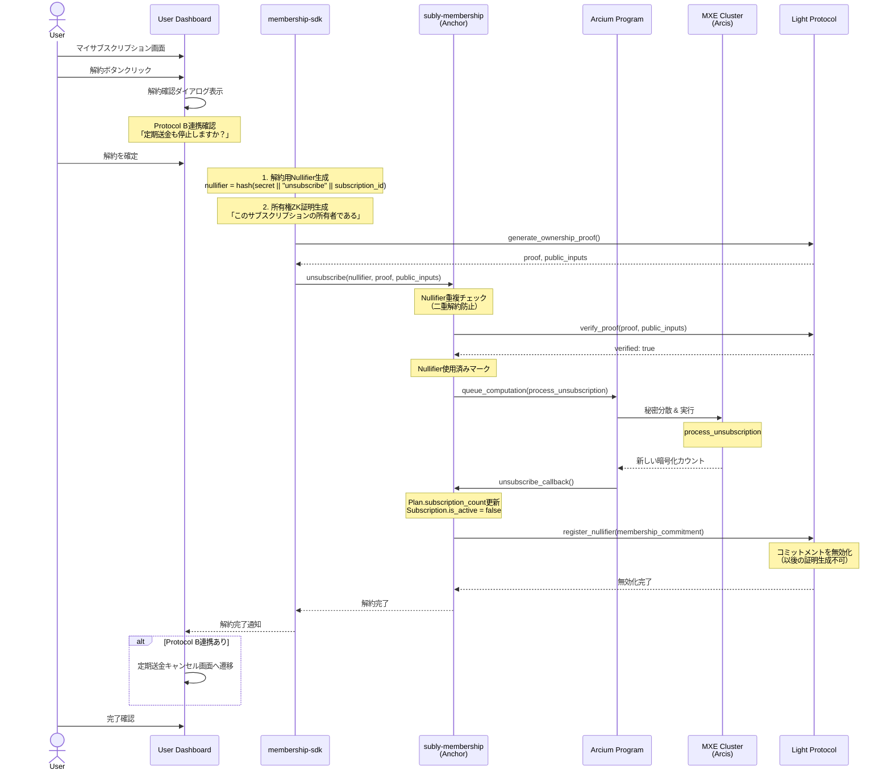
```mermaid
sequenceDiagram
    actor U as User
    participant UD as User Dashboard
    participant SDK as membership-sdk
    participant PA as subly-membership<br/>(Anchor)
    participant ARC as Arcium Program
    participant MXE as MXE Cluster<br/>(Arcis)
    participant LP as Light Protocol

    U->>UD: マイサブスクリプション画面
    U->>UD: 解約ボタンクリック

    UD->>UD: 解約確認ダイアログ表示

    Note over UD: Protocol B連携確認<br/>「定期送金も停止しますか？」

    U->>UD: 解約を確定

    Note over SDK: 1. 解約用Nullifier生成<br/>nullifier = hash(secret || "unsubscribe" || subscription_id)

    Note over SDK: 2. 所有権ZK証明生成<br/>「このサブスクリプションの所有者である」

    SDK->>LP: generate_ownership_proof()
    LP-->>SDK: proof, public_inputs

    SDK->>PA: unsubscribe(nullifier, proof, public_inputs)

    Note over PA: Nullifier重複チェック<br/>（二重解約防止）

    PA->>LP: verify_proof(proof, public_inputs)
    LP-->>PA: verified: true

    Note over PA: Nullifier使用済みマーク

    PA->>ARC: queue_computation(process_unsubscription)
    ARC->>MXE: 秘密分散 & 実行

    Note over MXE: process_unsubscription<br/>#[instruction] 実行<br/>- 契約数デクリメント

    MXE-->>ARC: 新しい暗号化カウント
    ARC->>PA: unsubscribe_callback()

    Note over PA: Plan.subscription_count更新<br/>Subscription.is_active = false

    PA->>LP: register_nullifier(membership_commitment)

    Note over LP: コミットメントを無効化<br/>（以後の証明生成不可）

    LP-->>PA: 無効化完了
    PA-->>SDK: 解約完了

    SDK-->>UD: 解約完了通知

    alt Protocol B連携あり
        UD->>UD: 定期送金キャンセル画面へ遷移
    end

    U->>UD: 完了確認
```

### Protocol A: エラー発生時のフロー

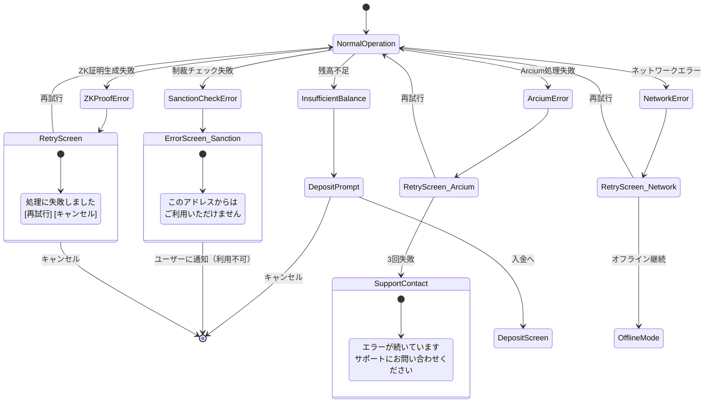
```mermaid
stateDiagram-v2
    [*] --> NormalOperation

    NormalOperation --> SanctionCheckError: 制裁チェック失敗
    NormalOperation --> ZKProofError: ZK証明生成失敗
    NormalOperation --> ArciumError: Arcium処理失敗
    NormalOperation --> NetworkError: ネットワークエラー
    NormalOperation --> InsufficientBalance: 残高不足

    SanctionCheckError --> ErrorScreen_Sanction
    ErrorScreen_Sanction --> [*]: ユーザーに通知（利用不可）

    ZKProofError --> RetryScreen
    RetryScreen --> NormalOperation: 再試行
    RetryScreen --> [*]: キャンセル

    ArciumError --> RetryScreen_Arcium
    RetryScreen_Arcium --> NormalOperation: 再試行
    RetryScreen_Arcium --> SupportContact: 3回失敗

    NetworkError --> RetryScreen_Network
    RetryScreen_Network --> NormalOperation: 再試行
    RetryScreen_Network --> OfflineMode: オフライン継続

    InsufficientBalance --> DepositPrompt
    DepositPrompt --> DepositScreen: 入金へ
    DepositPrompt --> [*]: キャンセル

    state ErrorScreen_Sanction {
        [*] --> ShowMessage
        ShowMessage: このアドレスからは<br/>ご利用いただけません
    }

    state RetryScreen {
        [*] --> ShowRetryOption
        ShowRetryOption: 処理に失敗しました<br/>[再試行] [キャンセル]
    }

    state SupportContact {
        [*] --> ShowSupport
        ShowSupport: エラーが続いています<br/>サポートにお問い合わせください
    }
```

### 補足: Arciumと Light Protocolの役割分担

```
┌─────────────────────────────────────────────────────────────────────────┐
│ Arcium MPC (データの暗号化・秘匿計算)                                    │
│ - サブスクリプション契約データの暗号化保存                               │
│ - 契約数のカウント（暗号化されたまま加算）                               │
│ - 事業者が個々のユーザーを特定できないようにする                         │
├─────────────────────────────────────────────────────────────────────────┤
│ Light Protocol (会員証明・ZK証明)                                        │
│ - 会員であることのゼロ知識証明を生成                                     │
│ - Merkle Treeでコミットメントを管理                                      │
│ - 証明時にユーザーの身元を明かさない                                     │
├─────────────────────────────────────────────────────────────────────────┤
│ 連携ポイント                                                             │
│ - 契約時: Arciumで暗号化 → Light ProtocolのMerkle Treeに追加            │
│ - 証明時: Light ProtocolでZK証明生成 → オンチェーンで検証               │
└─────────────────────────────────────────────────────────────────────────┘
```

### Protocol B: 入金・運用フロー（ZK証明ベース）

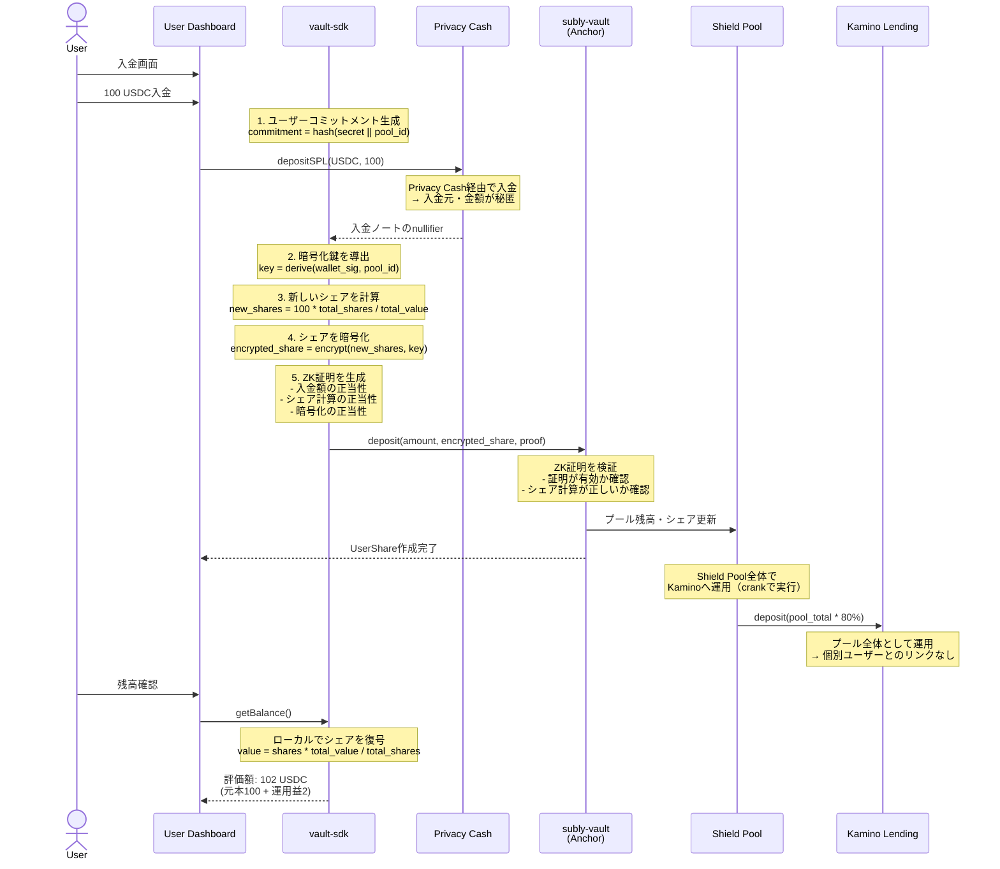
```mermaid
sequenceDiagram
    actor U as User
    participant UD as User Dashboard
    participant SDK as vault-sdk
    participant PC as Privacy Cash
    participant PB as subly-vault<br/>(Anchor)
    participant SP as Shield Pool
    participant KL as Kamino Lending

    U->>UD: 入金画面
    U->>UD: 100 USDC入金

    Note over SDK: 1. ユーザーコミットメント生成<br/>commitment = hash(secret || pool_id)

    UD->>PC: depositSPL(USDC, 100)

    Note over PC: Privacy Cash経由で入金<br/>→ 入金元・金額が秘匿

    PC-->>SDK: 入金ノートのnullifier

    Note over SDK: 2. 暗号化鍵を導出<br/>key = derive(wallet_sig, pool_id)

    Note over SDK: 3. 新しいシェアを計算<br/>new_shares = 100 * total_shares / total_value

    Note over SDK: 4. シェアを暗号化<br/>encrypted_share = encrypt(new_shares, key)

    Note over SDK: 5. ZK証明を生成<br/>- 入金額の正当性<br/>- シェア計算の正当性<br/>- 暗号化の正当性

    SDK->>PB: deposit(amount, encrypted_share, proof)

    Note over PB: ZK証明を検証<br/>- 証明が有効か確認<br/>- シェア計算が正しいか確認

    PB->>SP: プール残高・シェア更新
    PB-->>UD: UserShare作成完了

    Note over SP: Shield Pool全体で<br/>Kaminoへ運用（crankで実行）

    SP->>KL: deposit(pool_total * 80%)

    Note over KL: プール全体として運用<br/>→ 個別ユーザーとのリンクなし

    U->>UD: 残高確認
    UD->>SDK: getBalance()

    Note over SDK: ローカルでシェアを復号<br/>value = shares * total_value / total_shares

    SDK-->>UD: 評価額: 102 USDC<br/>(元本100 + 運用益2)
```

**プライバシー保証:**
- Privacy Cash経由の入金: 入金元・金額が第三者から見えない
- Shield Pool: 全ユーザーの資金が混合、個別追跡不可能
- Kamino運用: プール単位での運用、ユーザーとのリンクなし
- クライアント暗号化: シェア量はユーザーの鍵でのみ復号可能
- ZK証明: 正当性を証明しつつプライベート情報は非公開

### Protocol B: 出金フロー（ZK証明ベース）

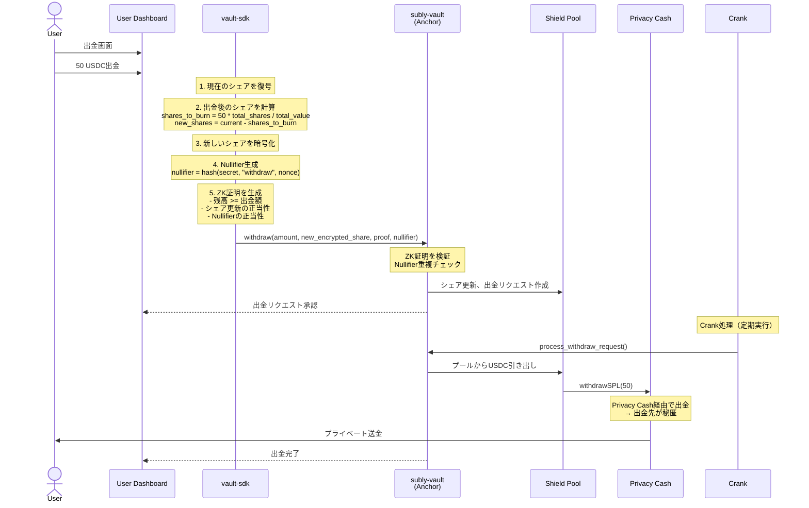
```mermaid
sequenceDiagram
    actor U as User
    participant UD as User Dashboard
    participant SDK as vault-sdk
    participant PB as subly-vault<br/>(Anchor)
    participant SP as Shield Pool
    participant PC as Privacy Cash
    participant CR as Crank

    U->>UD: 出金画面
    U->>UD: 50 USDC出金

    Note over SDK: 1. 現在のシェアを復号

    Note over SDK: 2. 出金後のシェアを計算<br/>shares_to_burn = 50 * total_shares / total_value<br/>new_shares = current - shares_to_burn

    Note over SDK: 3. 新しいシェアを暗号化

    Note over SDK: 4. Nullifier生成<br/>nullifier = hash(secret, "withdraw", nonce)

    Note over SDK: 5. ZK証明を生成<br/>- 残高 >= 出金額<br/>- シェア更新の正当性<br/>- Nullifierの正当性

    SDK->>PB: withdraw(amount, new_encrypted_share, proof, nullifier)

    Note over PB: ZK証明を検証<br/>Nullifier重複チェック

    PB->>SP: シェア更新、出金リクエスト作成
    PB-->>UD: 出金リクエスト承認

    Note over CR: Crank処理（定期実行）

    CR->>PB: process_withdraw_request()
    PB->>SP: プールからUSDC引き出し
    SP->>PC: withdrawSPL(50)

    Note over PC: Privacy Cash経由で出金<br/>→ 出金先が秘匿

    PC->>U: プライベート送金

    PB-->>UD: 出金完了
```

### Protocol B: 定期送金フロー（バッチZK証明方式）

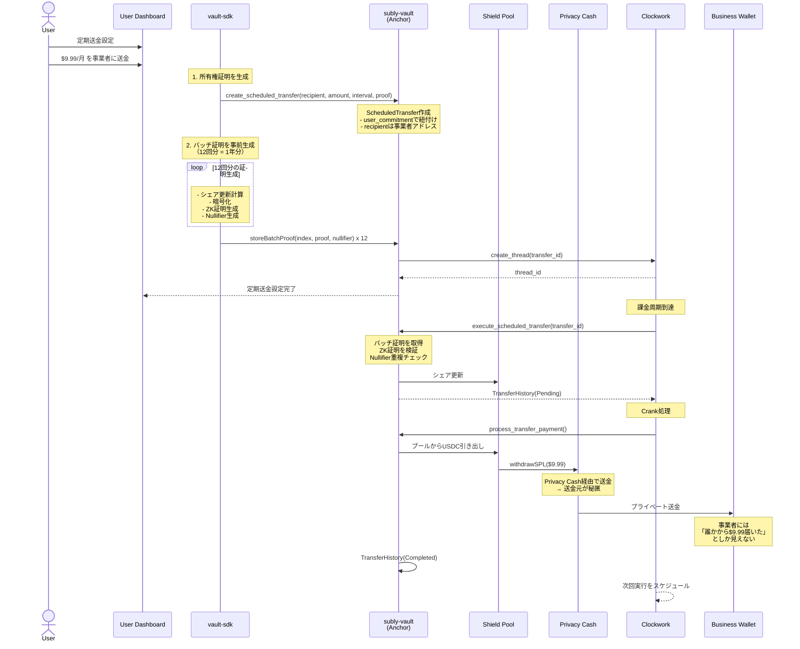
```mermaid
sequenceDiagram
    actor U as User
    participant UD as User Dashboard
    participant SDK as vault-sdk
    participant PB as subly-vault<br/>(Anchor)
    participant SP as Shield Pool
    participant PC as Privacy Cash
    participant CW as Clockwork
    participant B as Business Wallet

    U->>UD: 定期送金設定
    U->>UD: $9.99/月 を事業者に送金

    Note over SDK: 1. 所有権証明を生成

    SDK->>PB: create_scheduled_transfer(recipient, amount, interval, proof)

    Note over PB: ScheduledTransfer作成<br/>- user_commitmentで紐付け<br/>- recipientは事業者アドレス

    Note over SDK: 2. バッチ証明を事前生成<br/>（12回分 = 1年分）

    loop 12回分の証明生成
        Note over SDK: - シェア更新計算<br/>- 暗号化<br/>- ZK証明生成<br/>- Nullifier生成
    end

    SDK->>PB: storeBatchProof(index, proof, nullifier) x 12

    PB->>CW: create_thread(transfer_id)
    CW-->>PB: thread_id
    PB-->>UD: 定期送金設定完了

    Note over CW: 課金周期到達

    CW->>PB: execute_scheduled_transfer(transfer_id)

    Note over PB: バッチ証明を取得<br/>ZK証明を検証<br/>Nullifier重複チェック

    PB->>SP: シェア更新
    PB-->>CW: TransferHistory(Pending)

    Note over CW: Crank処理

    CW->>PB: process_transfer_payment()
    PB->>SP: プールからUSDC引き出し
    SP->>PC: withdrawSPL($9.99)

    Note over PC: Privacy Cash経由で送金<br/>→ 送金元が秘匿

    PC->>B: プライベート送金

    Note over B: 事業者には<br/>「誰かから$9.99届いた」<br/>としか見えない

    PB->>PB: TransferHistory(Completed)
    CW-->>CW: 次回実行をスケジュール
```

**プライバシー保証:**
- 送金元の秘匿: Privacy Cash経由で送金、事業者は送金元を特定できない
- ユーザー特定不可: ScheduledTransferにはcommitmentのみ、アドレスなし
- バッチZK証明: ユーザー不在でも事前生成した証明で送金可能
- Nullifier: 二重送金を防止

## 画面遷移図

### 事業者ダッシュボード

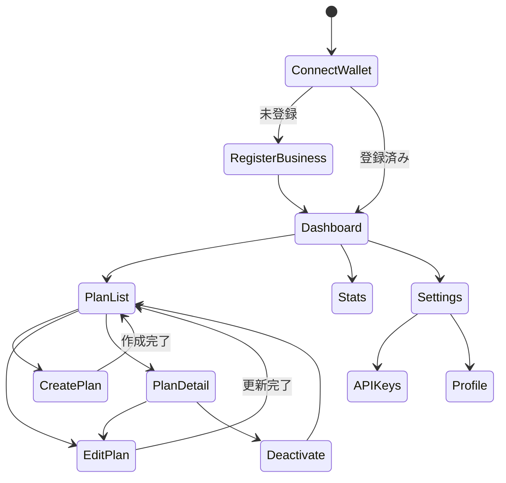
```mermaid
stateDiagram-v2
    [*] --> ConnectWallet
    ConnectWallet --> RegisterBusiness: 未登録
    ConnectWallet --> Dashboard: 登録済み

    RegisterBusiness --> Dashboard

    Dashboard --> PlanList
    Dashboard --> Stats
    Dashboard --> Settings

    PlanList --> CreatePlan
    PlanList --> EditPlan
    PlanList --> PlanDetail

    CreatePlan --> PlanList: 作成完了
    EditPlan --> PlanList: 更新完了

    PlanDetail --> EditPlan
    PlanDetail --> Deactivate
    Deactivate --> PlanList

    Settings --> APIKeys
    Settings --> Profile
```

### ユーザーダッシュボード

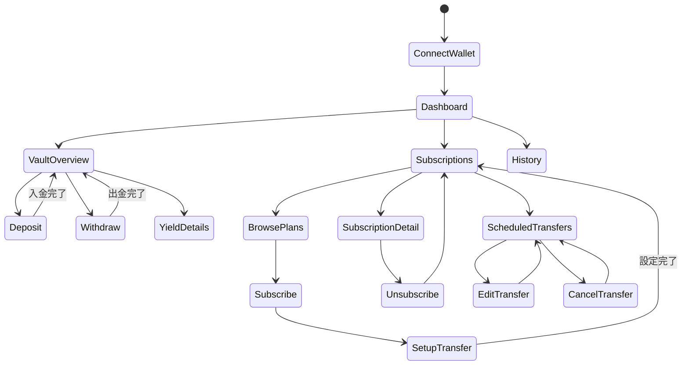
```mermaid
stateDiagram-v2
    [*] --> ConnectWallet
    ConnectWallet --> Dashboard

    Dashboard --> VaultOverview
    Dashboard --> Subscriptions
    Dashboard --> History

    VaultOverview --> Deposit
    VaultOverview --> Withdraw
    VaultOverview --> YieldDetails

    Deposit --> VaultOverview: 入金完了
    Withdraw --> VaultOverview: 出金完了

    Subscriptions --> BrowsePlans
    Subscriptions --> SubscriptionDetail
    Subscriptions --> ScheduledTransfers

    BrowsePlans --> Subscribe
    Subscribe --> SetupTransfer
    SetupTransfer --> Subscriptions: 設定完了

    SubscriptionDetail --> Unsubscribe
    Unsubscribe --> Subscriptions

    ScheduledTransfers --> EditTransfer
    ScheduledTransfers --> CancelTransfer
    EditTransfer --> ScheduledTransfers
    CancelTransfer --> ScheduledTransfers
```

### バッチ証明補充フロー

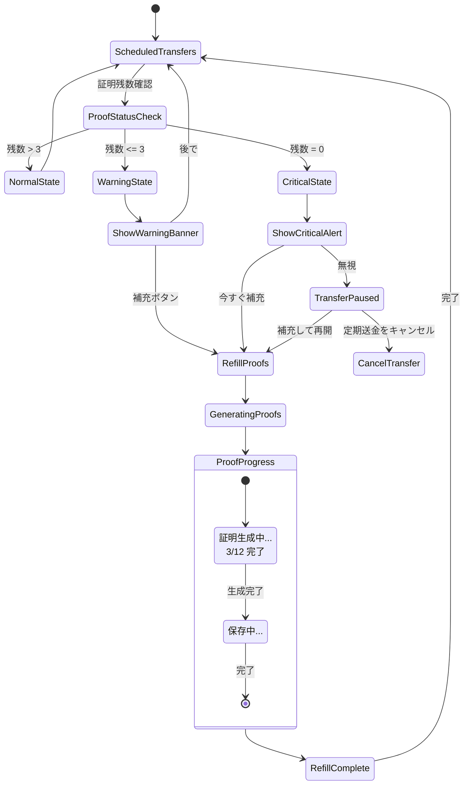
```mermaid
stateDiagram-v2
    [*] --> ScheduledTransfers

    ScheduledTransfers --> ProofStatusCheck: 証明残数確認

    ProofStatusCheck --> NormalState: 残数 > 3
    ProofStatusCheck --> WarningState: 残数 <= 3
    ProofStatusCheck --> CriticalState: 残数 = 0

    NormalState --> ScheduledTransfers

    WarningState --> ShowWarningBanner
    ShowWarningBanner --> RefillProofs: 補充ボタン
    ShowWarningBanner --> ScheduledTransfers: 後で

    CriticalState --> ShowCriticalAlert
    ShowCriticalAlert --> RefillProofs: 今すぐ補充
    ShowCriticalAlert --> TransferPaused: 無視

    TransferPaused --> RefillProofs: 補充して再開
    TransferPaused --> CancelTransfer: 定期送金をキャンセル

    RefillProofs --> GeneratingProofs
    GeneratingProofs --> ProofProgress

    state ProofProgress {
        [*] --> Generating
        Generating: 証明生成中...<br/>3/12 完了
        Generating --> Storing: 生成完了
        Storing: 保存中...
        Storing --> [*]: 完了
    }

    ProofProgress --> RefillComplete
    RefillComplete --> ScheduledTransfers: 完了
```

### エラー画面フロー

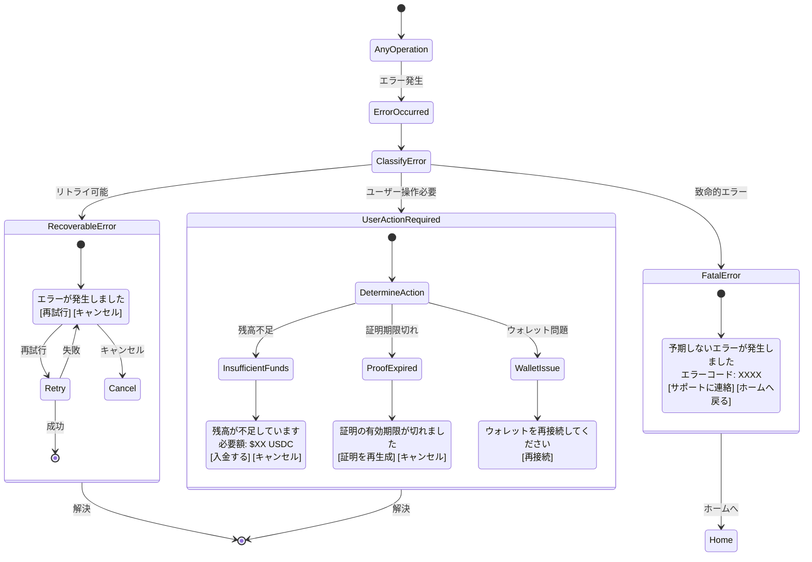
```mermaid
stateDiagram-v2
    [*] --> AnyOperation

    AnyOperation --> ErrorOccurred: エラー発生

    ErrorOccurred --> ClassifyError

    ClassifyError --> RecoverableError: リトライ可能
    ClassifyError --> UserActionRequired: ユーザー操作必要
    ClassifyError --> FatalError: 致命的エラー

    state RecoverableError {
        [*] --> ShowRetryDialog
        ShowRetryDialog: エラーが発生しました<br/>[再試行] [キャンセル]
        ShowRetryDialog --> Retry: 再試行
        ShowRetryDialog --> Cancel: キャンセル
        Retry --> [*]: 成功
        Retry --> ShowRetryDialog: 失敗
    }

    state UserActionRequired {
        [*] --> DetermineAction

        DetermineAction --> InsufficientFunds: 残高不足
        DetermineAction --> ProofExpired: 証明期限切れ
        DetermineAction --> WalletIssue: ウォレット問題

        InsufficientFunds --> DepositPromptScreen
        DepositPromptScreen: 残高が不足しています<br/>必要額: $XX USDC<br/>[入金する] [キャンセル]

        ProofExpired --> RegenerateProofScreen
        RegenerateProofScreen: 証明の有効期限が切れました<br/>[証明を再生成] [キャンセル]

        WalletIssue --> WalletReconnectScreen
        WalletReconnectScreen: ウォレットを再接続してください<br/>[再接続]
    }

    state FatalError {
        [*] --> ShowFatalScreen
        ShowFatalScreen: 予期しないエラーが発生しました<br/>エラーコード: XXXX<br/>[サポートに連絡] [ホームへ戻る]
    }

    RecoverableError --> [*]: 解決
    UserActionRequired --> [*]: 解決
    FatalError --> Home: ホームへ
```

### バッチ証明補充ワイヤフレーム

```
┌─────────────────────────────────────────────────────────────────┐
│  Subly                                       [Wallet: 7yM3...] │
├─────────────────────────────────────────────────────────────────┤
│  💰 Vault  |  📋 Subscriptions  |  📜 History                   │
├─────────────────────────────────────────────────────────────────┤
│                                                                 │
│  ⚠️ 定期送金の証明補充が必要です                                 │
│  ┌─────────────────────────────────────────────────────────┐   │
│  │  Premium Service への定期送金                            │   │
│  │  残り証明: 2/12                                         │   │
│  │                                                         │   │
│  │  ⚠️ あと2回分の証明しか残っていません。                  │   │
│  │  補充しないと送金が停止します。                          │   │
│  │                                                         │   │
│  │                              [今すぐ補充] [後で]         │   │
│  └─────────────────────────────────────────────────────────┘   │
│                                                                 │
│  定期送金一覧                                                   │
│  ┌─────────────────────────────────────────────────────────┐   │
│  │  🔄 Premium Service → $9.99/月                          │   │
│  │     次回: 2025年2月1日                                  │   │
│  │     証明: ⚠️ 2/12 [補充]                                │   │
│  │                                                         │   │
│  │  🔄 Analytics Tool → $4.99/月                           │   │
│  │     次回: 2025年2月15日                                 │   │
│  │     証明: ✅ 10/12                                      │   │
│  └─────────────────────────────────────────────────────────┘   │
│                                                                 │
└─────────────────────────────────────────────────────────────────┘
```

### バッチ証明生成中ワイヤフレーム

```
┌─────────────────────────────────────────────────────────────────┐
│  証明を生成中...                                                │
├─────────────────────────────────────────────────────────────────┤
│                                                                 │
│  Premium Service への定期送金                                   │
│                                                                 │
│  ┌─────────────────────────────────────────────────────────┐   │
│  │                                                         │   │
│  │     ████████████████████░░░░░░░░░░░░░░░   58%          │   │
│  │                                                         │   │
│  │     証明 7/12 を生成中...                                │   │
│  │                                                         │   │
│  │     ステップ:                                            │   │
│  │     ✅ 入力検証                                         │   │
│  │     ✅ 所有権証明生成                                   │   │
│  │     ✅ 証明 1-6 生成完了                                │   │
│  │     🔄 証明 7 生成中 (ZK回路実行)                       │   │
│  │     ⏳ 証明 8-12 待機中                                 │   │
│  │     ⏳ 証明保存                                         │   │
│  │                                                         │   │
│  │     推定残り時間: 約2分                                  │   │
│  │                                                         │   │
│  └─────────────────────────────────────────────────────────┘   │
│                                                                 │
│  ⚠️ ブラウザを閉じないでください                                │
│                                                                 │
│                                              [バックグラウンド] │
│                                                                 │
└─────────────────────────────────────────────────────────────────┘
```

## ワイヤフレーム

### 事業者ダッシュボード - プラン一覧

```
┌─────────────────────────────────────────────────────────────────┐
│  Subly Business Dashboard                    [Wallet: 5xK2...] │
├─────────────────────────────────────────────────────────────────┤
│  📊 Dashboard  |  📋 Plans  |  ⚙️ Settings                      │
├─────────────────────────────────────────────────────────────────┤
│                                                                 │
│  サブスクリプションプラン                    [+ 新規プラン作成]  │
│                                                                 │
│  ┌─────────────────────────────────────────────────────────┐   │
│  │  Premium Plan                                           │   │
│  │  月額 $9.99 USDC                                        │   │
│  │  契約数: 5                                              │   │
│  │  ステータス: ✅ 有効                                    │   │
│  │                                    [編集] [無効化]       │   │
│  └─────────────────────────────────────────────────────────┘   │
│                                                                 │
│  ┌─────────────────────────────────────────────────────────┐   │
│  │  Basic Plan                                             │   │
│  │  月額 $4.99 USDC                                        │   │
│  │  契約数: 12                                             │   │
│  │  ステータス: ✅ 有効                                    │   │
│  │                                    [編集] [無効化]       │   │
│  └─────────────────────────────────────────────────────────┘   │
│                                                                 │
└─────────────────────────────────────────────────────────────────┘
```

### 事業者ダッシュボード - プラン作成

```
┌─────────────────────────────────────────────────────────────────┐
│  Subly Business Dashboard                    [Wallet: 5xK2...] │
├─────────────────────────────────────────────────────────────────┤
│  📊 Dashboard  |  📋 Plans  |  ⚙️ Settings                      │
├─────────────────────────────────────────────────────────────────┤
│                                                                 │
│  新規プラン作成                                                 │
│                                                                 │
│  プラン名 *                                                     │
│  ┌─────────────────────────────────────────────────────────┐   │
│  │ Premium Membership                                       │   │
│  └─────────────────────────────────────────────────────────┘   │
│                                                                 │
│  説明                                                           │
│  ┌─────────────────────────────────────────────────────────┐   │
│  │ すべての機能にアクセスできるプレミアムプラン             │   │
│  │                                                         │   │
│  └─────────────────────────────────────────────────────────┘   │
│                                                                 │
│  価格 (USDC) *                    課金周期 *                    │
│  ┌────────────────────┐          ┌────────────────────────┐   │
│  │ 9.99               │          │ ▼ 月次                 │   │
│  └────────────────────┘          └────────────────────────┘   │
│                                                                 │
│  ☐ デモモード (1時間周期でテスト)                               │
│                                                                 │
│                           [キャンセル]  [プラン作成]            │
│                                                                 │
└─────────────────────────────────────────────────────────────────┘
```

### ユーザーダッシュボード - Vault概要

```
┌─────────────────────────────────────────────────────────────────┐
│  Subly                                       [Wallet: 7yM3...] │
├─────────────────────────────────────────────────────────────────┤
│  💰 Vault  |  📋 Subscriptions  |  📜 History                   │
├─────────────────────────────────────────────────────────────────┤
│                                                                 │
│  ┌─────────────────────────────────────────────────────────┐   │
│  │  プライベート残高                                        │   │
│  │  ┌─────────────────────────────────────────────────┐   │   │
│  │  │         $247.32 USDC                            │   │   │
│  │  │         (元本: $240.00 + 運用益: $7.32)          │   │   │
│  │  └─────────────────────────────────────────────────┘   │   │
│  │                                                         │   │
│  │  現在の利回り: 8.2% APY                                 │   │
│  │  提供: Kamino Lending                                   │   │
│  │                                                         │   │
│  │                        [入金]  [出金]                   │   │
│  └─────────────────────────────────────────────────────────┘   │
│                                                                 │
│  定期送金                                                       │
│  ┌─────────────────────────────────────────────────────────┐   │
│  │  🔄 Premium Service → $9.99/月                          │   │
│  │     次回: 2025年2月1日                                  │   │
│  │                                                         │   │
│  │  🔄 Analytics Tool → $4.99/月                           │   │
│  │     次回: 2025年2月15日                                 │   │
│  └─────────────────────────────────────────────────────────┘   │
│                                                                 │
└─────────────────────────────────────────────────────────────────┘
```

### ユーザーダッシュボード - 入金

```
┌─────────────────────────────────────────────────────────────────┐
│  Subly                                       [Wallet: 7yM3...] │
├─────────────────────────────────────────────────────────────────┤
│  💰 Vault  |  📋 Subscriptions  |  📜 History                   │
├─────────────────────────────────────────────────────────────────┤
│                                                                 │
│  USDCを入金                                                     │
│                                                                 │
│  ┌─────────────────────────────────────────────────────────┐   │
│  │  🔒 プライベート入金                                    │   │
│  │                                                         │   │
│  │  入金はPrivacy Cash経由で処理されます。                 │   │
│  │  第三者から入金元・金額は確認できません。               │   │
│  └─────────────────────────────────────────────────────────┘   │
│                                                                 │
│  ウォレット残高: 500.00 USDC                                    │
│                                                                 │
│  入金額 (USDC)                                                  │
│  ┌─────────────────────────────────────────────────────────┐   │
│  │ 100                                                     │   │
│  └─────────────────────────────────────────────────────────┘   │
│                                                                 │
│  [10] [50] [100] [MAX]                                          │
│                                                                 │
│  ✅ 入金後、自動的にKamino Lendingで運用されます                │
│                                                                 │
│                                              [入金を実行]       │
│                                                                 │
└─────────────────────────────────────────────────────────────────┘
```

### ユーザーダッシュボード - サブスクリプション契約

```
┌─────────────────────────────────────────────────────────────────┐
│  Subly                                       [Wallet: 7yM3...] │
├─────────────────────────────────────────────────────────────────┤
│  💰 Vault  |  📋 Subscriptions  |  📜 History                   │
├─────────────────────────────────────────────────────────────────┤
│                                                                 │
│  サブスクリプション契約                                         │
│                                                                 │
│  ┌─────────────────────────────────────────────────────────┐   │
│  │  Premium Membership                                     │   │
│  │  by Example Service                                     │   │
│  │                                                         │   │
│  │  $9.99 USDC / 月                                        │   │
│  │                                                         │   │
│  │  すべての機能にアクセスできるプレミアムプラン           │   │
│  └─────────────────────────────────────────────────────────┘   │
│                                                                 │
│  ┌─────────────────────────────────────────────────────────┐   │
│  │  🔒 プライバシー保護                                    │   │
│  │                                                         │   │
│  │  ・契約情報はArcium MPCで暗号化されます                 │   │
│  │  ・事業者はあなたが契約者であることを知りません         │   │
│  │  ・会員証明はゼロ知識証明で行われます                   │   │
│  └─────────────────────────────────────────────────────────┘   │
│                                                                 │
│  定期送金設定                                                   │
│  送金先: [Example Serviceのアドレス]                            │
│  金額: $9.99 USDC                                               │
│  周期: 月次 (30日)                                              │
│                                                                 │
│                              [キャンセル]  [契約して送金設定]   │
│                                                                 │
└─────────────────────────────────────────────────────────────────┘
```

## API設計

### Protocol A: membership-sdk 内部API

#### 事業者関連

| Method | Endpoint | Description |
|--------|----------|-------------|
| `create_business` | Program Instruction | 事業者アカウント作成 |
| `update_business` | Program Instruction | 事業者情報更新 |
| `get_business` | RPC Call | 事業者情報取得 |

#### プラン関連

| Method | Endpoint | Description |
|--------|----------|-------------|
| `create_plan` | Program Instruction | プラン作成（暗号化処理含む） |
| `update_plan` | Program Instruction | プラン更新 |
| `deactivate_plan` | Program Instruction | プラン無効化 |
| `get_plans` | RPC Call | プラン一覧取得 |
| `get_plan` | RPC Call | プラン詳細取得 |
| `get_subscription_count` | RPC Call | 契約数取得 |

#### サブスクリプション関連

| Method | Endpoint | Description |
|--------|----------|-------------|
| `create_subscription` | Program Instruction | サブスクリプション契約（ZKコミットメント生成） |
| `cancel_subscription` | Program Instruction | サブスクリプション解約 |
| `get_subscriptions` | RPC Call | ユーザーのサブスクリプション一覧 |

#### 会員証明関連

| Method | Endpoint | Description |
|--------|----------|-------------|
| `generate_proof` | Client-side | Light ProtocolでZK証明生成 |
| `verify_proof` | Program Instruction | ZK証明検証 |
| `record_nullifier` | Program Instruction | ナリファイア記録（二重使用防止） |

### Protocol B: vault-sdk 内部API

#### 入出金関連

| Method | Endpoint | Description |
|--------|----------|-------------|
| `deposit` | Program Instruction + Privacy Cash | プライベート入金 |
| `withdraw` | Program Instruction + Privacy Cash | プライベート出金 |
| `get_balance` | RPC Call | 残高取得（本人のみ） |

#### 運用関連

| Method | Endpoint | Description |
|--------|----------|-------------|
| `deposit_to_kamino` | Program Instruction | Kaminoへの預け入れ |
| `withdraw_from_kamino` | Program Instruction | Kaminoからの引き出し |
| `get_yield_info` | RPC Call | 運用益情報取得 |
| `update_yield_position` | Program Instruction | ポジション評価額更新 |

#### 定期送金関連

| Method | Endpoint | Description |
|--------|----------|-------------|
| `create_scheduled_transfer` | Program Instruction + Clockwork | 定期送金作成 |
| `update_scheduled_transfer` | Program Instruction | 定期送金更新 |
| `cancel_scheduled_transfer` | Program Instruction | 定期送金キャンセル |
| `execute_transfer` | Program Instruction (Clockwork trigger) | 送金実行 |
| `get_transfer_history` | RPC Call | 送金履歴取得 |

### Instruction引数詳細定義

#### Protocol A: subly-membership Instructions

```rust
// ========================================
// Anchor IDL形式 - Protocol A
// ========================================

/// 事業者登録
#[derive(AnchorSerialize, AnchorDeserialize)]
pub struct CreateBusinessArgs {
    pub name: String,              // max 32 chars
    pub metadata_uri: String,      // max 128 chars, IPFS/Arweave URI
}
// Accounts: payer, business (init), system_program

/// プラン作成
#[derive(AnchorSerialize, AnchorDeserialize)]
pub struct CreatePlanArgs {
    pub computation_offset: u64,            // Arcium計算オフセット
    pub encrypted_name: [u8; 32],           // クライアント暗号化済み
    pub encrypted_description: [u8; 64],    // クライアント暗号化済み
    pub price_usdc: u64,                    // 6 decimals (1_000_000 = 1 USDC)
    pub billing_cycle_seconds: u32,         // min: 3600, max: 31536000
    pub encryption_pubkey: [u8; 32],        // X25519公開鍵
    pub nonce: u128,                        // 操作nonce
}
// Accounts: payer, business, plan (init), arcium_program, mxe_account, system_program

/// サブスクリプション契約
#[derive(AnchorSerialize, AnchorDeserialize)]
pub struct SubscribeArgs {
    pub computation_offset: u64,
    pub encrypted_user_commitment: [u8; 32],  // hash(secret || plan_id)を暗号化
    pub encryption_pubkey: [u8; 32],
    pub nonce: u128,
}
// Accounts: payer, plan, subscription (init), arcium_program, mxe_account,
//           light_program, merkle_tree, system_program

/// サブスクリプション解約
#[derive(AnchorSerialize, AnchorDeserialize)]
pub struct UnsubscribeArgs {
    pub computation_offset: u64,
    pub nullifier: [u8; 32],               // hash(secret || "unsubscribe" || subscription_id)
    pub proof: Vec<u8>,                     // 所有権ZK証明 (max 256 bytes)
    pub public_inputs: Vec<[u8; 32]>,       // max 8 inputs
}
// Accounts: payer, subscription, plan, nullifier_account (init),
//           arcium_program, mxe_account, light_program, system_program

/// 会員証明検証
#[derive(AnchorSerialize, AnchorDeserialize)]
pub struct VerifyMembershipArgs {
    pub proof: Vec<u8>,                     // Light Protocol ZK証明 (max 256 bytes)
    pub public_inputs: Vec<[u8; 32]>,       // max 8 inputs
    pub nullifier: [u8; 32],                // 二重使用防止
}
// Accounts: plan, nullifier_account (init), light_program, system_program
```

#### Protocol B: subly-vault Instructions

```rust
// ========================================
// Anchor IDL形式 - Protocol B
// ========================================

/// 入金
#[derive(AnchorSerialize, AnchorDeserialize)]
pub struct DepositArgs {
    pub deposit_amount: u64,                // 6 decimals
    pub new_encrypted_share: [u8; 64],      // ECIES暗号化シェア
    pub proof: Vec<u8>,                     // ZK証明 (max 256 bytes)
    pub public_inputs: Vec<[u8; 32]>,       // max 8 inputs
}
// Accounts: payer, shield_pool, user_share (init_if_needed),
//           pool_token_account, user_token_account, token_program, system_program

/// 出金
#[derive(AnchorSerialize, AnchorDeserialize)]
pub struct WithdrawArgs {
    pub withdrawal_amount: u64,
    pub new_encrypted_share: [u8; 64],
    pub proof: Vec<u8>,
    pub public_inputs: Vec<[u8; 32]>,
    pub nullifier: [u8; 32],
}
// Accounts: payer, shield_pool, user_share, withdraw_request (init),
//           nullifier_account (init), system_program

/// 定期送金作成
#[derive(AnchorSerialize, AnchorDeserialize)]
pub struct CreateScheduledTransferArgs {
    pub recipient: Pubkey,                  // 送金先（事業者）
    pub amount: u64,                        // 送金額
    pub interval_seconds: u32,              // min: 3600, max: 31536000
    pub ownership_proof: Vec<u8>,           // 所有権証明
    pub public_inputs: Vec<[u8; 32]>,
}
// Accounts: payer, user_share, scheduled_transfer (init), clockwork_thread, system_program

/// バッチ証明保存
#[derive(AnchorSerialize, AnchorDeserialize)]
pub struct StoreBatchProofArgs {
    pub index: u32,                         // 0-based index
    pub proof: Vec<u8>,
    pub public_inputs: Vec<[u8; 32]>,
    pub new_encrypted_share: [u8; 64],
    pub nullifier: [u8; 32],
    pub pool_value_tolerance_bps: u16,      // 許容変動幅 (500 = 5%)
}
// Accounts: payer, scheduled_transfer, batch_proof_storage (init), system_program

/// 定期送金実行（Clockworkトリガー）
#[derive(AnchorSerialize, AnchorDeserialize)]
pub struct ExecuteScheduledTransferArgs {
    pub batch_proof_index: u32,             // 使用する証明のインデックス
}
// Accounts: scheduled_transfer, batch_proof_storage, user_share, shield_pool,
//           nullifier_account (init), transfer_history (init), clockwork_thread
```

### イベント定義

```rust
// ========================================
// Protocol A Events
// ========================================

#[event]
pub struct BusinessCreated {
    pub business: Pubkey,
    pub authority: Pubkey,
    pub name: String,
    pub timestamp: i64,
}

#[event]
pub struct PlanCreated {
    pub plan: Pubkey,
    pub business: Pubkey,
    pub price_usdc: u64,
    pub billing_cycle_seconds: u32,
    pub timestamp: i64,
}

#[event]
pub struct PlanUpdated {
    pub plan: Pubkey,
    pub price_usdc: u64,
    pub billing_cycle_seconds: u32,
    pub timestamp: i64,
}

#[event]
pub struct PlanDeactivated {
    pub plan: Pubkey,
    pub timestamp: i64,
}

#[event]
pub struct SubscriptionCreated {
    pub plan: Pubkey,
    pub commitment: [u8; 32],      // ユーザー特定不可
    pub timestamp: i64,
}

#[event]
pub struct SubscriptionCancelled {
    pub plan: Pubkey,
    pub commitment: [u8; 32],      // ユーザー特定不可
    pub timestamp: i64,
}

#[event]
pub struct MembershipVerified {
    pub plan: Pubkey,
    pub nullifier: [u8; 32],       // 二重使用防止用
    pub timestamp: i64,
}

// ========================================
// Protocol B Events
// ========================================

#[event]
pub struct DepositEvent {
    pub pool: Pubkey,
    pub commitment: [u8; 32],      // ユーザー特定不可
    pub amount: u64,               // 入金額は公開（プール総額に影響）
    pub new_total_shares: u64,
    pub new_total_value: u64,
    pub timestamp: i64,
}

#[event]
pub struct WithdrawRequestCreated {
    pub pool: Pubkey,
    pub commitment: [u8; 32],
    pub amount: u64,
    pub request_id: Pubkey,
    pub timestamp: i64,
}

#[event]
pub struct WithdrawCompleted {
    pub pool: Pubkey,
    pub commitment: [u8; 32],
    pub amount: u64,
    pub new_total_shares: u64,
    pub new_total_value: u64,
    pub timestamp: i64,
}

#[event]
pub struct ScheduledTransferCreated {
    pub transfer_id: Pubkey,
    pub commitment: [u8; 32],
    pub recipient: Pubkey,
    pub amount: u64,
    pub interval_seconds: u32,
    pub timestamp: i64,
}

#[event]
pub struct TransferExecuted {
    pub transfer_id: Pubkey,
    pub commitment: [u8; 32],
    pub recipient: Pubkey,
    pub amount: u64,
    pub batch_proof_index: u32,
    pub timestamp: i64,
}

#[event]
pub struct TransferSkipped {
    pub transfer_id: Pubkey,
    pub reason: TransferSkipReason,
    pub skip_count: u8,
    pub timestamp: i64,
}

#[derive(AnchorSerialize, AnchorDeserialize, Clone)]
pub enum TransferSkipReason {
    NoBatchProofAvailable,
    PoolStateOutOfTolerance,
    InsufficientLiquidity,
}

#[event]
pub struct BatchProofNeeded {
    pub transfer_id: Pubkey,
    pub commitment: [u8; 32],
    pub remaining_proofs: u32,
    pub timestamp: i64,
}

#[event]
pub struct PoolValueUpdated {
    pub pool: Pubkey,
    pub old_value: u64,
    pub new_value: u64,
    pub apy_bps: u64,
    pub timestamp: i64,
}
```

### RPC呼び出しフィルタリング仕様

```typescript
// ========================================
// Protocol A RPC Filters
// ========================================

// プラン一覧取得（事業者別）
interface GetPlansFilter {
  businessId?: PublicKey;      // 特定事業者のプランのみ
  isActive?: boolean;          // 有効/無効フィルタ
  priceRange?: {
    min?: number;              // 最低価格（USDC）
    max?: number;              // 最高価格（USDC）
  };
  billingCycleType?: 'hourly' | 'daily' | 'weekly' | 'monthly' | 'yearly';
}

// 使用例
const plans = await membershipSdk.plans.list({
  businessId: businessPubkey,
  isActive: true,
  priceRange: { max: 20 },
});

// サブスクリプション一覧取得（ユーザー別）
interface GetSubscriptionsFilter {
  planId?: PublicKey;          // 特定プランのサブスクのみ
  isActive?: boolean;
  createdAfter?: Date;
  createdBefore?: Date;
}

// 注: ユーザーのコミットメントで検索するため、
//     秘密値を知っているユーザー本人のみが取得可能
const subscriptions = await membershipSdk.subscriptions.list({
  isActive: true,
});

// ========================================
// Protocol B RPC Filters
// ========================================

// 送金履歴取得
interface GetTransferHistoryFilter {
  transferId?: PublicKey;      // 特定の定期送金のみ
  status?: TransferStatus;     // Pending | Completed | Failed
  executedAfter?: Date;
  executedBefore?: Date;
  limit?: number;              // デフォルト: 50, 最大: 100
  offset?: number;             // ページネーション用
}

// 使用例
const history = await vaultSdk.transfers.getHistory({
  status: 'Completed',
  executedAfter: new Date('2025-01-01'),
  limit: 20,
  offset: 0,
});

// 入金履歴取得
interface GetDepositHistoryFilter {
  depositedAfter?: Date;
  depositedBefore?: Date;
  amountRange?: {
    min?: number;
    max?: number;
  };
  limit?: number;
  offset?: number;
}

// 定期送金一覧取得
interface GetScheduledTransfersFilter {
  recipient?: PublicKey;       // 特定の送金先のみ
  isActive?: boolean;
  nextExecutionBefore?: Date;  // 指定日時までに実行予定のもの
  limit?: number;
  offset?: number;
}

// ========================================
// ページネーション共通仕様
// ========================================

interface PaginatedResponse<T> {
  items: T[];
  total: number;               // 全件数
  limit: number;
  offset: number;
  hasMore: boolean;
}

// 使用例
const result: PaginatedResponse<TransferHistory> = await vaultSdk.transfers.getHistory({
  limit: 20,
  offset: 40,  // 3ページ目
});

console.log(`${result.offset + 1}-${result.offset + result.items.length} / ${result.total}`);
// "41-60 / 150"

// ========================================
// SDK内部実装（Anchor getProgramAccounts使用）
// ========================================

async function getPlans(filter: GetPlansFilter): Promise<Plan[]> {
  const filters: GetProgramAccountsFilter[] = [
    {
      memcmp: {
        offset: 8,  // discriminator後
        bytes: PLAN_DISCRIMINATOR,
      },
    },
  ];

  if (filter.businessId) {
    filters.push({
      memcmp: {
        offset: 8 + 32,  // plan_id後のbusinessフィールド
        bytes: filter.businessId.toBase58(),
      },
    });
  }

  if (filter.isActive !== undefined) {
    filters.push({
      memcmp: {
        offset: 8 + 32 + 32 + 32 + 64 + 8 + 4 + 8,  // is_activeフィールド
        bytes: filter.isActive ? bs58.encode([1]) : bs58.encode([0]),
      },
    });
  }

  const accounts = await connection.getProgramAccounts(MEMBERSHIP_PROGRAM_ID, {
    filters,
  });

  // クライアント側でさらにフィルタリング（price, billingCycleなど）
  let plans = accounts.map(({ account }) => decodePlan(account.data));

  if (filter.priceRange?.min !== undefined) {
    plans = plans.filter(p => p.priceUsdc >= filter.priceRange!.min! * 1_000_000);
  }
  if (filter.priceRange?.max !== undefined) {
    plans = plans.filter(p => p.priceUsdc <= filter.priceRange!.max! * 1_000_000);
  }

  return plans;
}
```

### 外部API連携

#### Range Risk API（制裁チェック）

```typescript
// Request
GET https://api.range.org/v1/risk/address/{address}
Headers:
  Authorization: Bearer {API_KEY}

// Response
{
  "address": "5xK2...",
  "risk_score": 0.05,
  "is_sanctioned": false,
  "last_checked": "2025-01-25T00:00:00Z"
}
```

#### Privacy Cash SDK

```typescript
// Deposit
await privacyCash.depositSPL({
  mint: USDC_MINT,
  amount: 10_000_000, // 10 USDC (6 decimals)
  commitment: "confirmed"
});

// Withdraw (Private Transfer)
await privacyCash.withdrawSPL({
  mint: USDC_MINT,
  amount: 9_990_000, // 9.99 USDC
  recipient: businessWallet,
  commitment: "confirmed"
});
```

#### Kamino Finance SDK

```typescript
// Deposit to Lending Pool
await kamino.deposit({
  market: USDC_MARKET,
  amount: 10_000_000, // 10 USDC
  obligation: vaultObligation
});

// Get Position Value
const position = await kamino.getObligation(vaultObligation);
const currentValue = position.depositedValue;
const apy = position.supplyApy;
```

## エラーハンドリング

### エラーコード一覧

#### Protocol A

| Code | Name | Description |
|------|------|-------------|
| 6000 | `Unauthorized` | 権限がない操作 |
| 6001 | `PlanNotFound` | プランが見つからない |
| 6002 | `PlanInactive` | プランが無効化されている |
| 6003 | `SubscriptionNotFound` | サブスクリプションが見つからない |
| 6004 | `SubscriptionAlreadyExists` | 既に契約済み |
| 6005 | `SanctionedAddress` | 制裁対象アドレス |
| 6006 | `InvalidProof` | ZK証明が無効 |
| 6007 | `NullifierAlreadyUsed` | ナリファイアが既に使用されている |
| 6008 | `ArciumEncryptionError` | Arcium暗号化エラー |
| 6009 | `LightProtocolError` | Light Protocolエラー |

#### Protocol B

| Code | Name | Description |
|------|------|-------------|
| 7000 | `Unauthorized` | 権限がない操作 |
| 7001 | `InsufficientBalance` | 残高不足 |
| 7002 | `TransferNotFound` | 定期送金が見つからない |
| 7003 | `TransferInactive` | 定期送金が無効化されている |
| 7004 | `InvalidAmount` | 無効な金額 |
| 7005 | `PrivacyCashError` | Privacy Cashエラー |
| 7006 | `KaminoError` | Kaminoエラー |
| 7007 | `ClockworkError` | Clockworkエラー |
| 7008 | `YieldCalculationError` | 運用益計算エラー |

## セキュリティ考慮事項

### 暗号化

- **Arcium MPC**: 会員データ、契約情報の暗号化
- **Privacy Cash**: 入出金の秘匿化
- **Light Protocol**: ZK証明による会員認証

### アクセス制御

- **PDA署名**: プログラム派生アドレスによる権限管理
- **MagicBlock PER**: TEE環境でのアカウントアクセス制御
- **署名検証**: すべてのトランザクションでウォレット署名を検証

### プライバシー保護

- 事業者は契約者を特定できない（契約数のみ確認可能）
- 送金は第三者から送金元・金額が確認できない
- ZK証明により個人情報を開示せずに会員証明が可能

### 制裁チェック

- Range Risk APIによるアドレスのリスクスコア確認
- 制裁対象アドレスからの契約をブロック
- チェック結果の詳細は破棄（結果のみ保存）
