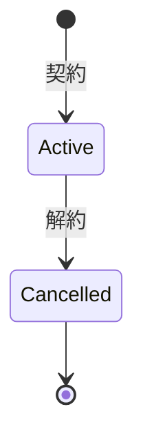

# プロジェクト用語集 (Glossary)

## 概要

このドキュメントは、Sublyプロジェクト内で使用される用語の定義を管理します。
チーム全体で統一された理解を持つためのユビキタス言語として機能します。

**更新日**: 2026-01-26

### 対象読者

- Sublyの開発チームメンバー
- SDKを使用してSublyを統合する事業者開発者
- プロダクトマネージャー

### 前提知識

- Solanaブロックチェーンの基本概念（アカウント、トランザクション、PDA）
- スマートコントラクト（プログラム）の概念
- Web3ウォレットの基本操作（Phantom、Backpack等）
- Rust / TypeScriptの基礎知識（開発者向け）

---

## ドメイン用語

プロジェクト固有のビジネス概念や機能に関する用語。

### Subly

**定義**: Privacy-first PayFi Protocol for Subscriptions on Solana

**説明**:
プライバシーを最優先にしたWeb3ネイティブのサブスクリプション決済プロトコル。
ユーザーは自分の資金がどこでどのように使われているかをコントロールでき、
事業者は顧客のプライバシーを侵害することなくサブスクリプション収益を得られる。

**コンセプト**:
- **Privacy-first**: 全ての取引データ、ユーザー情報、契約関係をプライバシー技術で保護
- **Yield-powered Payments**: 運用益（Yield）でサブスクリプション料金を支払い、元本を減らさない
- **Decentralized Stripe**: ブロックチェーンネイティブな決済インフラ

**関連用語**: [Protocol A](#protocol-a-subly-membership), [Protocol B](#protocol-b-subly-vault)

**英語表記**: Subly

---

### Protocol A (subly-membership)

**定義**: 会員管理とプライバシー保護を担当するプロトコル

**説明**:
Arcium MPC と Light Protocol を使用して、サブスクリプションの契約管理と
ゼロ知識証明による会員証明を提供する。Devnetで動作。

**機能**:
- サブスクリプションプラン管理（事業者向け）
- サブスクリプション契約・解約（ユーザー向け）
- ZK会員証明の生成・検証
- 事業者ダッシュボード（契約数のみ表示、個人特定不可）

**技術スタック**: Arcium MPC, Light Protocol, MagicBlock PER（オプション）

**関連用語**: [Business](#business-事業者), [User](#user-ユーザー), [Plan](#plan-プラン), [Subscription](#subscription-サブスクリプション)

**英語表記**: Protocol A / subly-membership

---

### Protocol B (subly-vault)

**定義**: 資金運用とプライベート決済を担当するプロトコル

**説明**:
Privacy Cash と Kamino Lending を使用して、プライベートな入金・運用・送金を提供する。
Mainnetで動作。

**機能**:
- プライベートUSDC入金
- Kamino Lendingでの自動運用（Yield生成）
- 定期的なプライベート送金（事業者への支払い）
- ユーザーダッシュボード（残高・運用状況）

**技術スタック**: Privacy Cash, Kamino Lending, Clockwork

**関連用語**: [Shield Pool](#shield-pool-シールドプール), [Yield](#yield-利回り運用益), [Private Transfer](#private-transfer-プライベート送金)

**英語表記**: Protocol B / subly-vault

---

### Business (事業者)

**定義**: サブスクリプションプランを提供し、ユーザーから料金を受け取る側

**説明**:
Web3プロジェクトの運営者やサービス提供者。SDKを使用してサブスクリプション機能を
自社アプリに組み込む。事業者は契約数のみ確認可能で、個々のユーザーを特定できない。

**関連用語**: [Plan](#plan-プラン), [Business Dashboard](#business-dashboard-事業者ダッシュボード)

**使用例**:
- 「事業者がプランを作成する」
- 「事業者が契約数を確認する」

**データモデル**: `BusinessAccount`

**英語表記**: Business / Service Provider

---

### User (ユーザー)

**定義**: サブスクリプションを契約し、サービスを利用する側

**説明**:
DeFiユーザーやWeb3サービスの利用者。ウォレットを使用してサービスに接続し、
プライバシーを保護した状態でサブスクリプションを管理する。

**関連用語**: [Subscription](#subscription-サブスクリプション), [User Dashboard](#user-dashboard-ユーザーダッシュボード)

**使用例**:
- 「ユーザーがプランに契約する」
- 「ユーザーがZK証明で会員認証を行う」

**データモデル**: `UserAccount`

**英語表記**: User / Subscriber

---

### Plan (プラン)

**定義**: 事業者が提供するサブスクリプションの課金単位

**説明**:
プラン名、説明、価格（USDC）、課金周期を持つ。プラン情報はオンチェーンに保存され、
契約数は暗号化された状態で管理される（誰が契約しているかは分からない）。

**属性**:
- `name`: プラン名
- `description`: プランの説明
- `price_usdc`: 価格（USDC、6桁精度）
- `billing_cycle_seconds`: 課金周期（秒）
- `subscription_count`: 契約数（暗号化）
- `is_active`: 有効フラグ

**関連用語**: [Billing Cycle](#billing-cycle-課金周期), [Subscription](#subscription-サブスクリプション)

**使用例**:
- 「プランを作成する」
- 「プランの契約数を確認する」

**データモデル**: `Plan`

**英語表記**: Plan / Subscription Plan

---

### Subscription (サブスクリプション)

**定義**: ユーザーとプランの間の契約関係

**説明**:
ユーザーがプランに契約すると作成される。契約情報はArcium MPCで暗号化され、
事業者はどのユーザーが契約しているか特定できない。

**属性**:
- `plan`: 契約しているプラン
- `encrypted_user_commitment`: 暗号化されたユーザーコミットメント
- `membership_commitment`: Light Protocol用コミットメント
- `subscribed_at`: 契約日時
- `is_active`: 有効フラグ

**状態遷移**:


**関連用語**: [Plan](#plan-プラン), [Commitment](#commitment-コミットメント), [Nullifier](#nullifier-ナリファイア)

**データモデル**: `Subscription`

**英語表記**: Subscription

---

### Membership Proof (会員証明)

**定義**: ゼロ知識証明を使用した会員であることの証明

**説明**:
Light Protocolを使用して生成されるZK証明。「特定のプランの会員である」という
情報のみが含まれ、ユーザーのウォレットアドレスや個人情報は含まれない。

**生成フロー**:
1. ユーザーが秘密鍵とコミットメントを使用して証明を生成
2. 事業者が証明を検証
3. 検証成功で会員限定コンテンツへのアクセスを許可

**関連用語**: [Commitment](#commitment-コミットメント), [ZK Proof](#zk-proof-ゼロ知識証明)

**英語表記**: Membership Proof / ZK Membership Proof

---

### Shield Pool (シールドプール)

**定義**: 全ユーザーの資金を混合して管理するプライバシープール

**説明**:
Protocol Bで使用される設計パターン。個別ユーザーとKaminoポジションのリンクを断ち切り、
プライバシーを保護する。ユーザーは「プール内シェア」を保持し、
プール全体としてDeFi運用を行う。

**特徴**:
- 資金の混合: 全ユーザーの資金がプールで混合され、個別追跡が不可能
- シェアベース管理: ユーザーは暗号化されたシェアを保持
- プール単位のDeFi運用: 個別ユーザーとのリンクなし

**関連用語**: [Share](#share-シェア), [Yield](#yield-利回り運用益)

**英語表記**: Shield Pool / Privacy Pool

---

### Share (シェア)

**定義**: Shield Pool内でのユーザーの持ち分

**説明**:
ユーザーがプールに入金した資金の割合を表す。シェアは暗号化された状態で保存され、
ユーザー本人のみが確認できる。

**関連用語**: [Shield Pool](#shield-pool-シールドプール)

**英語表記**: Share / Pool Share

---

### Yield (利回り/運用益)

**定義**: DeFi運用によって発生する収益

**説明**:
Shield Poolの資金をKamino Lendingに預け入れることで発生する利回り。
この運用益をサブスクリプション料金の支払いに充てることで、
ユーザーの元本を減らさない決済モデルを実現する。

**関連用語**: [Shield Pool](#shield-pool-シールドプール), [Kamino Lending](#kamino-lending)

**使用例**:
- 「Yieldでサブスクリプション料金を支払う」
- 「運用益が不足する場合は元本から補填される」

**英語表記**: Yield

---

### Billing Cycle (課金周期)

**定義**: サブスクリプション料金が発生する周期

**説明**:
時間単位、日次、週次、月次、年次から選択可能。
カスタム課金周期も設定可能（最小: 1時間、最大: 365日）。

**選択肢**:
| 周期 | 秒数 |
|------|------|
| 時間 | 3600 |
| 日次 | 86400 |
| 週次 | 604800 |
| 月次 | 2592000 |
| 年次 | 31536000 |

**関連用語**: [Plan](#plan-プラン)

**英語表記**: Billing Cycle

---

### Private Transfer (プライベート送金)

**定義**: 送金元・送金先・金額を秘匿した送金

**説明**:
Privacy Cashを使用して実行される。Solana Explorer上で
送金元や金額が見えない状態でUSDCを送金できる。

**関連用語**: [Privacy Cash](#privacy-cash)

**英語表記**: Private Transfer

---

### Commitment (コミットメント)

**定義**: ユーザーを特定せずに契約を識別するための暗号学的ハッシュ

**説明**:
`hash(secret || plan_id)` で生成される。コミットメント自体はハッシュなので、
平文で公開してもユーザーを特定できない。Light ProtocolのMerkle Treeに追加される。

**用途**:
- サブスクリプション契約の識別
- ZK証明の生成

**関連用語**: [Nullifier](#nullifier-ナリファイア), [Merkle Tree](#merkle-tree-マークルツリー)

**英語表記**: Commitment

---

### Nullifier (ナリファイア)

**定義**: 証明の二重使用を防止するための識別子

**説明**:
`hash(secret || "unsubscribe" || subscription_id)` で生成される。
一度使用されたNullifierはオンチェーンに記録され、同じ証明の再利用を防ぐ。

**用途**:
- サブスクリプション解約時の二重解約防止
- ZK証明の無効化

**関連用語**: [Commitment](#commitment-コミットメント)

**データモデル**: `MembershipNullifier`

**英語表記**: Nullifier

---

### Business Dashboard (事業者ダッシュボード)

**定義**: 事業者向けの管理画面

**説明**:
ウォレット接続でログインし、プランの作成・編集・削除、
アクティブなサブスクリプション数の確認（個人は特定できない）、
SDK統合用の設定情報の取得ができる。

**関連用語**: [Business](#business-事業者), [Plan](#plan-プラン)

**英語表記**: Business Dashboard

---

### User Dashboard (ユーザーダッシュボード)

**定義**: ユーザー向けの管理画面

**説明**:
ウォレット接続でログインし、プライベート残高の確認、
運用益の累計・現在の利回りの確認、決済履歴の確認、
資金の追加入金・出金ができる。

**関連用語**: [User](#user-ユーザー), [Shield Pool](#shield-pool-シールドプール)

**英語表記**: User Dashboard

---

## 技術用語

プロジェクトで使用している技術・フレームワーク・ツールに関する用語。

### Arcium MPC

**定義**: Multi-Party Computation（秘密計算）を提供するプラットフォーム

**公式サイト**: https://docs.arcium.com/

**本プロジェクトでの用途**:
- 会員データの暗号化
- 契約数の秘密計算（暗号化されたままインクリメント/デクリメント）
- コールバックによる暗号化結果の保存

**使用例**:
- 「Arcium MPCでサブスクリプション契約データを暗号化する」
- 「Arcium MPC経由で契約数をインクリメントする」

**関連コンポーネント**: [MXE](#mxe-multi-party-execution-environment), [Arcis](#arcis)

**関連ドキュメント**: [機能設計書](./functional-design.md)

**英語表記**: Arcium MPC

---

### Light Protocol

**定義**: ZK Compressionを使用したゼロ知識証明プロトコル

**公式サイト**: https://www.zkcompression.com/

**本プロジェクトでの用途**:
- 会員証明（Membership Proof）の生成
- Merkle Treeへのコミットメント追加
- ZK証明の検証

**使用例**:
- 「Light Protocolで会員証明を生成する」
- 「Light ProtocolのMerkle Treeにコミットメントを追加する」

**関連コンポーネント**: [Merkle Tree](#merkle-tree-マークルツリー), [ZK Proof](#zk-proof-ゼロ知識証明)

**英語表記**: Light Protocol / ZK Compression

---

### Privacy Cash

**定義**: Solana上でプライベート送金を実現するプロトコル

**公式サイト**: https://privacycash.mintlify.app/

**本プロジェクトでの用途**:
- プライベートUSDC入金（`depositSPL()`）
- プライベートUSDC送金（`withdrawSPL()`）
- 定期送金の秘匿化

**使用例**:
- 「Privacy Cashの`depositSPL()`でUSDCをプライベートに入金する」
- 「Privacy Cash経由で事業者へプライベート送金を実行する」

**対応トークン**: USDC, USDT, SOL

**関連ドキュメント**:
- [Privacy Cash SDK (Rust)](https://docs.rs/privacy-cash-sdk/latest/privacy_cash/)
- [Privacy Cash SDK (npm)](https://libraries.io/npm/privacycash)

**英語表記**: Privacy Cash

---

### Kamino Lending

**定義**: Solana上のDeFiレンディングプロトコル

**公式サイト**: https://docs.kamino.finance/

**本プロジェクトでの用途**:
- Shield Pool全体の資金をUSDCレンディングで運用
- Yield（利回り）の生成
- 年率約5-10%の利回り提供

**関連コンポーネント**: [Shield Pool](#shield-pool-シールドプール), [Yield](#yield-利回り運用益)

**英語表記**: Kamino Lending / Kamino Finance

---

### MagicBlock PER

**定義**: Private Ephemeral Rollups - TEEを使用したアクセス制御

**公式サイト**: https://docs.magicblock.gg/

**本プロジェクトでの用途**:
- 会員データPDAのアクセス制御（オプション機能）
- 暗号化されたデータの存在自体を隠蔽
- Arciumとの多層防御

**技術詳細**:
- TEE（Intel TDX）内でのみアクセス可能
- Permission Programによるアカウント単位のアクセス制御

**英語表記**: MagicBlock PER / Private Ephemeral Rollups

---

### Anchor Framework

**定義**: Solanaのスマートコントラクト開発フレームワーク

**公式サイト**: https://www.anchor-lang.com/

**本プロジェクトでの用途**:
- subly-membershipプログラムの開発
- subly-vaultプログラムの開発
- PDA管理、アカウント検証、CPI

**使用例**:
- 「Anchorでsubly-membershipプログラムを実装する」
- 「Anchor CPIでArcium Programを呼び出す」

**コード例**:
```rust
#[program]
pub mod subly_membership {
    use super::*;

    pub fn create_plan(ctx: Context<CreatePlan>, name: String, price: u64) -> Result<()> {
        // プラン作成ロジック
        Ok(())
    }
}
```

**関連ドキュメント**: [アーキテクチャ設計書](./architecture.md)

**英語表記**: Anchor Framework

---

### PDA (Program Derived Address)

**定義**: プログラムから派生して生成されるアドレス

**説明**:
秘密鍵を持たない特殊なアドレス。シードとバンプを使用して決定論的に生成される。
プログラムがデータを保存するために使用。

**本プロジェクトでの用途**:
- `BusinessAccount`: `[b"business", authority]`
- `Plan`: `[b"plan", business, plan_nonce]`
- `Subscription`: `[b"subscription", plan, user_commitment]`
- `UserAccount`: `[b"user", authority]`

**英語表記**: PDA / Program Derived Address

---

### MXE (Multi-party eXecution Environment)

**定義**: Arciumの秘密計算を実行するノードクラスター

**説明**:
複数のMXEノードが協調して秘密計算を実行する。
暗号化されたデータを秘密分散（secret shares）に変換し、
各ノードが部分的な計算を行った後、結果を暗号化して返却する。

**関連用語**: [Arcium MPC](#arcium-mpc), [Arcis](#arcis)

**英語表記**: MXE / Multi-party eXecution Environment

---

### Arcis

**定義**: Arciumの秘密計算命令言語

**説明**:
`#[instruction]`マクロで定義される、MXE内で実行される計算ロジック。
暗号化されたデータを復号せずに計算を行い、結果を暗号化して返す。

**データ型**:
- `Enc<Shared, T>`: クライアントとMXEが共有秘密鍵で暗号化したデータ
- `Enc<Mxe, T>`: MXEのみが復号可能な形式で暗号化されたデータ

**関連用語**: [MXE](#mxe-multi-party-execution-environment), [Arcium MPC](#arcium-mpc)

**英語表記**: Arcis

---

### Merkle Tree (マークルツリー)

**定義**: 暗号学的ハッシュを使用したツリー構造のデータ構造

**説明**:
Light Protocolで使用される。会員のコミットメントをリーフとして追加し、
ZK証明の生成・検証に使用される。

**関連用語**: [Commitment](#commitment-コミットメント), [Light Protocol](#light-protocol)

**英語表記**: Merkle Tree

---

### ZK Proof (ゼロ知識証明)

**定義**: 情報を明かさずに特定の事実を証明する暗号技術

**説明**:
「自分が会員である」ことを証明しながら、ウォレットアドレスや
個人情報を明かさない。本プロジェクトではLight Protocolを使用して生成。

**関連用語**: [Membership Proof](#membership-proof-会員証明), [Light Protocol](#light-protocol)

**英語表記**: Zero-Knowledge Proof / ZK Proof

---

### Clockwork

**定義**: Solana上のオートメーションプロトコル

**公式サイト**: https://clockwork.xyz/

**本プロジェクトでの用途**:
- 定期送金の自動実行
- 課金周期ごとの決済処理のトリガー

**英語表記**: Clockwork

---

### Range Risk API

**定義**: アドレスのリスクスコアを提供する制裁チェックAPI

**公式サイト**: https://docs.range.org/

**本プロジェクトでの用途**:
- サブスクリプション契約時のアドレスチェック
- 制裁対象アドレスからの契約ブロック
- コンプライアンス対応（個人情報を事業者に渡さない）

**英語表記**: Range Risk API

---

## 略語・頭字語

### MPC

**正式名称**: Multi-Party Computation

**意味**: 複数のパーティが秘密を共有せずに共同で計算を行う暗号技術

**本プロジェクトでの使用**: Arcium MPCによる会員データの暗号化と秘密計算

---

### ZK

**正式名称**: Zero Knowledge

**意味**: ゼロ知識。情報を明かさずに証明を行う暗号技術の概念

**本プロジェクトでの使用**: ZK証明による会員認証、Light Protocol

---

### PDA

**正式名称**: Program Derived Address

**意味**: プログラムから派生して生成されるアドレス

**本プロジェクトでの使用**: 各種アカウント（Business, Plan, Subscription等）の保存

---

### SDK

**正式名称**: Software Development Kit

**意味**: ソフトウェア開発キット

**本プロジェクトでの使用**:
- `@subly/membership-sdk`: 事業者向けSDK
- `@subly/vault-sdk`: ユーザー向けSDK

---

### TEE

**正式名称**: Trusted Execution Environment

**意味**: 信頼できる実行環境。ハードウェアレベルでの隔離された実行環境

**本プロジェクトでの使用**: MagicBlock PERでのIntel TDXを使用したアクセス制御

---

### USDC

**正式名称**: USD Coin

**意味**: Circle社が発行するUSドルペッグのステーブルコイン

**本プロジェクトでの使用**: サブスクリプション料金の決済通貨、DeFi運用の基本通貨

---

### DeFi

**正式名称**: Decentralized Finance

**意味**: 分散型金融。ブロックチェーン上で提供される金融サービス

**本プロジェクトでの使用**: Kamino Lendingでの資金運用、Yield生成

---

### CPI

**正式名称**: Cross-Program Invocation

**意味**: Solanaプログラム間呼び出し

**本プロジェクトでの使用**:
- Anchor → Arcium Program
- Anchor → Light Protocol
- subly-vault → Privacy Cash

---

### PER

**正式名称**: Private Ephemeral Rollups

**意味**: MagicBlockが提供するプライベートロールアップ技術

**本プロジェクトでの使用**: 会員データPDAのアクセス制御（オプション）

---

### APY

**正式名称**: Annual Percentage Yield

**意味**: 年間利回り。複利を考慮した1年間の収益率

**本プロジェクトでの使用**: Kamino LendingでのUSDC運用利回りの表示

---

## アーキテクチャ用語

### シールドプール方式

**定義**: 全ユーザーの資金を混合してプライバシーを保護する設計パターン

**本プロジェクトでの適用**: Protocol B (subly-vault) での資金管理

**メリット**:
- 個別ユーザーとDeFiポジションのリンクを断ち切る
- 入金額・運用状況の推測を防ぐ
- プール単位での効率的なDeFi運用

**図解**:
```
User Wallet → Privacy Cash → Shield Pool → Kamino
             (プライベート)   (混合)        (プール単位)
```

**関連用語**: [Shield Pool](#shield-pool-シールドプール), [Share](#share-シェア)

---

### 多層防御

**定義**: 複数のプライバシー技術を組み合わせた防御戦略

**本プロジェクトでの適用**:
```
┌─────────────────────────────────────────────┐
│ 第1層: MagicBlock PER (アクセス制御)        │
│   - PDAへのアクセス自体を制限              │
├─────────────────────────────────────────────┤
│ 第2層: Arcium MPC (データ暗号化)           │
│   - アクセスできてもデータは復号不可       │
└─────────────────────────────────────────────┘
```

**関連用語**: [MagicBlock PER](#magicblock-per), [Arcium MPC](#arcium-mpc)

---

## コード上の命名規則

本プロジェクトで使用するコード上の命名規則を定義する。

### Anchorアカウント構造体

| 概念 | Rust構造体名 | PDAシード | 備考 |
|------|--------------|-----------|------|
| 事業者 | `BusinessAccount` | `[b"business", authority]` | |
| プラン | `Plan` | `[b"plan", business, plan_nonce]` | |
| サブスクリプション | `Subscription` | `[b"subscription", plan, user_commitment]` | |
| ユーザー | `UserAccount` | `[b"user", authority]` | |
| Nullifier | `MembershipNullifier` | `[b"nullifier", nullifier_hash]` | |

### Arcium連携時の命名規則

Arciumと連携する際は、以下の命名規則に従う必要がある。

**アカウント名のサフィックス規則**:

Arciumのフレームワークでは、アカウント変数名に`_account`サフィックスを付与する必要がある。

```rust
// Arcium連携時のContext定義例
#[derive(Accounts)]
pub struct Subscribe<'info> {
    #[account(mut)]
    pub user_account: Account<'info, UserAccount>,  // ✅ _account サフィックス必須

    #[account(mut)]
    pub plan_account: Account<'info, Plan>,         // ✅ _account サフィックス必須

    #[account(
        init,
        payer = authority,
        space = 8 + Subscription::INIT_SPACE,
        seeds = [b"subscription", plan.key().as_ref(), &user_commitment],
        bump
    )]
    pub subscription_account: Account<'info, Subscription>,  // ✅ _account サフィックス必須

    #[account(mut)]
    pub authority: Signer<'info>,  // Signerは_accountサフィックス不要

    pub system_program: Program<'info, System>,  // Programも不要
}
```

**注意**: この規則はArciumのベストプラクティスに起因するもので、標準的なAnchorの命名規則とは異なる場合がある。

### 関数・命令名の規則

| 操作 | 命名パターン | 例 |
|------|--------------|-----|
| 作成 | `create_*` | `create_plan`, `create_subscription` |
| 更新 | `update_*` | `update_plan` |
| 削除/解約 | `cancel_*`, `delete_*` | `cancel_subscription`, `delete_plan` |
| 検証 | `verify_*` | `verify_membership` |
| 取得 | `get_*` | `get_plans`, `get_subscription_count` |

### SDK関数名の規則

TypeScript SDKでは、以下の命名規則を使用する。

**@subly/membership-sdk**:

| 関数名 | 説明 |
|--------|------|
| `getPlans()` | プラン一覧取得 |
| `createSubscription()` | サブスクリプション契約 |
| `cancelSubscription()` | サブスクリプション解約 |
| `verifyMembership()` | 会員証明の検証 |
| `getSubscriptionCount()` | アクティブ契約数取得 |

**@subly/vault-sdk**:

| 関数名 | 説明 |
|--------|------|
| `deposit()` | プライベート入金 |
| `withdraw()` | プライベート出金 |
| `getBalance()` | 残高取得 |
| `getYieldInfo()` | 運用益情報取得 |
| `setupRecurringPayment()` | 定期送金設定 |

### 変数・フィールド名の規則

| パターン | 用途 | 例 |
|----------|------|-----|
| `*_at` | タイムスタンプ | `created_at`, `subscribed_at` |
| `is_*` | ブールフラグ | `is_active`, `sanctions_passed` |
| `*_count` | 数量 | `subscription_count` |
| `*_usdc` | USDC金額（6桁精度） | `price_usdc`, `balance_usdc` |
| `*_seconds` | 秒単位の期間 | `billing_cycle_seconds` |
| `encrypted_*` | 暗号化データ | `encrypted_user_commitment` |
| `*_commitment` | コミットメント値 | `membership_commitment` |

### 定数名の規則

```rust
// 定数はSCREAMING_SNAKE_CASEを使用
pub const MAX_PLAN_NAME_LENGTH: usize = 32;
pub const MAX_DESCRIPTION_LENGTH: usize = 256;
pub const USDC_DECIMALS: u8 = 6;
pub const MIN_BILLING_CYCLE_SECONDS: u32 = 3600;      // 1時間
pub const MAX_BILLING_CYCLE_SECONDS: u32 = 31536000;  // 365日
```

---

## UI/UX用語

ユーザーインターフェースとユーザー体験に関する用語。

### ウォレット接続 (Wallet Connect)

**定義**: ユーザーがPhantomやBackpackなどのウォレットでアプリに認証すること

**UI要素**: 「Connect Wallet」ボタン

**フロー**:
1. ユーザーが「Connect Wallet」をクリック
2. ウォレット選択モーダルが表示
3. ウォレットで承認
4. 接続完了、アドレスがヘッダーに表示

**関連用語**: [User](#user-ユーザー), [Business](#business-事業者)

---

### 契約ボタン (Subscribe Button)

**定義**: ユーザーがプランへのサブスクリプション契約を開始するためのCTAボタン

**UI要素**: 「Subscribe」「契約する」ボタン

**状態**:
- デフォルト: クリック可能
- ローディング: トランザクション処理中
- 成功: 契約完了表示
- エラー: エラーメッセージ表示

**関連用語**: [Subscription](#subscription-サブスクリプション), [Plan](#plan-プラン)

---

### プライベート残高表示 (Private Balance Display)

**定義**: ユーザーのみが閲覧可能な暗号化された残高の表示コンポーネント

**特徴**:
- ユーザー本人のみが残高を確認可能
- 第三者からは金額が見えない
- リフレッシュボタンで最新残高を取得

**表示内容**:
- 現在の残高（USDC）
- 運用中の金額
- 累計運用益

**関連用語**: [Shield Pool](#shield-pool-シールドプール), [User Dashboard](#user-dashboard-ユーザーダッシュボード)

---

### プラン一覧 (Plan List)

**定義**: 事業者が提供するサブスクリプションプランの一覧表示

**表示項目**:
- プラン名
- 説明
- 価格（USDC/周期）
- 課金周期
- 契約ボタン

**関連用語**: [Plan](#plan-プラン), [Business Dashboard](#business-dashboard-事業者ダッシュボード)

---

### 会員バッジ (Membership Badge)

**定義**: ZK証明による会員認証が成功した際に表示されるインジケーター

**用途**:
- 会員限定コンテンツへのアクセス権表示
- 会員ステータスの視覚的確認

**関連用語**: [Membership Proof](#membership-proof-会員証明), [ZK Proof](#zk-proof-ゼロ知識証明)

---

### トランザクション確認モーダル (Transaction Confirmation Modal)

**定義**: トランザクション送信前にユーザーに確認を求めるダイアログ

**表示内容**:
- 操作内容の説明
- 予想されるガス代
- 確認/キャンセルボタン

**関連用語**: [Private Transfer](#private-transfer-プライベート送金)

---

### エラートースト (Error Toast)

**定義**: エラー発生時に画面上部または下部に表示される通知

**種類**:
- ウォレット接続エラー
- トランザクション失敗
- ネットワークエラー
- 残高不足

---

## 索引

### あ行
- [Arcis](#arcis) - 技術用語
- [Arcium MPC](#arcium-mpc) - 技術用語
- [ウォレット接続](#ウォレット接続-wallet-connect) - UI/UX用語
- [エラートースト](#エラートースト-error-toast) - UI/UX用語

### か行
- [会員バッジ](#会員バッジ-membership-badge) - UI/UX用語
- [Kamino Lending](#kamino-lending) - 技術用語
- [Clockwork](#clockwork) - 技術用語
- [契約ボタン](#契約ボタン-subscribe-button) - UI/UX用語
- [Commitment (コミットメント)](#commitment-コミットメント) - ドメイン用語

### さ行
- [Shield Pool (シールドプール)](#shield-pool-シールドプール) - ドメイン用語
- [Share (シェア)](#share-シェア) - ドメイン用語
- [Subscription (サブスクリプション)](#subscription-サブスクリプション) - ドメイン用語
- [Subly](#subly) - ドメイン用語

### た行
- [トランザクション確認モーダル](#トランザクション確認モーダル-transaction-confirmation-modal) - UI/UX用語

### な行
- [Nullifier (ナリファイア)](#nullifier-ナリファイア) - ドメイン用語

### は行
- [Billing Cycle (課金周期)](#billing-cycle-課金周期) - ドメイン用語
- [Business (事業者)](#business-事業者) - ドメイン用語
- [Plan (プラン)](#plan-プラン) - ドメイン用語
- [プライベート残高表示](#プライベート残高表示-private-balance-display) - UI/UX用語
- [プラン一覧](#プラン一覧-plan-list) - UI/UX用語
- [Privacy Cash](#privacy-cash) - 技術用語
- [Private Transfer (プライベート送金)](#private-transfer-プライベート送金) - ドメイン用語
- [Protocol A (subly-membership)](#protocol-a-subly-membership) - ドメイン用語
- [Protocol B (subly-vault)](#protocol-b-subly-vault) - ドメイン用語

### ま行
- [MagicBlock PER](#magicblock-per) - 技術用語
- [Membership Proof (会員証明)](#membership-proof-会員証明) - ドメイン用語
- [Merkle Tree (マークルツリー)](#merkle-tree-マークルツリー) - 技術用語
- [MXE](#mxe-multi-party-execution-environment) - 技術用語

### や行
- [Yield (利回り/運用益)](#yield-利回り運用益) - ドメイン用語
- [User (ユーザー)](#user-ユーザー) - ドメイン用語
- [User Dashboard (ユーザーダッシュボード)](#user-dashboard-ユーザーダッシュボード) - ドメイン用語

### ら行
- [Light Protocol](#light-protocol) - 技術用語
- [Range Risk API](#range-risk-api) - 技術用語

### A-Z
- [Anchor Framework](#anchor-framework) - 技術用語
- [APY](#apy) - 略語
- [Business Dashboard](#business-dashboard-事業者ダッシュボード) - ドメイン用語
- [CPI](#cpi) - 略語
- [DeFi](#defi) - 略語
- [MPC](#mpc) - 略語
- [PDA](#pda-program-derived-address) - 技術用語 / 略語
- [PER](#per) - 略語
- [SDK](#sdk) - 略語
- [TEE](#tee) - 略語
- [USDC](#usdc) - 略語
- [ZK](#zk) - 略語
- [ZK Proof (ゼロ知識証明)](#zk-proof-ゼロ知識証明) - 技術用語

---

## 変更履歴

| 日付 | 変更内容 |
|------|----------|
| 2026-01-26 | 初版作成 |
| 2026-01-26 | UI/UX用語セクション追加、コード上の命名規則セクション追加、対象読者・前提知識追加 |
