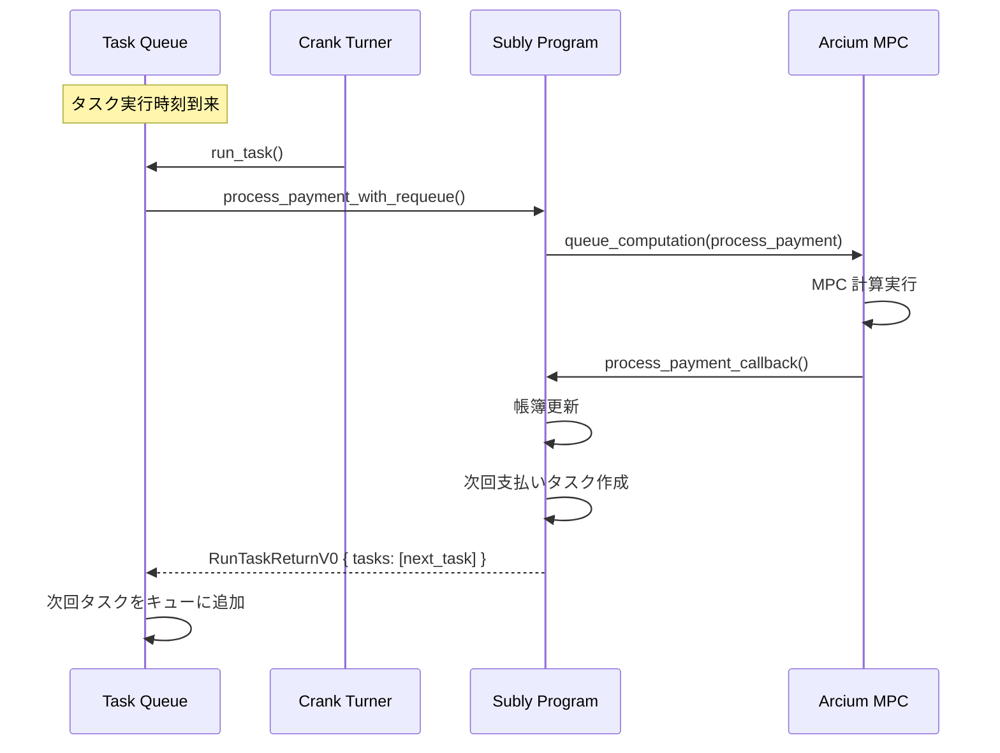
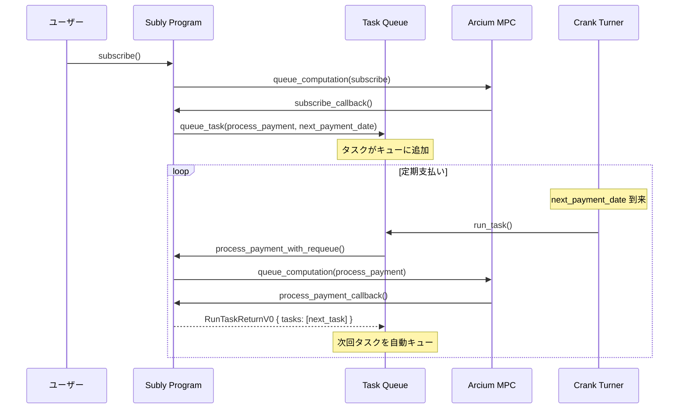

# 設計書 (Design Document)

## 1. 概要

本設計書では、定期支払い処理（process_payment）を自動的にトリガーするための仕組みを定義します。

### 1.1 実装アプローチ

```
┌─────────────────────────────────────────────────────────────────────────────┐
│                    定期支払いトリガーアーキテクチャ                           │
├─────────────────────────────────────────────────────────────────────────────┤
│                                                                              │
│  ┌──────────────────────────────────────────────────────────────────────┐   │
│  │  アプローチ 1: Tuk Tuk 統合（オンチェーン自動化）                     │   │
│  │                                                                       │   │
│  │  ┌─────────────┐    ┌─────────────┐    ┌─────────────────────────┐   │   │
│  │  │ Subscribe   │───>│ Task Queue  │───>│ Tuk Tuk Crank Turner    │   │   │
│  │  │ (初回登録)  │    │ (タスク追加)│    │ (タスク実行)            │   │   │
│  │  └─────────────┘    └─────────────┘    └───────────┬─────────────┘   │   │
│  │                                                    │                  │   │
│  │                                                    ▼                  │   │
│  │  ┌─────────────────────────────────────────────────────────────────┐ │   │
│  │  │ process_payment → Arcium MPC → callback → 自己再キューイング    │ │   │
│  │  │                                           (次回支払いをスケジュール)│ │   │
│  │  └─────────────────────────────────────────────────────────────────┘ │   │
│  └──────────────────────────────────────────────────────────────────────┘   │
│                                                                              │
│  ┌──────────────────────────────────────────────────────────────────────┐   │
│  │  アプローチ 2: 手動トリガースクリプト（バッチ処理）                   │   │
│  │                                                                       │   │
│  │  ┌─────────────┐    ┌─────────────┐    ┌─────────────────────────┐   │   │
│  │  │ SDK/Script  │───>│ 全サブスク  │───>│ 期日到来をフィルタ       │   │   │
│  │  │ (管理者実行)│    │ 取得        │    │                          │   │   │
│  │  └─────────────┘    └─────────────┘    └───────────┬─────────────┘   │   │
│  │                                                    │                  │   │
│  │                                                    ▼                  │   │
│  │  ┌─────────────────────────────────────────────────────────────────┐ │   │
│  │  │ process_payment を順次呼び出し → 結果ログ出力                   │ │   │
│  │  └─────────────────────────────────────────────────────────────────┘ │   │
│  └──────────────────────────────────────────────────────────────────────┘   │
│                                                                              │
└─────────────────────────────────────────────────────────────────────────────┘
```

## 2. Tuk Tuk 統合設計

### 2.1 Tuk Tuk 概要

Tuk Tuk は Helium が開発したオンチェーン自動化エンジンで、以下の特徴を持ちます：

| 機能               | 説明                                           |
| ------------------ | ---------------------------------------------- |
| Task Queue         | タスクを管理するキューアカウント               |
| Task               | 個々のタスク（実行するトランザクションを含む） |
| Crank Turner       | タスクを実行するオフチェーンサービス           |
| 自己再キューイング | タスク実行後に次のタスクを自動でキューに追加   |

### 2.2 新規アカウント構造

```rust
/// Subly Task Queue 設定アカウント
/// PDA Seeds: ["subly_task_queue"]
#[account]
pub struct SublyTaskQueue {
    /// 管理者（Task Queue の authority）
    pub authority: Pubkey,
    /// Tuk Tuk Task Queue のアドレス
    pub task_queue: Pubkey,
    /// 使用するトークンミント
    pub mint: Pubkey,
    /// 有効フラグ
    pub is_active: bool,
    /// PDA bump
    pub bump: u8,
}

impl SublyTaskQueue {
    pub const SIZE: usize = 8 + 32 + 32 + 32 + 1 + 1;
}
```

### 2.3 新規インストラクション

#### 2.3.1 initialize_task_queue

Task Queue を初期化し、Subly プログラムと連携させます。

```rust
pub fn initialize_task_queue(
    ctx: Context<InitializeTaskQueue>,
    min_crank_reward: u64,  // Crank Turner への最小報酬（lamports）
) -> Result<()>
```

**必要なアカウント:**

| アカウント       | 権限       | 説明                          |
| ---------------- | ---------- | ----------------------------- |
| authority        | Signer     | 管理者（資金提供者）          |
| subly_task_queue | Init       | Subly Task Queue PDA          |
| task_queue       | Init (CPI) | Tuk Tuk Task Queue アカウント |
| tuktuk_config    | -          | Tuk Tuk 設定アカウント        |
| tuktuk_program   | -          | Tuk Tuk プログラム            |
| system_program   | -          | System プログラム             |

#### 2.3.2 fund_task_queue

Task Queue に資金（SOL）を追加します。

```rust
pub fn fund_task_queue(
    ctx: Context<FundTaskQueue>,
    amount: u64,  // lamports
) -> Result<()>
```

#### 2.3.3 close_task_queue

Task Queue をクローズし、残高を回収します。

```rust
pub fn close_task_queue(
    ctx: Context<CloseTaskQueue>,
) -> Result<()>
```

#### 2.3.4 schedule_initial_payment（subscribe 内部で呼び出し）

サブスクリプション登録時に初回支払いタスクをスケジュールします。

```rust
// subscribe 関数内で Tuk Tuk へタスクをキュー
fn schedule_payment_task(
    task_queue: &Account<TaskQueueV0>,
    user_subscription: &Account<UserSubscription>,
    next_payment_timestamp: i64,
) -> Result<()>
```

### 2.4 自己再キューイングフロー



### 2.5 process_payment_with_requeue インストラクション

既存の `process_payment` を拡張し、Tuk Tuk からの呼び出しと自己再キューイングに対応します。

```rust
/// Tuk Tuk Task として実行される process_payment
/// 実行後に次回支払いタスクを自動で再キュー
pub fn process_payment_with_requeue(
    ctx: Context<ProcessPaymentWithRequeue>,
    computation_offset: u64,
    pubkey: [u8; 32],
    nonce: u128,
) -> Result<RunTaskReturnV0>
```

**追加アカウント:**

| アカウント     | 説明               |
| -------------- | ------------------ |
| task_queue     | Tuk Tuk Task Queue |
| task           | 現在実行中のタスク |
| tuktuk_program | Tuk Tuk プログラム |

### 2.6 シーケンス図: サブスクリプション登録から自動支払いまで



## 3. 手動トリガースクリプト設計

### 3.1 アーキテクチャ

```
┌─────────────────────────────────────────────────────────────────┐
│  手動トリガースクリプト                                          │
├─────────────────────────────────────────────────────────────────┤
│                                                                  │
│  1. 全 UserSubscription アカウントを取得                         │
│     │                                                            │
│     ▼                                                            │
│  2. encrypted_status をチェック（Active のみ対象）               │
│     │  ※ MPC 経由で復号してステータス確認                       │
│     ▼                                                            │
│  3. encrypted_next_payment_date ≤ 現在時刻 をフィルタ            │
│     │  ※ MPC 経由で復号して期日確認                             │
│     ▼                                                            │
│  4. process_payment を順次呼び出し                               │
│     │                                                            │
│     ▼                                                            │
│  5. 結果をログ出力                                               │
│                                                                  │
└─────────────────────────────────────────────────────────────────┘
```

### 3.2 スクリプト設計

#### 3.2.1 trigger-payments.ts

```typescript
// scripts/trigger-payments.ts

/**
 * 使用例:
 * npx ts-node scripts/trigger-payments.ts \
 *   --rpc https://api.devnet.solana.com \
 *   --keypair ./admin-keypair.json \
 *   --mint So11111111111111111111111111111111111111112 \
 *   --look-ahead 3600 \
 *   --concurrency 5
 */

import { Command } from "commander";
import { Connection, Keypair, PublicKey } from "@solana/web3.js";
import * as fs from "fs";

const program = new Command();

program
  .requiredOption("--rpc <url>", "RPC endpoint URL")
  .requiredOption("--keypair <path>", "Payer keypair JSON file path")
  .requiredOption("--mint <address>", "Token mint address")
  .option("--look-ahead <seconds>", "Seconds to look ahead", "0")
  .option("--concurrency <n>", "Parallel execution count", "1")
  .option("--dry-run", "Show what would be processed without executing");

program.parse();
const opts = program.opts();

async function main() {
  const connection = new Connection(opts.rpc, "confirmed");
  const keypairData = JSON.parse(fs.readFileSync(opts.keypair, "utf-8"));
  const payer = Keypair.fromSecretKey(Uint8Array.from(keypairData));
  const mint = new PublicKey(opts.mint);

  console.log("Fetching subscriptions due for payment...");

  // 全 UserSubscription アカウントを取得
  const subscriptionsDue = await getSubscriptionsDue(connection, mint, {
    lookAheadSeconds: parseInt(opts.lookAhead),
  });

  console.log(`Found ${subscriptionsDue.length} subscriptions due`);

  if (opts.dryRun) {
    subscriptionsDue.forEach((sub) => {
      console.log(`  - ${sub.userSubscription.toBase58()}`);
    });
    return;
  }

  // process_payment を順次呼び出し
  const results = await triggerPayments(connection, payer, subscriptionsDue, {
    concurrency: parseInt(opts.concurrency),
    onProgress: (processed, total) => {
      console.log(`Progress: ${processed}/${total}`);
    },
  });

  // 結果サマリー
  const succeeded = results.filter((r) => r.success).length;
  const failed = results.filter((r) => !r.success).length;

  console.log(`\nResults:`);
  console.log(`  Succeeded: ${succeeded}`);
  console.log(`  Failed: ${failed}`);

  if (failed > 0) {
    console.log("\nFailed payments:");
    results
      .filter((r) => !r.success)
      .forEach((r) => {
        console.log(`  ${r.userSubscription.toBase58()}: ${r.error}`);
      });
  }
}

// ヘルパー関数（スクリプト内に実装）
async function getSubscriptionsDue(connection, mint, options) {
  // 実装: getProgramAccounts で全 UserSubscription を取得
  // 注: 暗号化フィールドのため、期日フィルタは限定的
}

async function triggerPayments(connection, payer, subscriptions, options) {
  // 実装: process_payment を順次/並列で呼び出し
}

main().catch(console.error);
```

#### 3.2.2 setup-task-queue.ts

```typescript
// scripts/setup-task-queue.ts

/**
 * 使用例:
 * npx ts-node scripts/setup-task-queue.ts \
 *   --rpc https://api.devnet.solana.com \
 *   --keypair ./admin-keypair.json \
 *   --mint So11111111111111111111111111111111111111112 \
 *   --min-crank-reward 10000 \
 *   --initial-funding 1000000000
 */

import { Command } from "commander";
import {
  Connection,
  Keypair,
  PublicKey,
  LAMPORTS_PER_SOL,
} from "@solana/web3.js";
import * as fs from "fs";

const program = new Command();

program
  .requiredOption("--rpc <url>", "RPC endpoint URL")
  .requiredOption("--keypair <path>", "Authority keypair JSON file path")
  .requiredOption("--mint <address>", "Token mint address")
  .option("--min-crank-reward <lamports>", "Minimum crank reward", "10000")
  .option(
    "--initial-funding <lamports>",
    "Initial funding amount",
    String(LAMPORTS_PER_SOL),
  );

program.parse();
const opts = program.opts();

async function main() {
  const connection = new Connection(opts.rpc, "confirmed");
  const keypairData = JSON.parse(fs.readFileSync(opts.keypair, "utf-8"));
  const authority = Keypair.fromSecretKey(Uint8Array.from(keypairData));
  const mint = new PublicKey(opts.mint);

  console.log("Initializing Task Queue...");

  // initialize_task_queue を呼び出し
  // fund_task_queue で初期資金をデポジット

  console.log("Task Queue initialized successfully");
}

main().catch(console.error);
```

## 4. 変更対象コンポーネント

### 4.1 Anchor プログラム

| ファイル                                    | 変更内容                                                  |
| ------------------------------------------- | --------------------------------------------------------- |
| `programs/privacy_subscriptions/src/lib.rs` | SublyTaskQueue 構造体、Tuk Tuk 関連インストラクション追加 |
| `programs/privacy_subscriptions/src/lib.rs` | subscribe 内での初回タスクスケジュール                    |
| `programs/privacy_subscriptions/src/lib.rs` | process_payment_with_requeue インストラクション追加       |
| `programs/privacy_subscriptions/Cargo.toml` | tuktuk-program 依存関係追加                               |

### 4.2 スクリプト

| ファイル                      | 変更内容                                  |
| ----------------------------- | ----------------------------------------- |
| `scripts/trigger-payments.ts` | 手動トリガースクリプト新規作成            |
| `scripts/setup-task-queue.ts` | Task Queue セットアップスクリプト新規作成 |

## 5. 影響範囲分析

### 5.1 既存機能への影響

| 機能            | 影響     | 詳細                                                         |
| --------------- | -------- | ------------------------------------------------------------ |
| subscribe       | 変更あり | 初回支払いタスクのスケジュールを追加                         |
| process_payment | 変更なし | 既存のまま（手動トリガー用）                                 |
| unsubscribe     | 変更なし | タスクは期日に実行されても status = Cancelled で処理スキップ |
| SDK             | 変更なし | SDK は事業者アプリ向け。定期支払いは管理者用スクリプトで対応 |

### 5.2 新規依存関係

| 依存関係       | バージョン | 用途                                    |
| -------------- | ---------- | --------------------------------------- |
| tuktuk-program | 最新       | オンチェーン自動化（Anchor プログラム） |
| commander      | 最新       | スクリプト CLI パーサー                 |

### 5.3 セキュリティ考慮事項

1. **Task Queue の authority 管理**: authority の秘密鍵は厳重に管理
2. **Crank Reward の設定**: 適切な報酬額を設定しないと Crank Turner が実行しない可能性
3. **資金管理**: Task Queue には十分な SOL をデポジットしておく必要（最低 1 SOL）

## 6. テスト計画

### 6.1 ユニットテスト

| テスト             | 説明                                                 |
| ------------------ | ---------------------------------------------------- |
| Task Queue 初期化  | 正常に初期化できることを確認                         |
| タスクスケジュール | subscribe 後にタスクがキューに追加されることを確認   |
| 自己再キューイング | process_payment 後に次回タスクが追加されることを確認 |
| 手動トリガー       | triggerPayments が正常に動作することを確認           |

### 6.2 統合テスト

| テスト         | 説明                                                   |
| -------------- | ------------------------------------------------------ |
| E2E フロー     | subscribe → 自動支払い → 次回スケジュール の一連の流れ |
| 残高不足時     | 残高不足で Cancelled になった場合のタスク動作          |
| 手動バッチ処理 | スクリプトによる複数サブスクの一括処理                 |

## 7. 制約事項・注意点

1. **Tuk Tuk Task Queue のデポジット**: 最低 1 SOL 必要（Devnet では Devnet SOL）
2. **Arcium MPC レイテンシ**: 1 件あたり数秒のレイテンシが発生
3. **手動スクリプトの秘密鍵**: payer として署名するため、管理者の秘密鍵が必要
4. **Crank Turner の可用性**: Tuk Tuk の Crank Turner サービスが稼働している必要あり

---

## 変更履歴

| 日付       | バージョン | 変更内容 | 作成者 |
| ---------- | ---------- | -------- | ------ |
| 2026-02-01 | 1.0        | 初版作成 | -      |
