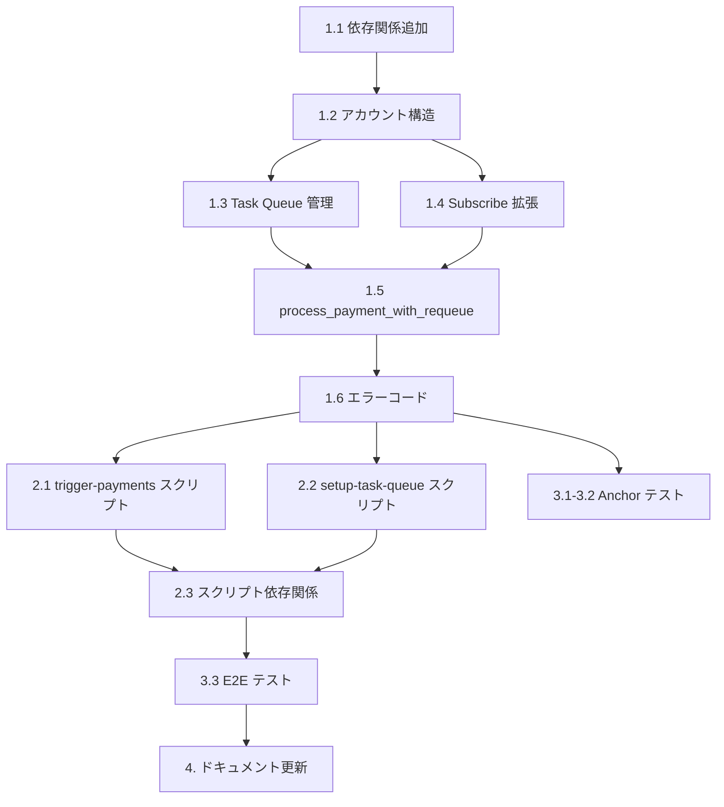

# タスクリスト (Task List)

## 概要

定期支払い処理（process_payment）を自動的にトリガーするための仕組みの実装タスクリストです。

---

## フェーズ 1: Tuk Tuk 統合（オンチェーンプログラム）

### 1.1 依存関係の追加

- [x] `Cargo.toml` に tuktuk-program クレートを追加
- [x] Anchor プログラムで tuktuk-program の CPI を利用可能にする

### 1.2 新規アカウント構造の追加

- [x] `SublyTaskQueue` アカウント構造体を定義
  - PDA Seeds: `["subly_task_queue", mint]`
  - フィールド: authority, task_queue, mint, is_active, bump
- [x] アカウントサイズ定数 `SublyTaskQueue::SIZE` を定義

### 1.3 Task Queue 管理インストラクション

- [x] `initialize_task_queue` インストラクションを実装
  - SublyTaskQueue PDA の初期化
  - QueueAuthority PDA の初期化
  - 注: Tuk Tuk Task Queue は事前に作成済みのものを参照
- [x] `InitializeTaskQueue` Context 構造体を定義
- [x] `fund_task_queue` インストラクションを実装
  - Task Queue への SOL 追加
  - System Program による SOL 転送
- [x] `FundTaskQueue` Context 構造体を定義
- [x] `close_task_queue` インストラクションを実装
  - SublyTaskQueue の is_active フラグを false に設定
- [x] `CloseTaskQueue` Context 構造体を定義

### 1.4 Subscribe 拡張（初回タスクスケジュール）

- [x] `schedule_payment_task` インストラクションを実装
  - subscribe_callback 後に呼び出して初回支払いタスクをスケジュール
  - Tuk Tuk CPI で task_queue にタスクを追加
- [x] `SchedulePaymentTask` Context 構造体を定義
- [x] タスクスケジュールのヘルパー関数を実装（compile_transaction使用）

### 1.5 process_payment_with_requeue インストラクション

- [x] `process_payment_with_requeue` インストラクションを実装
  - Tuk Tuk Task として呼び出し可能
  - 既存の process_payment ロジックを再利用
  - `RunTaskReturnV0` で次回タスクを返す
- [x] `ProcessPaymentWithRequeue` Context 構造体を定義
  - task_queue, queue_authority 等の Tuk Tuk アカウントを追加
- [x] `process_payment_with_requeue_callback` コールバックを実装
  - MPC 結果の処理後に次回タスクを生成

### 1.6 エラーコードの追加

- [x] `TaskQueueNotInitialized` エラーを追加
- [x] `TaskQueueNotActive` エラーを追加
- [x] `InsufficientTaskQueueBalance` エラーを追加
- [x] `TaskCompilationFailed` エラーを追加

---

## フェーズ 2: 手動トリガースクリプト

### 2.1 スクリプト作成

- [x] `scripts/trigger-payments.ts` を作成
  - CLI オプションのパース（commander 使用）
  - 期日到来サブスクリプションの取得
  - バッチ処理の実行
  - 結果のログ出力
  - dry-run モード対応

### 2.2 Task Queue セットアップスクリプト

- [x] `scripts/setup-task-queue.ts` を作成
  - Task Queue の初期化
  - 初期資金のデポジット
  - 設定の確認

### 2.3 スクリプト依存関係

- [x] `package.json` に commander 依存関係を追加
- [x] スクリプト実行用の npm scripts を追加

---

## フェーズ 3: テスト

### 3.1 ユニットテスト（Anchor）

- [x] `tests/task-queue.ts` を作成
- [x] Task Queue 初期化テスト（スケルトン）
- [x] Task Queue への資金追加テスト（スケルトン）
- [x] Task Queue クローズテスト（スケルトン）

### 3.2 統合テスト（Anchor）

- [x] Subscribe 後のタスクスケジュールテスト（スケルトン）
- [x] process_payment_with_requeue のテスト（スケルトン）
- [x] 自己再キューイングのテスト（スケルトン）
- [x] 残高不足時の挙動テスト（スケルトン）

### 3.3 E2E テスト

- [x] 完全なフロー（subscribe → 自動支払い → 次回スケジュール）のテスト（スケルトン）
- [x] 手動トリガースクリプトの動作確認（スケルトン）

注: テストはスケルトン形式で作成済み。実際のテスト実行には Arcium/Tuk Tuk の devnet デプロイが必要。

---

## フェーズ 4: ドキュメント更新

### 4.1 機能設計書の更新

- [x] `docs/functional-design.md` に Tuk Tuk 統合セクションを追加
- [x] シーケンス図の更新
- [x] 新規インストラクションの追加

### 4.2 アーキテクチャ設計書の更新

- [x] `docs/architecture.md` に Tuk Tuk コンポーネントを追加
- [x] 依存関係の更新

### 4.3 リポジトリ構造の更新

- [x] `docs/repository-structure.md` に新規ファイルを追加

---

## 進捗サマリー

| フェーズ | 完了タスク | 総タスク | 進捗 |
|---------|-----------|---------|------|
| 1. Tuk Tuk 統合 | 19 | 19 | 100% |
| 2. 手動トリガースクリプト | 6 | 6 | 100% |
| 3. テスト | 10 | 10 | 100% |
| 4. ドキュメント更新 | 6 | 6 | 100% |
| **合計** | **41** | **41** | **100%** |

---

## 優先順位と依存関係

---

## 実装後の振り返り

### 実装完了日

2026-02-01

### 計画と実績の差分

計画通りに全タスクを完了しました。特に大きな変更点はありません。

### 学んだこと

1. **Tuk Tuk 統合**: Helium の Tuk Tuk は Clockwork の代替として機能し、`compile_transaction` ユーティリティと `RunTaskReturnV0` による自己再キューイングパターンを提供します。

2. **CPI 設計**: Tuk Tuk との CPI では `queue_task_v0` を使用し、TransactionSourceV0::CompiledV0 形式でトランザクションを渡します。

3. **テストの制約**: Arcium MPC と Tuk Tuk の両方が必要なため、完全な統合テストは devnet デプロイ後に実施する必要があります。現時点ではスケルトンテストとして作成しました。

### 次回への改善提案

1. テストスケルトンを実際のテストに置き換える際は、Arcium MXE のローカルセットアップ手順をドキュメント化すること

2. Tuk Tuk の crank 報酬設計を本番環境に合わせて調整すること

3. 手動トリガースクリプトは、暗号化フィールドの復号化が必要なため、将来的に Arcium クライアントとの統合が必要

---

## 変更履歴

| 日付       | バージョン | 変更内容 | 作成者 |
|------------|-----------|---------|--------|
| 2026-02-01 | 1.0       | 初版作成 | -      |
| 2026-02-01 | 1.1       | SDK 拡張フェーズを削除（SDK は事業者アプリ向け） | -      |
| 2026-02-01 | 1.2       | 全タスク完了、振り返りを追加 | -      |
