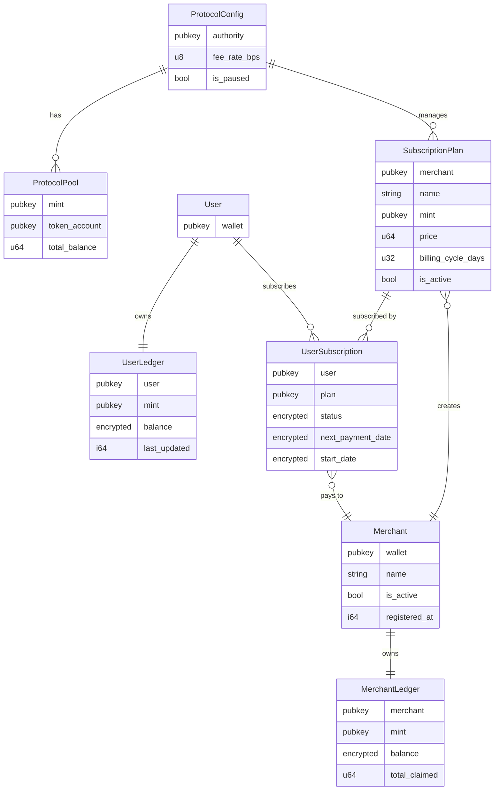
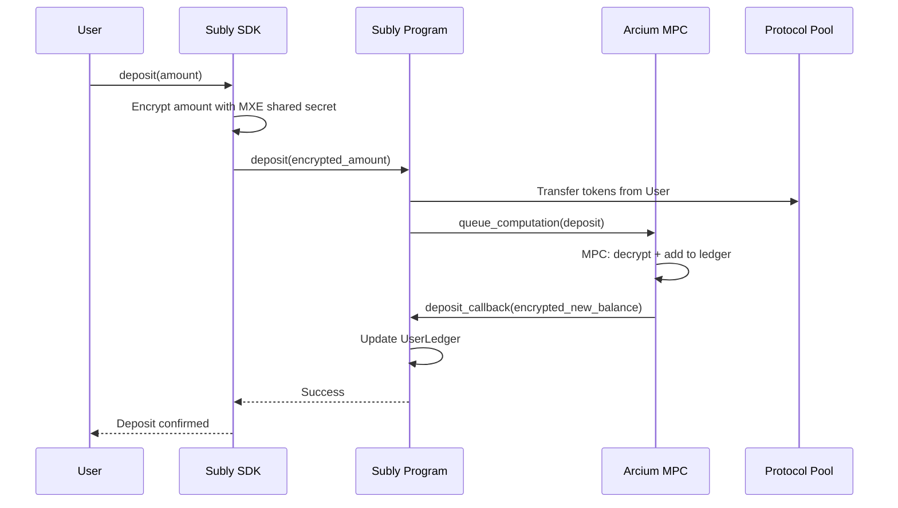
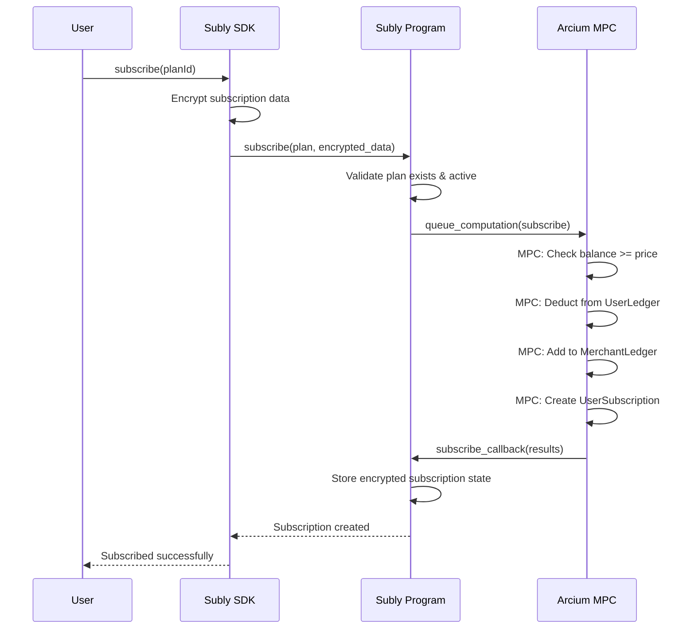
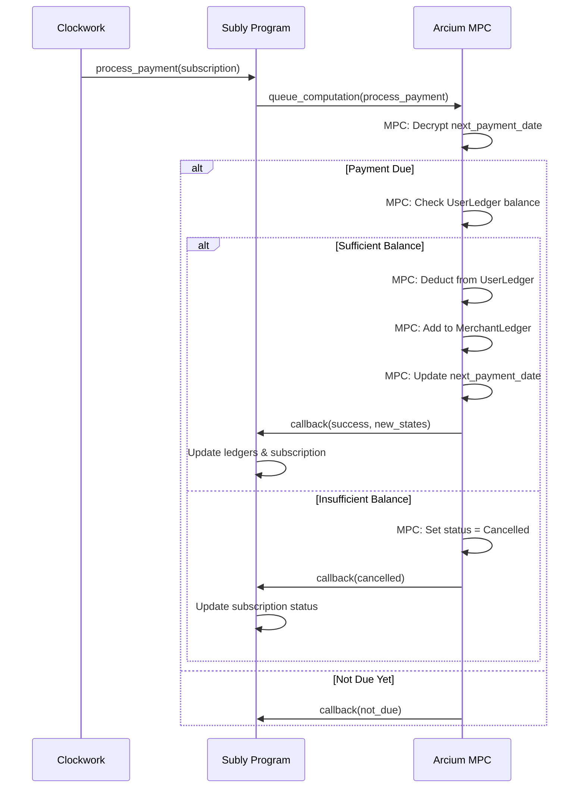
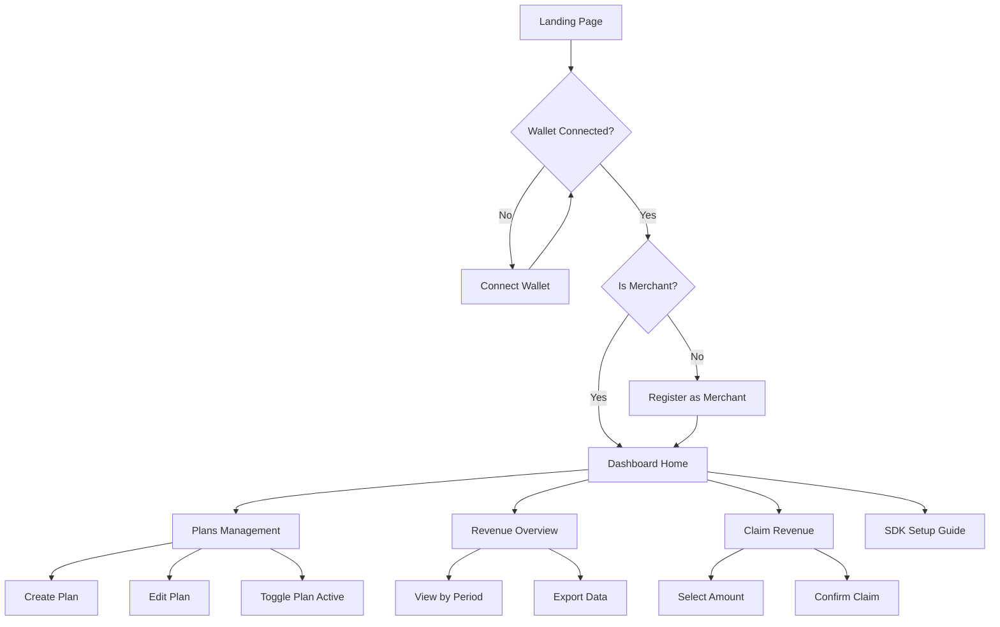

# 機能設計書 (Functional Design Document)

## 1. システムアーキテクチャ概要

### 1.1 全体構成図

```
┌─────────────────────────────────────────────────────────────────────────────┐
│                              Subly Architecture                              │
├─────────────────────────────────────────────────────────────────────────────┤
│                                                                              │
│  ┌──────────────────┐     ┌──────────────────┐     ┌──────────────────┐    │
│  │   User Wallet    │     │  Merchant App    │     │  Subly Dashboard │    │
│  │   (Phantom等)    │     │  (SDK組込)       │     │  (事業者向け)    │    │
│  └────────┬─────────┘     └────────┬─────────┘     └────────┬─────────┘    │
│           │                        │                        │               │
│           └────────────────────────┼────────────────────────┘               │
│                                    │                                         │
│                          ┌─────────▼─────────┐                              │
│                          │     Subly SDK     │                              │
│                          │   (TypeScript)    │                              │
│                          └─────────┬─────────┘                              │
│                                    │                                         │
│  ┌─────────────────────────────────┼─────────────────────────────────────┐  │
│  │                         Solana Blockchain                              │  │
│  │  ┌──────────────────────────────▼──────────────────────────────────┐  │  │
│  │  │                    Subly Anchor Program                          │  │  │
│  │  │  ┌─────────────┐  ┌─────────────┐  ┌─────────────────────────┐  │  │  │
│  │  │  │ Non-Encrypt │  │  Encrypted  │  │   Arcis Circuits        │  │  │  │
│  │  │  │ Instructions│  │ Instructions│  │   (MPC処理定義)         │  │  │  │
│  │  │  └─────────────┘  └──────┬──────┘  └─────────────────────────┘  │  │  │
│  │  └──────────────────────────┼──────────────────────────────────────┘  │  │
│  │                             │                                          │  │
│  │  ┌──────────────────────────▼──────────────────────────────────────┐  │  │
│  │  │                      Arcium Program                              │  │  │
│  │  │         (Queue Computation / Callback Handler)                   │  │  │
│  │  └──────────────────────────┬──────────────────────────────────────┘  │  │
│  └─────────────────────────────┼──────────────────────────────────────────┘  │
│                                │                                             │
│                      ┌─────────▼─────────┐                                  │
│                      │   Arcium MPC      │                                  │
│                      │   Cluster         │                                  │
│                      │ (MXE Nodes)       │                                  │
│                      └───────────────────┘                                  │
│                                                                              │
│  ┌───────────────────────────────────────────────────────────────────────┐  │
│  │                         Clockwork / Cron                               │  │
│  │                    (自動支払い処理トリガー)                            │  │
│  └───────────────────────────────────────────────────────────────────────┘  │
│                                                                              │
└─────────────────────────────────────────────────────────────────────────────┘
```

### 1.2 コンポーネント責務

| コンポーネント       | 責務                                                     |
| -------------------- | -------------------------------------------------------- |
| User Wallet          | ユーザー認証、トランザクション署名                       |
| Merchant App         | 事業者アプリ、SDK を通じてサブスク機能を提供             |
| Subly Dashboard      | 事業者向け管理画面（プラン管理、収益確認、Claim）        |
| Subly SDK            | クライアントライブラリ、暗号化処理、トランザクション構築 |
| Subly Anchor Program | オンチェーンロジック、アカウント管理                     |
| Arcium Program       | MPC 計算キュー管理、コールバック処理                     |
| Arcium MPC Cluster   | 暗号化データの計算実行（秘密分散）                       |
| Clockwork            | 定期支払い処理の自動実行                                 |

## 2. データモデル定義

### 2.1 ER 図



### 2.2 アカウント詳細定義

#### 2.2.1 ProtocolConfig

プロトコル全体の設定を管理するシングルトンアカウント。

```rust
#[account]
pub struct ProtocolConfig {
    /// プロトコル管理者
    pub authority: Pubkey,
    /// 手数料率（BPS: 100 = 1%）
    pub fee_rate_bps: u8,
    /// プロトコル一時停止フラグ
    pub is_paused: bool,
    /// バンプシード
    pub bump: u8,
}
```

**PDA Seeds**: `["protocol_config"]`

#### 2.2.2 ProtocolPool

トークンごとの共通資金プール。

```rust
#[account]
pub struct ProtocolPool {
    /// トークンミント
    pub mint: Pubkey,
    /// プールのトークンアカウント
    pub token_account: Pubkey,
    /// バンプシード
    pub bump: u8,
}
```

**PDA Seeds**: `["protocol_pool", mint]`

#### 2.2.3 Merchant

事業者アカウント。

```rust
#[account]
pub struct Merchant {
    /// 事業者ウォレット
    pub wallet: Pubkey,
    /// 事業者名（最大64バイト）
    pub name: [u8; 64],
    /// 有効フラグ
    pub is_active: bool,
    /// 登録日時（Unix timestamp）
    pub registered_at: i64,
    /// バンプシード
    pub bump: u8,
}
```

**PDA Seeds**: `["merchant", wallet]`

#### 2.2.4 MerchantLedger

事業者の帳簿残高（暗号化）。

```rust
#[account]
pub struct MerchantLedger {
    /// 事業者
    pub merchant: Pubkey,
    /// トークンミント
    pub mint: Pubkey,
    /// 暗号化された残高（Enc<Mxe, u64>）
    pub encrypted_balance: [u8; 64],
    /// 累計引き出し額（平文、監査用）
    pub total_claimed: u64,
    /// バンプシード
    pub bump: u8,
}
```

**PDA Seeds**: `["merchant_ledger", merchant, mint]`

#### 2.2.5 SubscriptionPlan

サブスクリプションプラン。

```rust
#[account]
pub struct SubscriptionPlan {
    /// 事業者
    pub merchant: Pubkey,
    /// プラン名（最大32バイト）
    pub name: [u8; 32],
    /// 支払いトークン
    pub mint: Pubkey,
    /// 料金（lamports / token units）
    pub price: u64,
    /// 請求サイクル（日数）
    pub billing_cycle_days: u32,
    /// 有効フラグ
    pub is_active: bool,
    /// 作成日時
    pub created_at: i64,
    /// バンプシード
    pub bump: u8,
}
```

**PDA Seeds**: `["subscription_plan", merchant, plan_id]`

#### 2.2.6 UserLedger

ユーザーの帳簿残高（暗号化）。

```rust
#[account]
pub struct UserLedger {
    /// ユーザー
    pub user: Pubkey,
    /// トークンミント
    pub mint: Pubkey,
    /// 暗号化された残高（Enc<Mxe, u64>）
    pub encrypted_balance: [u8; 64],
    /// 最終更新日時
    pub last_updated: i64,
    /// バンプシード
    pub bump: u8,
}
```

**PDA Seeds**: `["user_ledger", user, mint]`

#### 2.2.7 UserSubscription

ユーザーのサブスクリプション状態（暗号化）。

```rust
#[account]
pub struct UserSubscription {
    /// ユーザー
    pub user: Pubkey,
    /// サブスクリプションプラン
    pub plan: Pubkey,
    /// 暗号化されたステータス（Enc<Mxe, SubscriptionStatus>）
    /// SubscriptionStatus: Active = 0, Cancelled = 1, Expired = 2
    pub encrypted_status: [u8; 32],
    /// 暗号化された次回支払日（Enc<Mxe, i64>）
    pub encrypted_next_payment_date: [u8; 32],
    /// 暗号化された開始日（Enc<Mxe, i64>）
    pub encrypted_start_date: [u8; 32],
    /// バンプシード
    pub bump: u8,
}
```

**PDA Seeds**: `["user_subscription", user, plan]`

## 3. ユースケース詳細

### 3.1 ユースケース図

```mermaid
graph TB
    subgraph Users
        U[User]
        M[Merchant]
        A[Admin]
    end

    subgraph "User Actions"
        U --> UC1[Deposit to Pool]
        U --> UC2[Withdraw from Pool]
        U --> UC3[Subscribe to Plan]
        U --> UC4[Unsubscribe]
        U --> UC5[Check Balance]
        U --> UC6[Check Subscription Status]
    end

    subgraph "Merchant Actions"
        M --> UC7[Register as Merchant]
        M --> UC8[Create Subscription Plan]
        M --> UC9[Update Subscription Plan]
        M --> UC10[Claim Revenue]
        M --> UC11[View Revenue Dashboard]
    end

    subgraph "Admin Actions"
        A --> UC12[Initialize Protocol]
        A --> UC13[Update Fee Rate]
        A --> UC14[Pause Protocol]
    end

    subgraph "Automated Actions"
        CRON[Clockwork Cron] --> UC15[Process Payments]
        UC15 --> UC16[Auto Cancel on Failure]
    end
```



### 3.2 主要ユースケースシーケンス

#### 3.2.1 UC1: Deposit to Pool



#### 3.2.2 UC3: Subscribe to Plan



#### 3.2.3 UC15: Process Payments (Cron)



## 4. インストラクション詳細設計

### 4.1 非暗号化インストラクション

#### 4.1.1 initialize_protocol

```rust
pub fn initialize_protocol(
    ctx: Context<InitializeProtocol>,
    fee_rate_bps: u8,
) -> Result<()>
```

| パラメータ     | 型    | 説明                       |
| -------------- | ----- | -------------------------- |
| `fee_rate_bps` | `u8`  | 手数料率（BPS、0-255）     |

| アカウント        | 権限       | 説明                     |
| ----------------- | ---------- | ------------------------ |
| `authority`       | Signer     | プロトコル管理者         |
| `protocol_config` | Init       | プロトコル設定 PDA       |
| `system_program`  | -          | System Program           |

#### 4.1.2 register_merchant

```rust
pub fn register_merchant(
    ctx: Context<RegisterMerchant>,
    name: String,
) -> Result<()>
```

| パラメータ | 型       | 説明                   |
| ---------- | -------- | ---------------------- |
| `name`     | `String` | 事業者名（最大64文字） |

#### 4.1.3 create_subscription_plan

```rust
pub fn create_subscription_plan(
    ctx: Context<CreateSubscriptionPlan>,
    name: String,
    price: u64,
    billing_cycle_days: u32,
) -> Result<()>
```

| パラメータ           | 型       | 説明               |
| -------------------- | -------- | ------------------ |
| `name`               | `String` | プラン名           |
| `price`              | `u64`    | 料金               |
| `billing_cycle_days` | `u32`    | 請求サイクル（日） |

### 4.2 暗号化インストラクション（3フェーズ）

#### 4.2.1 Deposit

**Init Phase**
```rust
pub fn init_deposit_comp_def(
    ctx: Context<InitDepositCompDef>,
) -> Result<()>
```

**Queue Phase**
```rust
pub fn deposit(
    ctx: Context<Deposit>,
    amount: u64,  // 平文（Pool への実送金額）
    encrypted_amount: [u8; 64],  // 暗号化（帳簿更新用）
) -> Result<()>
```

**Callback Phase**
```rust
pub fn deposit_callback(
    ctx: Context<DepositCallback>,
    encrypted_new_balance: [u8; 64],
) -> Result<()>
```

#### 4.2.2 Subscribe

**Queue Phase**
```rust
pub fn subscribe(
    ctx: Context<Subscribe>,
    plan: Pubkey,
) -> Result<()>
```

**Callback Phase**
```rust
pub fn subscribe_callback(
    ctx: Context<SubscribeCallback>,
    encrypted_user_balance: [u8; 64],
    encrypted_merchant_balance: [u8; 64],
    encrypted_subscription_status: [u8; 32],
    encrypted_next_payment_date: [u8; 32],
    encrypted_start_date: [u8; 32],
) -> Result<()>
```

#### 4.2.3 VerifySubscription

**Queue Phase**
```rust
pub fn verify_subscription(
    ctx: Context<VerifySubscription>,
    user: Pubkey,
    merchant: Pubkey,
) -> Result<()>
```

**Callback Phase**
```rust
pub fn verify_subscription_callback(
    ctx: Context<VerifySubscriptionCallback>,
    is_valid: bool,  // 平文で返却（公開情報）
) -> Result<()>
```

## 5. Arcis 回路設計

### 5.1 deposit 回路

```rust
#[encrypted]
pub fn deposit_circuit(
    current_balance: Enc<Mxe, u64>,
    deposit_amount: Enc<Shared, u64>,
) -> Enc<Mxe, u64> {
    let current = current_balance.to_arcis();
    let amount = deposit_amount.to_arcis();

    let new_balance = current + amount;

    new_balance.from_arcis()
}
```

### 5.2 process_payment 回路

```rust
#[encrypted]
pub fn process_payment_circuit(
    user_balance: Enc<Mxe, u64>,
    merchant_balance: Enc<Mxe, u64>,
    subscription_status: Enc<Mxe, u8>,
    next_payment_date: Enc<Mxe, i64>,
    current_timestamp: i64,  // 平文（公開情報）
    plan_price: u64,         // 平文（公開情報）
    billing_cycle_days: u32, // 平文（公開情報）
) -> (
    Enc<Mxe, u64>,  // new_user_balance
    Enc<Mxe, u64>,  // new_merchant_balance
    Enc<Mxe, u8>,   // new_status
    Enc<Mxe, i64>,  // new_next_payment_date
    bool,           // payment_processed (平文)
) {
    let user_bal = user_balance.to_arcis();
    let merchant_bal = merchant_balance.to_arcis();
    let status = subscription_status.to_arcis();
    let next_date = next_payment_date.to_arcis();

    // ステータスがActiveでない場合はスキップ
    let is_active = status.eq(&0u8);

    // 支払い日が到来しているか
    let is_due = next_date.le(&current_timestamp);

    // 残高が十分か
    let has_balance = user_bal.ge(&plan_price);

    // 支払い実行判定
    let should_process = is_active & is_due;
    let can_pay = should_process & has_balance;

    // 残高更新
    let new_user_bal = if can_pay {
        user_bal - plan_price
    } else {
        user_bal
    };

    let new_merchant_bal = if can_pay {
        merchant_bal + plan_price
    } else {
        merchant_bal
    };

    // ステータス更新（残高不足時はキャンセル）
    let new_status = if should_process & !has_balance {
        1u8  // Cancelled
    } else {
        status
    };

    // 次回支払日更新
    let cycle_seconds = (billing_cycle_days as i64) * 86400;
    let new_next_date = if can_pay {
        next_date + cycle_seconds
    } else {
        next_date
    };

    (
        new_user_bal.from_arcis(),
        new_merchant_bal.from_arcis(),
        new_status.from_arcis(),
        new_next_date.from_arcis(),
        can_pay.reveal(),
    )
}
```

### 5.3 verify_subscription 回路

```rust
#[encrypted]
pub fn verify_subscription_circuit(
    subscription_status: Enc<Mxe, u8>,
    next_payment_date: Enc<Mxe, i64>,
    current_timestamp: i64,
) -> bool {
    let status = subscription_status.to_arcis();
    let next_date = next_payment_date.to_arcis();

    // Active かつ 支払い期限内
    let is_active = status.eq(&0u8);
    let is_valid = next_date.gt(&current_timestamp);

    (is_active & is_valid).reveal()
}
```

## 6. SDK 設計

### 6.1 クラス構成

```typescript
// subly-sdk/src/index.ts

export class SublySDK {
  private connection: Connection;
  private merchantWallet: PublicKey;
  private programId: PublicKey;
  private arciumClient: ArciumClient;

  constructor(config: SublyConfig);

  // User methods
  async deposit(amount: BN, mint: PublicKey): Promise<TransactionSignature>;
  async withdraw(amount: BN, mint: PublicKey): Promise<TransactionSignature>;
  async subscribe(planId: PublicKey): Promise<TransactionSignature>;
  async unsubscribe(planId: PublicKey): Promise<TransactionSignature>;
  async getBalance(mint: PublicKey): Promise<BN | null>;
  async checkSubscription(planId: PublicKey): Promise<SubscriptionStatus>;

  // Merchant methods (for dashboard)
  async getPlans(): Promise<SubscriptionPlan[]>;
  async getMerchantBalance(mint: PublicKey): Promise<BN | null>;
  async claimRevenue(amount: BN, mint: PublicKey): Promise<TransactionSignature>;
}

export interface SublyConfig {
  merchantWallet: string;
  rpcEndpoint: string;
  programId?: string;
  arciumConfig?: ArciumConfig;
}

export interface SubscriptionPlan {
  publicKey: PublicKey;
  merchant: PublicKey;
  name: string;
  mint: PublicKey;
  price: BN;
  billingCycleDays: number;
  isActive: boolean;
}

export enum SubscriptionStatus {
  NotSubscribed = 'not_subscribed',
  Active = 'active',
  Cancelled = 'cancelled',
  Expired = 'expired',
}
```

### 6.2 使用例

```typescript
import { SublySDK, SubscriptionStatus } from '@subly/sdk';
import { useWallet } from '@solana/wallet-adapter-react';

// 初期化
const subly = new SublySDK({
  merchantWallet: 'MERCHANT_WALLET_ADDRESS',
  rpcEndpoint: 'https://api.devnet.solana.com',
});

// ユーザーがサブスク状態を確認
const status = await subly.checkSubscription(planId);
if (status === SubscriptionStatus.NotSubscribed) {
  // サブスク登録を促す
}

// デポジット
await subly.deposit(new BN(1_000_000_000), NATIVE_MINT); // 1 SOL

// サブスク登録
await subly.subscribe(planId);

// 残高確認（暗号化されているが本人は復号可能）
const balance = await subly.getBalance(NATIVE_MINT);
```

## 7. Dashboard 画面設計

### 7.1 画面遷移図



### 7.2 主要画面ワイヤフレーム

#### 7.2.1 Dashboard Home

```
┌─────────────────────────────────────────────────────────────────┐
│  Subly Dashboard                          [Wallet: 0x1234...] │
├─────────────────────────────────────────────────────────────────┤
│                                                                 │
│  ┌─────────────────┐  ┌─────────────────┐  ┌─────────────────┐ │
│  │ Total Revenue   │  │ Active Subs     │  │ This Month      │ │
│  │ ██████ SOL      │  │ ███ users       │  │ ████ SOL        │ │
│  │ (encrypted)     │  │ (count only)    │  │ (encrypted)     │ │
│  └─────────────────┘  └─────────────────┘  └─────────────────┘ │
│                                                                 │
│  ┌─────────────────────────────────────────────────────────────┐│
│  │ Quick Actions                                                ││
│  │ [+ Create Plan]  [Claim Revenue]  [View SDK Docs]           ││
│  └─────────────────────────────────────────────────────────────┘│
│                                                                 │
│  ┌─────────────────────────────────────────────────────────────┐│
│  │ Your Plans                                                   ││
│  │ ┌─────────────────────────────────────────────────────────┐ ││
│  │ │ Premium Plan    1 SOL/month    Active    [Edit] [Toggle]│ ││
│  │ │ Basic Plan      0.5 SOL/month  Active    [Edit] [Toggle]│ ││
│  │ └─────────────────────────────────────────────────────────┘ ││
│  └─────────────────────────────────────────────────────────────┘│
│                                                                 │
└─────────────────────────────────────────────────────────────────┘
```

#### 7.2.2 Create Plan

```
┌─────────────────────────────────────────────────────────────────┐
│  Create Subscription Plan                              [← Back] │
├─────────────────────────────────────────────────────────────────┤
│                                                                 │
│  Plan Name                                                      │
│  ┌─────────────────────────────────────────────────────────────┐│
│  │ Premium Membership                                          ││
│  └─────────────────────────────────────────────────────────────┘│
│                                                                 │
│  Price                              Token                       │
│  ┌───────────────────────┐         ┌───────────────────────┐   │
│  │ 1.0                   │         │ SOL           ▼       │   │
│  └───────────────────────┘         └───────────────────────┘   │
│                                                                 │
│  Billing Cycle                                                  │
│  ┌─────────────────────────────────────────────────────────────┐│
│  │ Monthly (30 days)                                    ▼      ││
│  └─────────────────────────────────────────────────────────────┘│
│                                                                 │
│                                            [Cancel] [Create]    │
│                                                                 │
└─────────────────────────────────────────────────────────────────┘
```

## 8. Clockwork Cron 設計

### 8.1 ジョブ構成

```rust
// 毎日 00:00 UTC に実行
pub fn create_payment_cron_job(
    ctx: Context<CreatePaymentCronJob>,
) -> Result<()> {
    // Clockwork Thread を作成
    let trigger = Trigger::Cron {
        schedule: "0 0 * * *".to_string(),
        skippable: true,
    };

    // process_payment を呼び出すスレッドを作成
    clockwork_sdk::cpi::thread_create(
        ctx.accounts.to_thread_create(),
        "subly_payment_processor".to_string(),
        trigger,
        vec![
            Instruction {
                program_id: ctx.accounts.subly_program.key(),
                accounts: vec![/* ... */],
                data: subly::instruction::ProcessPaymentBatch {}.data(),
            }
        ],
    )?;

    Ok(())
}
```

### 8.2 バッチ処理フロー

```
┌─────────────────────────────────────────────────────────────────┐
│  Daily Payment Processing                                        │
├─────────────────────────────────────────────────────────────────┤
│                                                                  │
│  1. Clockwork triggers at 00:00 UTC                              │
│     │                                                            │
│     ▼                                                            │
│  2. process_payment_batch instruction called                     │
│     │                                                            │
│     ▼                                                            │
│  3. Iterate through UserSubscription accounts                    │
│     │  (using getProgramAccounts with filters)                   │
│     │                                                            │
│     ▼                                                            │
│  4. For each subscription:                                       │
│     ├── Queue process_payment to Arcium                          │
│     └── Arcium callback updates ledgers                          │
│                                                                  │
│  Note: Due to compute limits, batch size is limited              │
│        Multiple transactions may be needed                       │
│                                                                  │
└─────────────────────────────────────────────────────────────────┘
```

---

## 変更履歴

| 日付       | バージョン | 変更内容 | 作成者 |
| ---------- | ---------- | -------- | ------ |
| 2025-01-31 | 1.0        | 初版作成 | -      |
