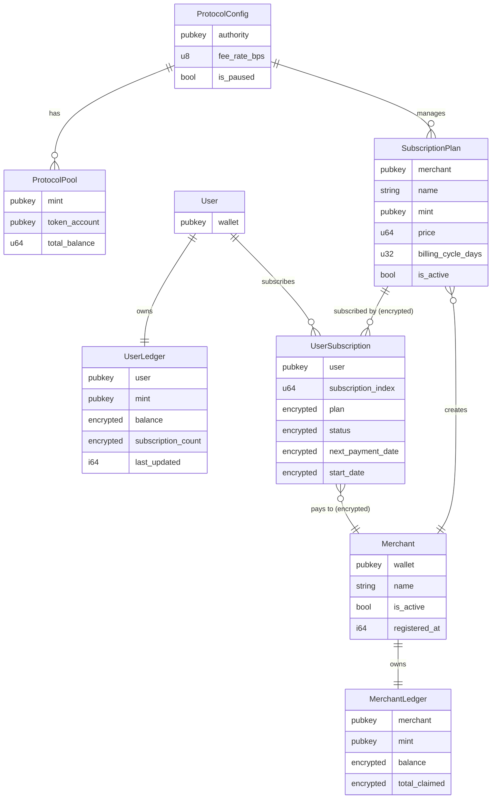
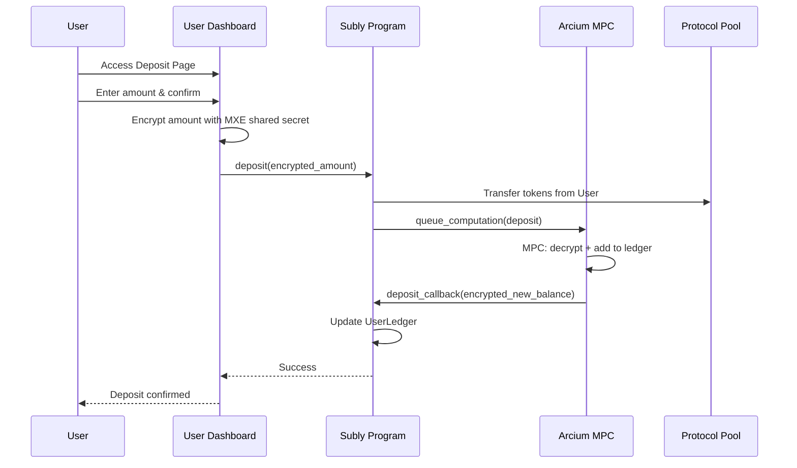
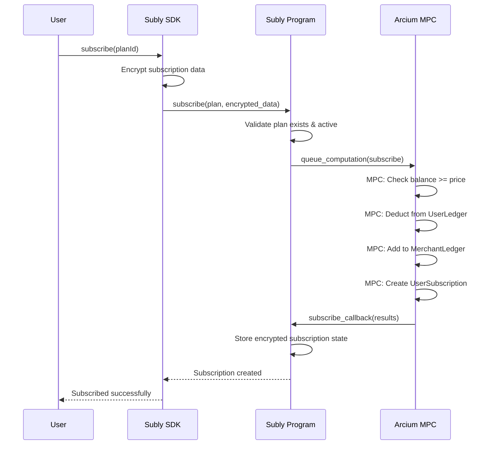
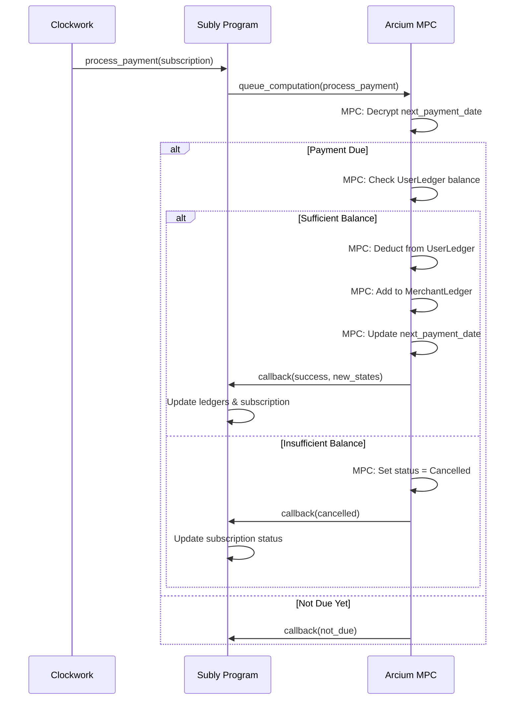
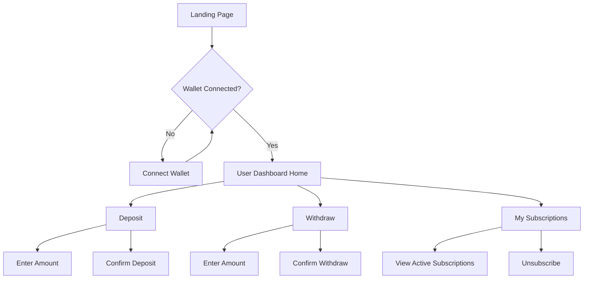
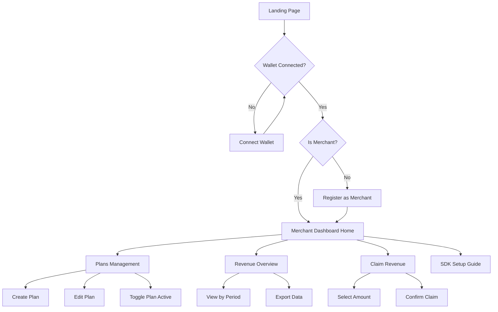
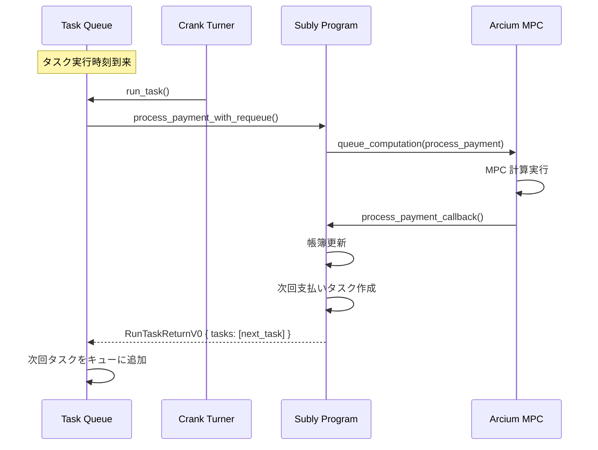

# 機能設計書 (Functional Design Document)

## 1. システムアーキテクチャ概要

### 1.1 全体構成図

```
┌─────────────────────────────────────────────────────────────────────────────┐
│                              Subly Architecture                              │
├─────────────────────────────────────────────────────────────────────────────┤
│                                                                              │
│  ┌──────────────────┐     ┌──────────────────┐     ┌──────────────────┐    │
│  │   User Wallet    │     │  Merchant App    │     │  Subly Dashboard │    │
│  │   (Phantom等)    │     │  (SDK組込)       │     │  (事業者向け)    │    │
│  └────────┬─────────┘     └────────┬─────────┘     └────────┬─────────┘    │
│           │                        │                        │               │
│           └────────────────────────┼────────────────────────┘               │
│                                    │                                         │
│                          ┌─────────▼─────────┐                              │
│                          │     Subly SDK     │                              │
│                          │   (TypeScript)    │                              │
│                          └─────────┬─────────┘                              │
│                                    │                                         │
│  ┌─────────────────────────────────┼─────────────────────────────────────┐  │
│  │                         Solana Blockchain                              │  │
│  │  ┌──────────────────────────────▼──────────────────────────────────┐  │  │
│  │  │                    Subly Anchor Program                          │  │  │
│  │  │  ┌─────────────┐  ┌─────────────┐  ┌─────────────────────────┐  │  │  │
│  │  │  │ Non-Encrypt │  │  Encrypted  │  │   Arcis Circuits        │  │  │  │
│  │  │  │ Instructions│  │ Instructions│  │   (MPC処理定義)         │  │  │  │
│  │  │  └─────────────┘  └──────┬──────┘  └─────────────────────────┘  │  │  │
│  │  └──────────────────────────┼──────────────────────────────────────┘  │  │
│  │                             │                                          │  │
│  │  ┌──────────────────────────▼──────────────────────────────────────┐  │  │
│  │  │                      Arcium Program                              │  │  │
│  │  │         (Queue Computation / Callback Handler)                   │  │  │
│  │  └──────────────────────────┬──────────────────────────────────────┘  │  │
│  └─────────────────────────────┼──────────────────────────────────────────┘  │
│                                │                                             │
│                      ┌─────────▼─────────┐                                  │
│                      │   Arcium MPC      │                                  │
│                      │   Cluster         │                                  │
│                      │ (MXE Nodes)       │                                  │
│                      └───────────────────┘                                  │
│                                                                              │
│  ┌───────────────────────────────────────────────────────────────────────┐  │
│  │                         Clockwork / Cron                               │  │
│  │                    (自動支払い処理トリガー)                            │  │
│  └───────────────────────────────────────────────────────────────────────┘  │
│                                                                              │
└─────────────────────────────────────────────────────────────────────────────┘
```

### 1.2 コンポーネント責務

| コンポーネント       | 責務                                                     |
| -------------------- | -------------------------------------------------------- |
| User Wallet          | ユーザー認証、トランザクション署名                       |
| Merchant App         | 事業者アプリ、SDK を通じてサブスク機能を提供             |
| Subly Dashboard      | 事業者向け管理画面（プラン管理、収益確認、Claim）        |
| Subly SDK            | クライアントライブラリ、暗号化処理、トランザクション構築 |
| Subly Anchor Program | オンチェーンロジック、アカウント管理                     |
| Arcium Program       | MPC 計算キュー管理、コールバック処理                     |
| Arcium MPC Cluster   | 暗号化データの計算実行（秘密分散）                       |
| Clockwork            | 定期支払い処理の自動実行                                 |

## 2. データモデル定義

### 2.1 ER 図



### 2.2 アカウント詳細定義

#### 2.2.1 ProtocolConfig

プロトコル全体の設定を管理するシングルトンアカウント。

```rust
#[account]
pub struct ProtocolConfig {
    /// プロトコル管理者
    pub authority: Pubkey,
    /// 手数料率（BPS: 100 = 1%）
    pub fee_rate_bps: u8,
    /// プロトコル一時停止フラグ
    pub is_paused: bool,
    /// バンプシード
    pub bump: u8,
}
```

**PDA Seeds**: `["protocol_config"]`

#### 2.2.2 ProtocolPool

トークンごとの共通資金プール。

```rust
#[account]
pub struct ProtocolPool {
    /// トークンミント
    pub mint: Pubkey,
    /// プールのトークンアカウント
    pub token_account: Pubkey,
    /// バンプシード
    pub bump: u8,
}
```

**PDA Seeds**: `["protocol_pool", mint]`

#### 2.2.3 Merchant

事業者アカウント。

```rust
#[account]
pub struct Merchant {
    /// 事業者ウォレット
    pub wallet: Pubkey,
    /// 事業者名（最大64バイト）
    pub name: [u8; 64],
    /// 有効フラグ
    pub is_active: bool,
    /// 登録日時（Unix timestamp）
    pub registered_at: i64,
    /// バンプシード
    pub bump: u8,
}
```

**PDA Seeds**: `["merchant", wallet]`

#### 2.2.4 MerchantLedger

事業者の帳簿残高（暗号化）。

```rust
#[account]
pub struct MerchantLedger {
    /// 事業者
    pub merchant: Pubkey,
    /// トークンミント
    pub mint: Pubkey,
    /// 暗号化された残高（Enc<Mxe, u64>）
    pub encrypted_balance: [u8; 64],
    /// 暗号化された累計引き出し額（Enc<Mxe, u64>）
    /// ※プライバシー保護のため暗号化
    pub encrypted_total_claimed: [u8; 64],
    /// バンプシード
    pub bump: u8,
}
```

**PDA Seeds**: `["merchant_ledger", merchant, mint]`

#### 2.2.5 SubscriptionPlan

サブスクリプションプラン。

```rust
#[account]
pub struct SubscriptionPlan {
    /// 事業者
    pub merchant: Pubkey,
    /// プラン名（最大32バイト）
    pub name: [u8; 32],
    /// 支払いトークン
    pub mint: Pubkey,
    /// 料金（lamports / token units）
    pub price: u64,
    /// 請求サイクル（日数）
    pub billing_cycle_days: u32,
    /// 有効フラグ
    pub is_active: bool,
    /// 作成日時
    pub created_at: i64,
    /// バンプシード
    pub bump: u8,
}
```

**PDA Seeds**: `["subscription_plan", merchant, plan_id]`

#### 2.2.6 UserLedger

ユーザーの帳簿残高（暗号化）。

```rust
#[account]
pub struct UserLedger {
    /// ユーザー
    pub user: Pubkey,
    /// トークンミント
    pub mint: Pubkey,
    /// 暗号化された残高（Enc<Mxe, u64>）
    pub encrypted_balance: [u8; 64],
    /// 暗号化されたサブスクリプションカウンター（Enc<Mxe, u64>）
    /// ※UserSubscription作成時にMPC内でインクリメント
    /// ※第三者からはサブスク数が不明
    pub encrypted_subscription_count: [u8; 64],
    /// 最終更新日時
    pub last_updated: i64,
    /// バンプシード
    pub bump: u8,
}
```

**PDA Seeds**: `["user_ledger", user, mint]`

#### 2.2.7 UserSubscription

ユーザーのサブスクリプション状態（暗号化）。

**プライバシー設計**: どのプランにサブスクライブしているかを秘匿するため、`plan` も暗号化。
PDA Seeds には `subscription_index`（ユーザーごとのカウンター）を使用し、プラン情報との紐付けを隠蔽。

```rust
#[account]
pub struct UserSubscription {
    /// ユーザー
    pub user: Pubkey,
    /// サブスクリプションインデックス（ユーザーごとの連番）
    pub subscription_index: u64,
    /// 暗号化されたプラン（Enc<Mxe, Pubkey>）
    /// ※どのプランにサブスクしているか第三者には不明
    pub encrypted_plan: [u8; 64],
    /// 暗号化されたステータス（Enc<Mxe, SubscriptionStatus>）
    /// SubscriptionStatus: Active = 0, Cancelled = 1, Expired = 2
    pub encrypted_status: [u8; 32],
    /// 暗号化された次回支払日（Enc<Mxe, i64>）
    pub encrypted_next_payment_date: [u8; 32],
    /// 暗号化された開始日（Enc<Mxe, i64>）
    pub encrypted_start_date: [u8; 32],
    /// バンプシード
    pub bump: u8,
}
```

**PDA Seeds**: `["user_subscription", user, subscription_index]`

> **Note**: `subscription_index` は `UserLedger.encrypted_subscription_count` から払い出す。
> カウンター自体も暗号化されているため、第三者からは以下がすべて秘匿される：
> - ユーザーがいくつサブスクを持っているか
> - どのプランにサブスクしているか
> - どの事業者と契約しているか
>
> Subscribe 時は MPC 内でカウンターをインクリメントし、その値を `subscription_index` として
> UserSubscription PDA のシードに使用する。SDK は復号したカウンター値を保持し、
> PDA アドレスの導出に使用する。

### 2.3 Arcium アカウント命名規則

Arcium では、Anchor Context 内のアカウントフィールド名に `_account` サフィックスを使用する規則があります。

#### 2.3.1 命名規則

| 種別                  | フィールド名規則     | 例                                 |
| --------------------- | -------------------- | ---------------------------------- |
| アプリケーション PDA  | `{name}_account`     | `user_ledger_account`              |
| Arcium システム       | `{name}_account`     | `mxe_account`, `cluster_account`   |
| ComputationDefinition | `comp_def_account`   | `deposit_comp_def_account`         |
| 署名者                | `payer`, `authority` | サフィックスなし                   |
| プログラム参照        | `{name}_program`     | `system_program`, `arcium_program` |

#### 2.3.2 Context 構造体の例

```rust
#[derive(Accounts)]
pub struct Deposit<'info> {
    #[account(mut)]
    pub payer: Signer<'info>,

    /// ユーザー帳簿（暗号化残高を保持）
    #[account(
        mut,
        seeds = [b"user_ledger", payer.key().as_ref(), mint.key().as_ref()],
        bump = user_ledger_account.bump,
    )]
    pub user_ledger_account: Account<'info, UserLedger>,

    /// 共通プール
    #[account(
        mut,
        seeds = [b"protocol_pool", mint.key().as_ref()],
        bump = protocol_pool_account.bump,
    )]
    pub protocol_pool_account: Account<'info, ProtocolPool>,

    /// プールのトークンアカウント
    #[account(mut)]
    pub pool_token_account: Account<'info, TokenAccount>,

    pub mint: Account<'info, Mint>,

    /// Arcium MXE アカウント
    pub mxe_account: Account<'info, PersistentMXEAccount>,

    /// Computation Definition
    #[account(address = derive_comp_def_pda!(...))]
    pub comp_def_account: Account<'info, ComputationDefinitionAccount>,

    /// Arcium クラスター
    pub cluster_account: AccountLoader<'info, ClusterAccount>,

    pub system_program: Program<'info, System>,
    pub token_program: Program<'info, Token>,
    pub arcium_program: Program<'info, Arcium>,
}
```

#### 2.3.3 アカウント名マッピング

| Struct 名          | Context フィールド名        |
| ------------------ | --------------------------- |
| `ProtocolConfig`   | `protocol_config_account`   |
| `ProtocolPool`     | `protocol_pool_account`     |
| `Merchant`         | `merchant_account`          |
| `MerchantLedger`   | `merchant_ledger_account`   |
| `SubscriptionPlan` | `subscription_plan_account` |
| `UserLedger`       | `user_ledger_account`       |
| `UserSubscription` | `user_subscription_account` |

## 3. ユースケース詳細

### 3.1 ユースケース図

```mermaid
graph TB
    subgraph Users
        U[User]
        M[Merchant]
        A[Admin]
    end

    subgraph "User Actions"
        U --> UC1[Deposit to Pool]
        U --> UC2[Withdraw from Pool]
        U --> UC3[Subscribe to Plan]
        U --> UC4[Unsubscribe]
        U --> UC5[Check Balance]
        U --> UC6[Check Subscription Status]
    end

    subgraph "Merchant Actions"
        M --> UC7[Register as Merchant]
        M --> UC8[Create Subscription Plan]
        M --> UC9[Update Subscription Plan]
        M --> UC10[Claim Revenue]
        M --> UC11[View Revenue Dashboard]
    end

    subgraph "Admin Actions"
        A --> UC12[Initialize Protocol]
        A --> UC13[Update Fee Rate]
        A --> UC14[Pause Protocol]
    end

    subgraph "Automated Actions"
        CRON[Clockwork Cron] --> UC15[Process Payments]
        UC15 --> UC16[Auto Cancel on Failure]
    end
```



### 3.2 主要ユースケースシーケンス

#### 3.2.1 UC1: Deposit to Pool



#### 3.2.2 UC3: Subscribe to Plan



#### 3.2.3 UC15: Process Payments (Cron)



## 4. インストラクション詳細設計

### 4.1 非暗号化インストラクション

#### 4.1.1 initialize_protocol

```rust
pub fn initialize_protocol(
    ctx: Context<InitializeProtocol>,
    fee_rate_bps: u8,
) -> Result<()>
```

| パラメータ     | 型   | 説明                   |
| -------------- | ---- | ---------------------- |
| `fee_rate_bps` | `u8` | 手数料率（BPS、0-255） |

| アカウント        | 権限   | 説明               |
| ----------------- | ------ | ------------------ |
| `authority`       | Signer | プロトコル管理者   |
| `protocol_config` | Init   | プロトコル設定 PDA |
| `system_program`  | -      | System Program     |

#### 4.1.2 register_merchant

```rust
pub fn register_merchant(
    ctx: Context<RegisterMerchant>,
    name: String,
) -> Result<()>
```

| パラメータ | 型       | 説明                     |
| ---------- | -------- | ------------------------ |
| `name`     | `String` | 事業者名（最大 64 文字） |

#### 4.1.3 create_subscription_plan

```rust
pub fn create_subscription_plan(
    ctx: Context<CreateSubscriptionPlan>,
    name: String,
    price: u64,
    billing_cycle_days: u32,
) -> Result<()>
```

| パラメータ           | 型       | 説明               |
| -------------------- | -------- | ------------------ |
| `name`               | `String` | プラン名           |
| `price`              | `u64`    | 料金               |
| `billing_cycle_days` | `u32`    | 請求サイクル（日） |

### 4.2 暗号化インストラクション（3 フェーズ）

#### 4.2.1 Deposit

**Init Phase**

```rust
pub fn init_deposit_comp_def(
    ctx: Context<InitDepositCompDef>,
) -> Result<()>
```

**Queue Phase**

```rust
pub fn deposit(
    ctx: Context<Deposit>,
    amount: u64,  // 平文（Pool への実送金額）
    encrypted_amount: [u8; 64],  // 暗号化（帳簿更新用）
) -> Result<()>
```

**Callback Phase**

```rust
pub fn deposit_callback(
    ctx: Context<DepositCallback>,
    encrypted_new_balance: [u8; 64],
) -> Result<()>
```

#### 4.2.2 Subscribe

**プライバシー設計**: トランザクション時点から plan を暗号化して送信。
第三者はトランザクション履歴を追跡してもどのプランにサブスクしたか判別不可。

**Queue Phase**

```rust
pub fn subscribe(
    ctx: Context<Subscribe>,
    encrypted_plan: [u8; 64],  // 暗号化されたプラン（Enc<Shared, Pubkey>）
    encrypted_price: [u8; 64], // 暗号化された価格（Enc<Shared, u64>）
    encrypted_billing_cycle: [u8; 32], // 暗号化された請求サイクル（Enc<Shared, u32>）
) -> Result<()>
```

> **Note**: MPC 内で以下を検証:
> 1. 復号した plan が有効な SubscriptionPlan アカウントか
> 2. 復号した price/billing_cycle がプランの実際の値と一致するか
> 3. ユーザー残高が price 以上あるか

**Callback Phase**

```rust
pub fn subscribe_callback(
    ctx: Context<SubscribeCallback>,
    encrypted_plan: [u8; 64],           // Enc<Mxe, Pubkey> に再暗号化
    encrypted_user_balance: [u8; 64],
    encrypted_merchant_balance: [u8; 64],
    encrypted_subscription_count: [u8; 64],
    encrypted_subscription_status: [u8; 32],
    encrypted_next_payment_date: [u8; 32],
    encrypted_start_date: [u8; 32],
) -> Result<()>
```

#### 4.2.3 VerifySubscription

**Queue Phase**

```rust
pub fn verify_subscription(
    ctx: Context<VerifySubscription>,
    user: Pubkey,
    merchant: Pubkey,
) -> Result<()>
```

**Callback Phase**

```rust
pub fn verify_subscription_callback(
    ctx: Context<VerifySubscriptionCallback>,
    is_valid: bool,  // 平文で返却（公開情報）
) -> Result<()>
```

## 5. Arcis 回路設計

### 5.1 deposit 回路

```rust
#[encrypted]
pub fn deposit_circuit(
    current_balance: Enc<Mxe, u64>,
    deposit_amount: Enc<Shared, u64>,
) -> Enc<Mxe, u64> {
    let current = current_balance.to_arcis();
    let amount = deposit_amount.to_arcis();

    let new_balance = current + amount;

    new_balance.from_arcis()
}
```

### 5.2 process_payment 回路

```rust
#[encrypted]
pub fn process_payment_circuit(
    user_balance: Enc<Mxe, u64>,
    merchant_balance: Enc<Mxe, u64>,
    subscription_status: Enc<Mxe, u8>,
    next_payment_date: Enc<Mxe, i64>,
    current_timestamp: i64,  // 平文（公開情報）
    plan_price: u64,         // 平文（公開情報）
    billing_cycle_days: u32, // 平文（公開情報）
) -> (
    Enc<Mxe, u64>,  // new_user_balance
    Enc<Mxe, u64>,  // new_merchant_balance
    Enc<Mxe, u8>,   // new_status
    Enc<Mxe, i64>,  // new_next_payment_date
    bool,           // payment_processed (平文)
) {
    let user_bal = user_balance.to_arcis();
    let merchant_bal = merchant_balance.to_arcis();
    let status = subscription_status.to_arcis();
    let next_date = next_payment_date.to_arcis();

    // ステータスがActiveでない場合はスキップ
    let is_active = status.eq(&0u8);

    // 支払い日が到来しているか
    let is_due = next_date.le(&current_timestamp);

    // 残高が十分か
    let has_balance = user_bal.ge(&plan_price);

    // 支払い実行判定
    let should_process = is_active & is_due;
    let can_pay = should_process & has_balance;

    // 残高更新
    let new_user_bal = if can_pay {
        user_bal - plan_price
    } else {
        user_bal
    };

    let new_merchant_bal = if can_pay {
        merchant_bal + plan_price
    } else {
        merchant_bal
    };

    // ステータス更新（残高不足時はキャンセル）
    let new_status = if should_process & !has_balance {
        1u8  // Cancelled
    } else {
        status
    };

    // 次回支払日更新
    let cycle_seconds = (billing_cycle_days as i64) * 86400;
    let new_next_date = if can_pay {
        next_date + cycle_seconds
    } else {
        next_date
    };

    (
        new_user_bal.from_arcis(),
        new_merchant_bal.from_arcis(),
        new_status.from_arcis(),
        new_next_date.from_arcis(),
        can_pay.reveal(),
    )
}
```

### 5.3 verify_subscription 回路

```rust
#[encrypted]
pub fn verify_subscription_circuit(
    subscription_status: Enc<Mxe, u8>,
    next_payment_date: Enc<Mxe, i64>,
    current_timestamp: i64,
) -> bool {
    let status = subscription_status.to_arcis();
    let next_date = next_payment_date.to_arcis();

    // Active かつ 支払い期限内
    let is_active = status.eq(&0u8);
    let is_valid = next_date.gt(&current_timestamp);

    (is_active & is_valid).reveal()
}
```

## 6. SDK 設計

### 6.1 概要

**Subly SDK** は事業者アプリに組み込むためのライブラリ。
ユーザーの Deposit/Withdraw/残高確認 は **User Dashboard** で行うため、SDK には含めない。

```
┌─────────────────────────────────────────────────────────────┐
│  SDK の責務                                                  │
├─────────────────────────────────────────────────────────────┤
│  ・事業者アプリでサブスク状態を確認（checkSubscription）     │
│  ・サブスク登録/解除のトランザクション構築                   │
│  ・プラン一覧の取得                                          │
└─────────────────────────────────────────────────────────────┘

┌─────────────────────────────────────────────────────────────┐
│  User Dashboard の責務（SDK外）                              │
├─────────────────────────────────────────────────────────────┤
│  ・Deposit / Withdraw                                        │
│  ・残高確認                                                  │
│  ・サブスクリプション一覧・管理                              │
└─────────────────────────────────────────────────────────────┘
```

### 6.2 クラス構成

```typescript
// subly-sdk/src/index.ts

export class SublySDK {
  private connection: Connection;
  private merchantWallet: PublicKey;
  private programId: PublicKey;
  private arciumClient: ArciumClient;

  constructor(config: SublyConfig);

  // Subscription methods（事業者アプリ向け）
  async checkSubscription(
    userWallet: PublicKey,
    planId: PublicKey,
  ): Promise<SubscriptionStatus>;
  async subscribe(planId: PublicKey): Promise<TransactionSignature>;
  async unsubscribe(subscriptionIndex: number): Promise<TransactionSignature>;

  // Plan methods
  async getPlans(): Promise<SubscriptionPlan[]>;
  async getPlan(planId: PublicKey): Promise<SubscriptionPlan | null>;
}

export interface SublyConfig {
  merchantWallet: string;
  rpcEndpoint: string;
  programId?: string;
  arciumConfig?: ArciumConfig;
}

export interface SubscriptionPlan {
  publicKey: PublicKey;
  merchant: PublicKey;
  name: string;
  mint: PublicKey;
  price: BN;
  billingCycleDays: number;
  isActive: boolean;
}

export enum SubscriptionStatus {
  NotSubscribed = "not_subscribed",
  Active = "active",
  Cancelled = "cancelled",
  Expired = "expired",
}
```

### 6.3 使用例（事業者アプリ）

```typescript
import { SublySDK, SubscriptionStatus } from "@subly/sdk";
import { useWallet } from "@solana/wallet-adapter-react";

// 初期化（事業者アプリ）
const subly = new SublySDK({
  merchantWallet: "MERCHANT_WALLET_ADDRESS",
  rpcEndpoint: "https://api.devnet.solana.com",
});

// ユーザーのサブスク状態を確認（WalletConnect 後）
const { publicKey: userWallet } = useWallet();
const status = await subly.checkSubscription(userWallet, planId);

if (status === SubscriptionStatus.Active) {
  // プレミアム機能を解放
  showPremiumContent();
} else {
  // サブスク登録を促す（User Dashboard へ誘導）
  showSubscriptionPrompt();
}

// プラン一覧を取得して表示
const plans = await subly.getPlans();
plans.forEach((plan) => {
  console.log(`${plan.name}: ${plan.price} / ${plan.billingCycleDays} days`);
});
```

> **Note**: Deposit/Withdraw は User Dashboard で行う。
> 事業者アプリからは `checkSubscription` でサブスク状態を確認し、
> 未登録の場合は User Dashboard へ誘導する。

## 7. Dashboard 画面設計

### 7.1 画面遷移図

#### 7.1.1 User Dashboard（ユーザー向け）



#### 7.1.2 Merchant Dashboard（事業者向け）



### 7.2 User Dashboard ワイヤフレーム

#### 7.2.1 User Dashboard Home

```
┌─────────────────────────────────────────────────────────────────┐
│  Subly                                    [Wallet: 0x1234...]   │
├─────────────────────────────────────────────────────────────────┤
│                                                                  │
│  ┌─────────────────────────────┐  ┌─────────────────────────────┐│
│  │ My Balance                  │  │ Active Subscriptions        ││
│  │ ████████ SOL                │  │ ██ services                 ││
│  │ (encrypted - only you see)  │  │                             ││
│  └─────────────────────────────┘  └─────────────────────────────┘│
│                                                                  │
│  ┌─────────────────────────────────────────────────────────────┐ │
│  │ Quick Actions                                                │ │
│  │ [+ Deposit]  [Withdraw]                                      │ │
│  └─────────────────────────────────────────────────────────────┘ │
│                                                                  │
│  ┌─────────────────────────────────────────────────────────────┐ │
│  │ My Subscriptions                                             │ │
│  │ ┌─────────────────────────────────────────────────────────┐  │ │
│  │ │ Service A    Active    Next: 2025-02-15    [Unsubscribe]│  │ │
│  │ │ Service B    Active    Next: 2025-02-20    [Unsubscribe]│  │ │
│  │ └─────────────────────────────────────────────────────────┘  │ │
│  └─────────────────────────────────────────────────────────────┘ │
│                                                                  │
└─────────────────────────────────────────────────────────────────┘
```

#### 7.2.2 Deposit Page

```
┌─────────────────────────────────────────────────────────────────┐
│  Deposit to Subly Pool                                 [← Back] │
├─────────────────────────────────────────────────────────────────┤
│                                                                  │
│  Current Balance: ████████ SOL (encrypted)                       │
│                                                                  │
│  Token                                                           │
│  ┌─────────────────────────────────────────────────────────────┐ │
│  │ SOL                                                 ▼       │ │
│  └─────────────────────────────────────────────────────────────┘ │
│                                                                  │
│  Amount                                                          │
│  ┌─────────────────────────────────────────────────────────────┐ │
│  │ 10.0                                                        │ │
│  └─────────────────────────────────────────────────────────────┘ │
│  Wallet Balance: 50.0 SOL                                        │
│                                                                  │
│  ┌─────────────────────────────────────────────────────────────┐ │
│  │ Note: Your deposit will be encrypted. Only you can see      │ │
│  │ your balance. Funds are held in a shared pool.              │ │
│  └─────────────────────────────────────────────────────────────┘ │
│                                                                  │
│                                           [Cancel] [Deposit]     │
│                                                                  │
└─────────────────────────────────────────────────────────────────┘
```

#### 7.2.3 Withdraw Page

```
┌─────────────────────────────────────────────────────────────────┐
│  Withdraw from Subly Pool                              [← Back] │
├─────────────────────────────────────────────────────────────────┤
│                                                                  │
│  Current Balance: ████████ SOL (encrypted)                       │
│                                                                  │
│  Token                                                           │
│  ┌─────────────────────────────────────────────────────────────┐ │
│  │ SOL                                                 ▼       │ │
│  └─────────────────────────────────────────────────────────────┘ │
│                                                                  │
│  Amount                                                          │
│  ┌─────────────────────────────────────────────────────────────┐ │
│  │ 5.0                                                         │ │
│  └─────────────────────────────────────────────────────────────┘ │
│  [Max]                                                           │
│                                                                  │
│                                           [Cancel] [Withdraw]    │
│                                                                  │
└─────────────────────────────────────────────────────────────────┘
```

### 7.3 Merchant Dashboard ワイヤフレーム

#### 7.3.1 Merchant Dashboard Home

```
┌─────────────────────────────────────────────────────────────────┐
│  Subly Dashboard                          [Wallet: 0x1234...] │
├─────────────────────────────────────────────────────────────────┤
│                                                                 │
│  ┌─────────────────┐  ┌─────────────────┐  ┌─────────────────┐ │
│  │ Total Revenue   │  │ Active Subs     │  │ This Month      │ │
│  │ ██████ SOL      │  │ ███ users       │  │ ████ SOL        │ │
│  │ (encrypted)     │  │ (count only)    │  │ (encrypted)     │ │
│  └─────────────────┘  └─────────────────┘  └─────────────────┘ │
│                                                                 │
│  ┌─────────────────────────────────────────────────────────────┐│
│  │ Quick Actions                                                ││
│  │ [+ Create Plan]  [Claim Revenue]  [View SDK Docs]           ││
│  └─────────────────────────────────────────────────────────────┘│
│                                                                 │
│  ┌─────────────────────────────────────────────────────────────┐│
│  │ Your Plans                                                   ││
│  │ ┌─────────────────────────────────────────────────────────┐ ││
│  │ │ Premium Plan    1 SOL/month    Active    [Edit] [Toggle]│ ││
│  │ │ Basic Plan      0.5 SOL/month  Active    [Edit] [Toggle]│ ││
│  │ └─────────────────────────────────────────────────────────┘ ││
│  └─────────────────────────────────────────────────────────────┘│
│                                                                 │
└─────────────────────────────────────────────────────────────────┘
```

#### 7.3.2 Create Plan

```
┌─────────────────────────────────────────────────────────────────┐
│  Create Subscription Plan                              [← Back] │
├─────────────────────────────────────────────────────────────────┤
│                                                                  │
│  Plan Name                                                       │
│  ┌─────────────────────────────────────────────────────────────┐ │
│  │ Premium Membership                                          │ │
│  └─────────────────────────────────────────────────────────────┘ │
│                                                                  │
│  Price                              Token                        │
│  ┌───────────────────────┐         ┌───────────────────────┐    │
│  │ 1.0                   │         │ SOL           ▼       │    │
│  └───────────────────────┘         └───────────────────────┘    │
│                                                                  │
│  Billing Cycle                                                   │
│  ┌─────────────────────────────────────────────────────────────┐ │
│  │ Monthly (30 days)                                    ▼      │ │
│  └─────────────────────────────────────────────────────────────┘ │
│                                                                  │
│                                            [Cancel] [Create]     │
│                                                                  │
└─────────────────────────────────────────────────────────────────┘
```

## 8. Tuk Tuk 自動支払い設計

Tuk Tuk は Helium が開発したオンチェーン自動化エンジンです。Clockwork のシャットダウン後の代替として採用しました。

### 8.1 アーキテクチャ概要

```
┌─────────────────────────────────────────────────────────────────────────────┐
│                    定期支払いトリガーアーキテクチャ                           │
├─────────────────────────────────────────────────────────────────────────────┤
│                                                                              │
│  ┌──────────────────────────────────────────────────────────────────────┐   │
│  │  Tuk Tuk 統合（オンチェーン自動化）                                   │   │
│  │                                                                       │   │
│  │  ┌─────────────┐    ┌─────────────┐    ┌─────────────────────────┐   │   │
│  │  │ Subscribe   │───>│ Task Queue  │───>│ Tuk Tuk Crank Turner    │   │   │
│  │  │ (初回登録)  │    │ (タスク追加)│    │ (タスク実行)            │   │   │
│  │  └─────────────┘    └─────────────┘    └───────────┬─────────────┘   │   │
│  │                                                    │                  │   │
│  │                                                    ▼                  │   │
│  │  ┌─────────────────────────────────────────────────────────────────┐ │   │
│  │  │ process_payment → Arcium MPC → callback → 自己再キューイング    │ │   │
│  │  │                                           (次回支払いをスケジュール)│ │   │
│  │  └─────────────────────────────────────────────────────────────────┘ │   │
│  └──────────────────────────────────────────────────────────────────────┘   │
│                                                                              │
│  ┌──────────────────────────────────────────────────────────────────────┐   │
│  │  手動トリガースクリプト（バッチ処理）                                 │   │
│  │                                                                       │   │
│  │  ┌─────────────┐    ┌─────────────┐    ┌─────────────────────────┐   │   │
│  │  │ SDK/Script  │───>│ 全サブスク  │───>│ 期日到来をフィルタ       │   │   │
│  │  │ (管理者実行)│    │ 取得        │    │                          │   │   │
│  │  └─────────────┘    └─────────────┘    └───────────┬─────────────┘   │   │
│  │                                                    │                  │   │
│  │                                                    ▼                  │   │
│  │  ┌─────────────────────────────────────────────────────────────────┐ │   │
│  │  │ process_payment を順次呼び出し → 結果ログ出力                   │ │   │
│  │  └─────────────────────────────────────────────────────────────────┘ │   │
│  └──────────────────────────────────────────────────────────────────────┘   │
│                                                                              │
└─────────────────────────────────────────────────────────────────────────────┘
```

### 8.2 新規アカウント構造

#### SublyTaskQueue

Task Queue のラッパーアカウント。Subly プログラムと Tuk Tuk Task Queue を紐付けます。

```rust
#[account]
pub struct SublyTaskQueue {
    /// 管理者
    pub authority: Pubkey,
    /// Tuk Tuk Task Queue のアドレス
    pub task_queue: Pubkey,
    /// 使用するトークンミント
    pub mint: Pubkey,
    /// 有効フラグ
    pub is_active: bool,
    /// PDA bump
    pub bump: u8,
}
```

**PDA Seeds**: `["subly_task_queue", mint]`

#### QueueAuthority

タスクキュー操作の署名用 PDA。

```rust
#[account]
pub struct QueueAuthority {
    /// 関連する Task Queue
    pub task_queue: Pubkey,
    /// PDA bump
    pub bump: u8,
}
```

**PDA Seeds**: `["queue_authority", task_queue]`

### 8.3 新規インストラクション

#### initialize_task_queue

```rust
pub fn initialize_task_queue(
    ctx: Context<InitializeTaskQueue>,
    task_queue_id: u32,
) -> Result<()>
```

#### fund_task_queue

```rust
pub fn fund_task_queue(
    ctx: Context<FundTaskQueue>,
    amount: u64,
) -> Result<()>
```

#### close_task_queue

```rust
pub fn close_task_queue(
    ctx: Context<CloseTaskQueue>,
) -> Result<()>
```

#### schedule_payment_task

```rust
pub fn schedule_payment_task(
    ctx: Context<SchedulePaymentTask>,
    task_id: u16,
    trigger_at: i64,
    crank_reward: u64,
    computation_offset: u64,
    pubkey: [u8; 32],
    nonce: u128,
) -> Result<()>
```

#### process_payment_with_requeue

```rust
pub fn process_payment_with_requeue(
    ctx: Context<ProcessPaymentWithRequeue>,
    computation_offset: u64,
    pubkey: [u8; 32],
    nonce: u128,
) -> Result<()>
```

### 8.4 自己再キューイングフロー



### 8.5 手動トリガースクリプト

Tuk Tuk に加えて、管理者が手動で支払いを処理するためのスクリプトを提供します。

```bash
# 期日到来サブスクリプションの支払いをトリガー
npx ts-node scripts/trigger-payments.ts \
  --rpc https://api.devnet.solana.com \
  --keypair ./admin-keypair.json \
  --mint So11111111111111111111111111111111111111112 \
  --look-ahead 3600 \
  --concurrency 5

# Task Queue のセットアップ
npx ts-node scripts/setup-task-queue.ts \
  --rpc https://api.devnet.solana.com \
  --keypair ./admin-keypair.json \
  --mint So11111111111111111111111111111111111111112 \
  --min-crank-reward 10000 \
  --initial-funding 1000000000
```

---

## 変更履歴

| 日付       | バージョン | 変更内容                                                  | 作成者 |
| ---------- | ---------- | --------------------------------------------------------- | ------ |
| 2025-01-31 | 1.0        | 初版作成                                                  | -      |
| 2025-01-31 | 1.1        | Arcium アカウント命名規則（\_account サフィックス）を追加 | -      |
| 2025-01-31 | 1.2        | プライバシー強化: plan, total_claimed を暗号化、PDA設計変更 | -      |
| 2025-01-31 | 1.3        | subscription_count を暗号化（encrypted_subscription_count）| -      |
| 2025-01-31 | 1.4        | User Dashboard追加、Deposit/Withdrawをユーザー画面経由に変更 | -      |
| 2025-01-31 | 1.5        | Subscribe を完全暗号化方式に変更（トランザクション時から plan 秘匿）| -      |
| 2025-01-31 | 1.6        | SDK設計を整理（Deposit/Withdraw/getBalanceはUser Dashboard側へ移動）| -      |
